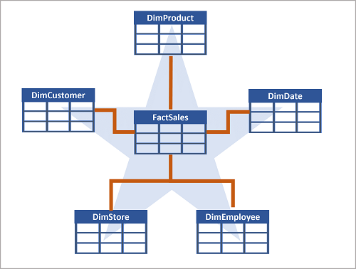
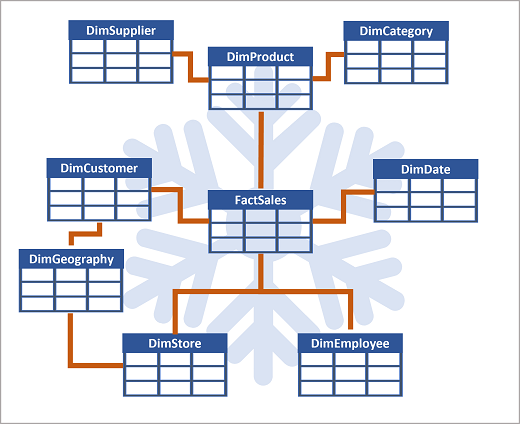

A data warehouse is a centralized, structured store designed for analytical queries and reporting. Unlike operational databases that handle day-to-day business transactions, a data warehouse consolidates data from multiple sources into a format optimized for analysis.

Building a modern data warehouse typically involves:

- **Data ingestion** - Moving data from source systems into the warehouse.
- **Data storage** - Storing the data in a format optimized for analytics.
- **Data processing** - Transforming the data into a format ready for consumption by analytical tools.
- **Data analysis and delivery** - Analyzing the data to gain insights and delivering them to the business.

## Design a data warehouse

Data warehouses contain tables organized in a schema optimized for multidimensional modeling. In this approach, you group numerical data related to events by different attributes. For instance, you can analyze the total amount paid for sales orders that occurred on a specific date or at a particular store.

### Tables in a data warehouse

You organize data warehouse tables to support efficient analysis of large amounts of data. This organization, known as dimensional modeling, involves structuring tables into fact tables and dimension tables.

**Fact tables** contain the numerical data that you want to analyze. Fact tables typically have a large number of rows and are the primary source of data for analysis. For example, a fact table might contain the total amount paid for sales orders that occurred on a specific date or at a particular store.

**Dimension tables** contain descriptive information about the data in the fact tables. Dimension tables typically have a few rows and provide context for the data in the fact tables. For example, a dimension table might contain information about the customers who placed sales orders.

In addition to attribute columns, a dimension table contains a unique key column that uniquely identifies each row in the table. In fact, it's common for a dimension table to include two key columns:

- A *surrogate key* is a unique identifier for each row in the dimension table. It's often an integer value that the database management system generates automatically when you insert a new row.
- An *alternate key* is often a natural or business key that identifies a specific instance of an entity in the transactional source system - such as a product code or a customer ID.

You need both surrogate and alternate keys in a data warehouse, because they serve different purposes. Surrogate keys are specific to the data warehouse and help maintain consistency and accuracy. Alternate keys are specific to the source system and help maintain traceability between the data warehouse and the source system.

#### Special types of dimension tables

Special types of dimensions provide additional context and enable more comprehensive data analysis.

*Time dimensions* provide information about the time period in which an event occurred. This table enables data analysts to aggregate data over temporal intervals. For example, a time dimension might include columns for the year, quarter, month, and day of a sales order.

*Slowly changing dimensions* track changes to dimension attributes over time, like changes to a customer's address or a product's price. They're significant in a data warehouse because they enable you to analyze and understand changes to data over time. Slowly changing dimensions ensure that data stays up-to-date and accurate, which is important for making good business decisions.

### Data warehouse schema designs

In most transactional databases used in business applications, the data is *normalized* to reduce duplication. In a data warehouse however, the dimension data is denormalized* to reduce the number of joins required to query the data.

Often, a data warehouse uses a *star schema*, in which a fact table relates directly to the dimension tables, as shown in this example:

You can use dimension attributes to group fact table numbers at different levels. For example, you could find the total sales revenue for a whole region or just for one customer. You can store the information for each level in the same dimension table.

> [!TIP]
> See [What is a star schema?](/power-bi/guidance/star-schema) for more information on designing star schemas for Fabric.

If there are lots of levels or attributes shared by different things, it might make sense to use a *snowflake schema* instead. Here's an example:

In this case, the **DimProduct** table splits (normalizes) into separate dimension tables for product categories and suppliers.

- Each row in the **DimProduct** table contains key values for the corresponding rows in the **DimCategory** and **DimSupplier tables**.

A **DimGeography** table contains information on where customers and stores are located.

- Each row in the **DimCustomer** and **DimStore** tables contains a key value for the corresponding row in the **DimGeography** table.
