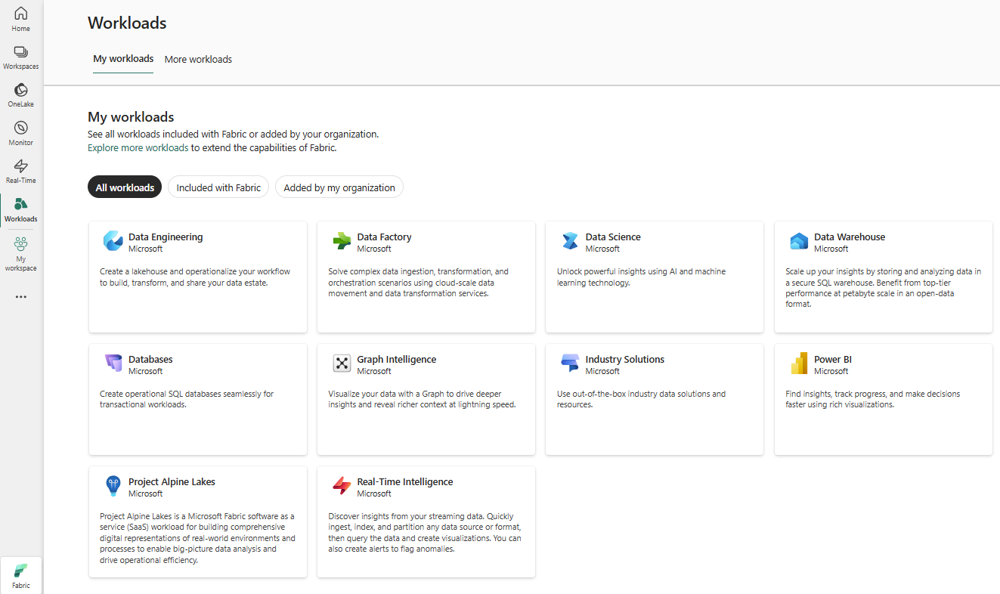
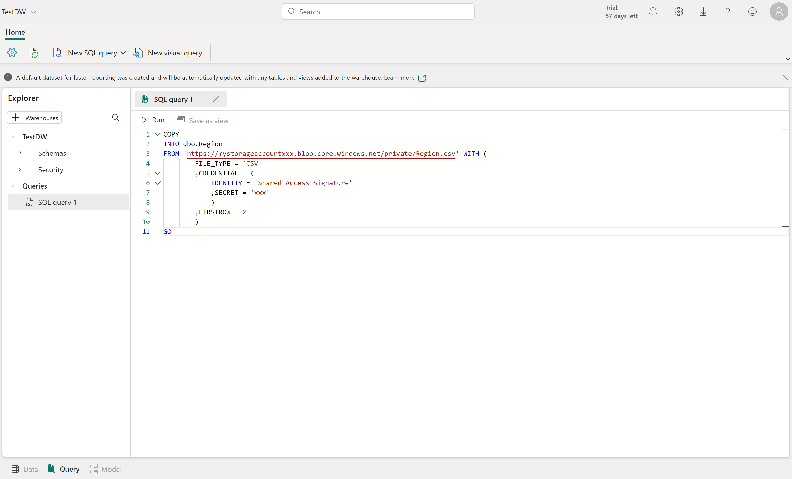

---
ms.custom:
  - build-2023
---
Fabric's Lakehouse is a collection of files, folders, tables, and shortcuts that act like a database over a data lake. It's used by the Spark engine and SQL engine for big data processing and has features for ACID transactions when using the open-source Delta formatted tables. 

Fabric's data warehouse experience allows you to transition from the lake view of the Lakehouse (which supports data engineering and Apache Spark) to the SQL experiences that a traditional data warehouse would provide. The Lakehouse gives you the ability to read tables and use the SQL endpoint, whereas the data warehouse enables you to manipulate the data.

In the data warehouse experience, you'll model data using tables and views, run T-SQL to query data across the data warehouse and Lakehouse, use T-SQL to perform DML operations on data inside the data warehouse, and serve reporting layers like Power BI.

Now that you understand the basic architectural principles for a relational data warehouse schema, let's explore how to create a data warehouse.

## Describe a data warehouse in Fabric

In the data warehouse experience in Fabric, you can build a relational layer on top of physical data in the Lakehouse and expose it to analysis and reporting tools. You can create your data warehouse directly in Fabric from the **create hub** or within a **workspace**. After creating an empty warehouse, you can add objects to it.



Once your warehouse is created, you can create tables using T-SQL directly in the Fabric interface.

## Ingest data into your data warehouse

There are a few ways to ingest data into a Fabric data warehouse, including *Pipelines*, *Dataflows*, *cross-database querying*, and the *COPY INTO* command. After ingestion, the data becomes available for analysis by multiple business groups, who can use features such as cross-database querying and sharing to access it.

### Create tables

To create a table in the data warehouse, you can use SQL Server Management Studio (SSMS) or another SQL client to connect to the data warehouse and run a CREATE TABLE statement. You can also create tables directly in the Fabric UI.

You can copy data from an external location into a table in the data warehouse using the `COPY INTO` syntax. For example:

```sql
COPY INTO dbo.Region 
FROM 'https://mystorageaccountxxx.blob.core.windows.net/private/Region.csv' WITH ( 
            FILE_TYPE = 'CSV'
            ,CREDENTIAL = ( 
                IDENTITY = 'Shared Access Signature'
                , SECRET = 'xxx'
                )
            ,FIRSTROW = 2
            )
GO
```

This SQL query loads data from a CSV file stored in Azure Blob Storage into a table called "Region" in the Fabric data warehouse.



### Table considerations

After creating tables in a data warehouse, it's important to consider the process of loading data into those tables. A common approach is to use *staging tables*. In Fabric, you can use T-SQL commands to load data from files into staging tables in the data warehouse.

Staging tables are temporary tables that can be used to perform data cleansing, data transformations, and data validation. You can also use staging tables to load data from multiple sources into a single destination table.

Usually, data loading is performed as a periodic batch process in which inserts and updates to the data warehouse are coordinated to occur at a regular interval (for example, daily, weekly, or monthly).

Generally, you should implement a data warehouse load process that performs tasks in the following order:

1. Ingest the new data to be loaded into a data lake, applying pre-load cleansing or transformations as required.
2. Load the data from files into staging tables in the relational data warehouse.
3. Load the dimension tables from the dimension data in the staging tables, updating existing rows or inserting new rows and generating surrogate key values as necessary.
4. Load the fact tables from the fact data in the staging tables, looking up the appropriate surrogate keys for related dimensions.
5. Perform post-load optimization by updating indexes and table distribution statistics.

 With a Fabric data warehouse, you don't have to copy data from the lakehouse to the data warehouse. You can query data in the lakehouse directly from the data warehouse using cross-database querying.

> [!IMPORTANT]
> Working with tables in the Fabric data warehouse currently has some limitations. See [Tables in data warehousing in Microsoft Fabric](https://learn.microsoft.com/fabric/data-warehouse/tables) for more information.
