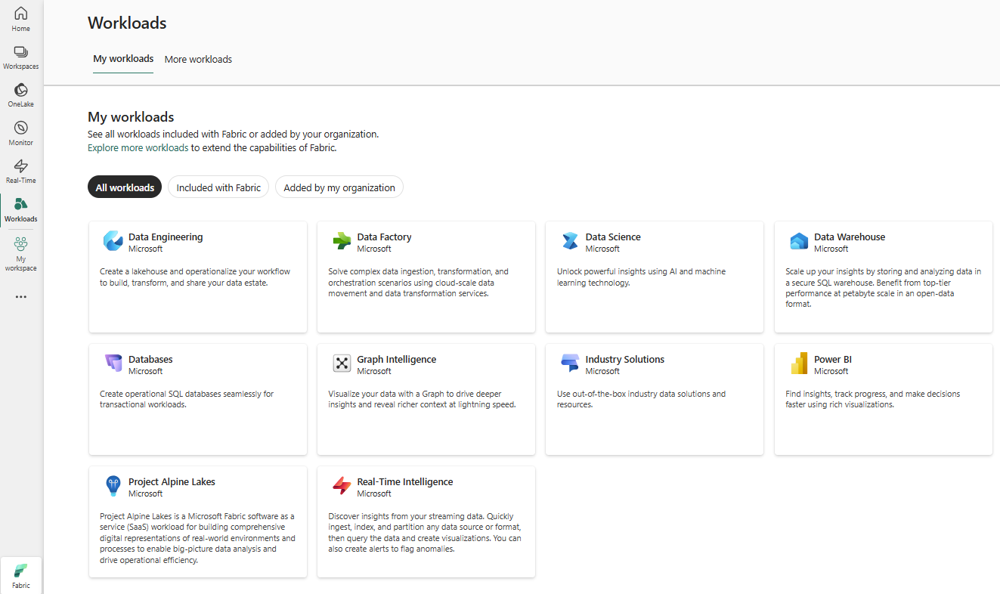

Now that you understand data warehouse fundamentals, let's explore what Microsoft Fabric provides for data warehousing.

## Describe a Fabric data warehouse

A Fabric data warehouse is a fully managed, enterprise-scale relational database built on OneLake. It provides full transactional T-SQL capabilities, including DDL statements (CREATE, ALTER, DROP) and DML statements (INSERT, UPDATE, DELETE, MERGE), with full ACID compliance for data consistency.

Data is stored in open Delta format on OneLake, which means other Fabric workloads can access the same data without duplication. You use T-SQL to create tables, load data, build views and stored procedures, and perform transformations, all within a familiar SQL experience.

Key capabilities include:

- **Full T-SQL support** - Write DDL and DML statements, including MERGE for upsert scenarios, using familiar SQL Server syntax.
- **Fully managed** - No infrastructure to configure. Compute scales automatically and independently from storage.
- **OneLake integration** - Warehouse data is stored in Delta format and accessible by other Fabric workloads without duplication.
- **Cross-database querying** - Query data across warehouses and lakehouses without copying data. Use three-part naming (database.schema.table) to join warehouse tables with lakehouse tables in a single query.
- **Familiar tooling** - Connect with SQL Server Management Studio (SSMS), Azure Data Studio, or any SQL client through standard TDS connections.
- **Copilot assistance** - Copilot for Data Warehouse generates SQL queries from natural language, provides code completion as you type, and can explain or fix existing queries in the SQL editor.

### Warehouse vs SQL analytics endpoint

Fabric workspaces can contain two types of SQL-based items that serve different purposes.

| Capability | Warehouse | SQL analytics endpoint |
|---|---|---|
| Read data | Yes | Yes |
| Write data (INSERT, UPDATE, DELETE, MERGE) | Yes | No |
| Create tables (DDL) | Yes | No |
| Create views and stored procedures | Yes | Yes |
| Data source | Native warehouse tables | Lakehouse Delta tables |

Use a warehouse when you need full read/write T-SQL capabilities. Use the SQL analytics endpoint when you need read-only SQL access to lakehouse data.

## Create a data warehouse

You can create a data warehouse in Fabric from the **create hub** or within a **workspace**. After creating an empty warehouse, you can add tables, views, and other objects.



Once your warehouse is created, you can start creating tables and loading data using the SQL query editor in the Fabric portal.

## Ingest data into a warehouse

There are several ways to load data into a Fabric data warehouse:

- **COPY INTO** - Bulk load data from external files (CSV, Parquet) in Azure storage into warehouse tables.
- **OPENROWSET** - Query files directly from external storage or OneLake locations for ad hoc analysis or ingestion, without creating tables first.
- **Pipelines and Dataflows** - Use Data Factory pipelines or Dataflows Gen2 for orchestrated data movement and transformation.
- **Cross-database queries** - Query lakehouse tables directly from the warehouse using three-part naming, without copying data.

You can use the `COPY INTO` T-SQL command to bulk load data from files. For example, the following statement loads data from a CSV file into a table:

```sql
COPY INTO dbo.Region
FROM 'https://mystorageaccount.blob.core.windows.net/data/Region.csv'
WITH (
    FILE_TYPE = 'CSV',
    CREDENTIAL = (
        IDENTITY = 'Shared Access Signature',
        SECRET = 'xxx'
    ),
    FIRSTROW = 2
)
GO
```


> [!TIP]
> If you have tables in a lakehouse that you want to query from your warehouse without making changes, use cross-database querying instead. You don't need to copy the data.

## Create tables and load data

After creating a warehouse and choosing an ingestion method, the next step is to define your tables and load data into them.

You create tables using T-SQL `CREATE TABLE` statements. Define columns with appropriate data types for analytics workloads.

```sql
CREATE TABLE dbo.DimCustomer
(
    CustomerKey INT NOT NULL,
    CustomerAltKey NVARCHAR(10) NOT NULL,
    CustomerName NVARCHAR(100) NOT NULL,
    Region NVARCHAR(50) NULL
);
GO

CREATE TABLE dbo.FactSales
(
    SalesKey INT NOT NULL,
    CustomerKey INT NOT NULL,
    ProductKey INT NOT NULL,
    DateKey INT NOT NULL,
    SalesAmount DECIMAL(10,2) NOT NULL,
    Quantity INT NOT NULL
);
GO
```

Choose data types that balance precision with storage efficiency. Use `INT` for key columns, `NVARCHAR` for text that may include special characters, and `DECIMAL` for financial values that require precision.

### Use staging tables for data loading

A common pattern in data warehousing is to land raw data in staging tables before transforming and loading it into final dimension and fact tables. Staging tables mirror the structure of your source data and act as a temporary holding area.

After loading data into staging tables using `COPY INTO` or pipelines, you transform and insert it into your dimensional model:

```sql
INSERT INTO dbo.FactSales (SalesKey, CustomerKey, ProductKey, DateKey, SalesAmount, Quantity)
SELECT
    s.OrderID,
    c.CustomerKey,
    p.ProductKey,
    d.DateKey,
    s.Amount,
    s.Qty
FROM dbo.StgSales AS s
INNER JOIN dbo.DimCustomer AS c ON s.CustomerID = c.CustomerAltKey
INNER JOIN dbo.DimProduct AS p ON s.ProductID = p.ProductAltKey
INNER JOIN dbo.DimDate AS d ON s.OrderDate = d.DateValue;
GO
```

This pattern keeps your source data intact while you apply business rules and key lookups during the load process.

## Understand table clones

You can create zero-copy table clones in a Fabric data warehouse. Clones copy table metadata while still referencing the same underlying data files in OneLake. The data itself isn't duplicated, which keeps storage costs low.

The following code example shows you how to create a clone with T-SQL:

```sql
--Clone creation within the same schema
CREATE TABLE dbo.Employee AS CLONE OF dbo.EmployeeUSA;
```  

Table clones are useful for development and testing, data recovery after a failed release, and preserving data at specific points in time for historical reporting. 

> [!TIP]
> For more information, see the [Clone table in Microsoft Fabric](/fabric/data-warehouse/clone-table) documentation.

Now that you understand Fabric's warehouse capabilities, let's explore how to query and transform your data.