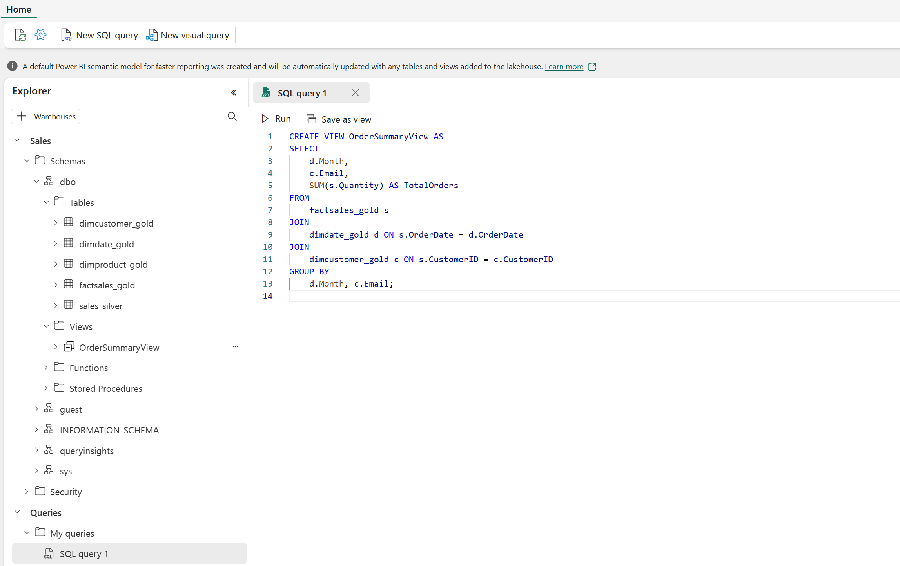
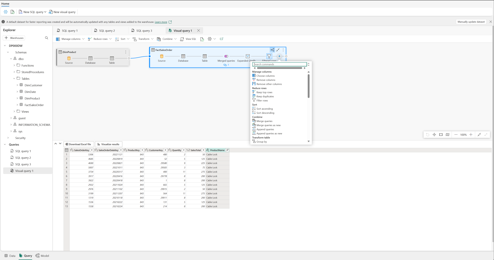

---
ms.custom:
  - build-2023
---
Now that you know how to implement a data warehouse in Fabric, let's prepare the data for analytics.

There are two ways to query data from your data warehouse. The *Visual query editor* provides a no-code, drag-and-drop experience to create your queries. If you're comfortable with T-SQL, you may prefer to use the *SQL query editor* to write your queries. In both cases, you can create tables, views, and stored procedures to query data in the data warehouse and Lakehouse.

There's also a SQL endpoint, where you can connect from any tool.

### Query data using the SQL query editor

The **SQL query editor** provides a query experience that includes intellisense, code completion, syntax highlighting, client-side parsing, and validation. If you've written T-SQL in SQL Server Management Studio (SSMS) or Azure Data Studio (ADS), you'll find it familiar.

To create a new query, use the **New SQL query** button in the menu. You can author and run your T-SQL queries here. In the example below we're creating a new view for analysts to use for reporting in Power BI.

### Query data using the Visual query editor

The *Visual query editor* provides an experience similar to the [Power Query online diagram view](https://learn.microsoft.com/power-query/diagram-view). Use the **New visual query** button to create a new query.

Drag a table from your data warehouse onto the canvas to get started. You can then use the **Transform** menu at the top of the screen to add columns, filters, and other transformations to your query. You can use the  (+) button on the visual itself to perform similar transformations.

