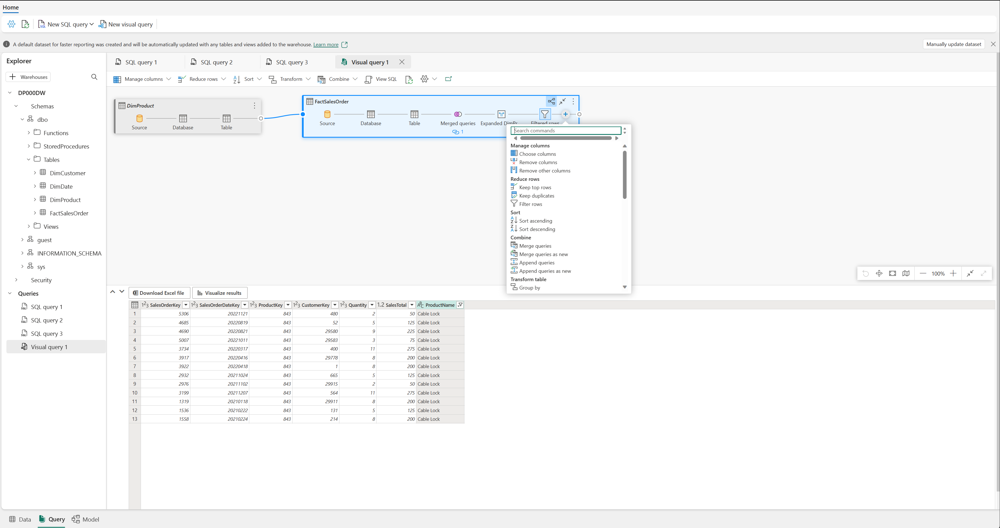
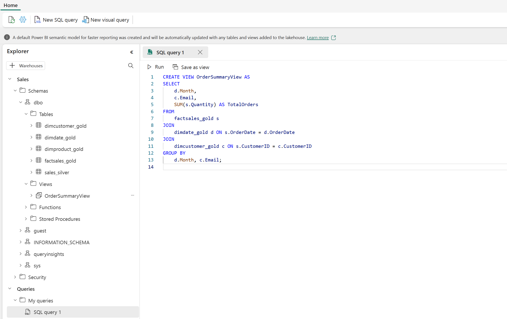

Now that you know how to create a warehouse and ingest data, you can start exploring and shaping that data for analytics.

Raw data rarely arrives in the exact format you need for analysis. You might need to join tables, filter rows, aggregate values, or restructure data before it's useful for reporting. A Fabric data warehouse gives you two tools for this work: the SQL query editor for T-SQL and the Visual query editor for a no-code approach.

## Query data with the SQL query editor

The **SQL query editor** provides a query experience that includes IntelliSense, code completion, syntax highlighting, client-side parsing, and validation. This will feel familiar if you have experience writing T-SQL in SQL Server Management Studio (SSMS) or Azure Data Studio (ADS).

To create a new query, use the **New SQL query** button in the menu. Copilot for Data Warehouse is available in the editor to help generate queries from natural language, complete code as you type, and explain or fix existing queries.

## Query data with the Visual query editor

The *Visual query editor* provides an experience similar to the [Power Query online diagram view](/power-query/diagram-view). Use the **New visual query** button to create a new query.

Drag a table from your data warehouse onto the canvas to get started. You can then use the **Transform** menu at the top of the screen to add columns, filters, and other transformations. You can also use the (+) button on the visual itself to perform similar actions.



## Transform data with views and stored procedures

Beyond ad hoc queries, you can save transformation logic as reusable objects in the warehouse.

**Views** define a saved query that you can reference like a table. Use views to standardize how analysts access data, such as combining fact and dimension tables into a reporting-friendly format or filtering rows to a specific business context. For example:

**Stored procedures** contain T-SQL logic that you can execute on demand. Use stored procedures for repeatable transformation tasks, like loading staging data into final tables or applying business rules.

Views and stored procedures also help make your data more accessible to AI-powered tools. Copilot and Fabric IQ data agents can query views just like tables, so standardizing data access through well-named views improves the accuracy of natural language queries.

The following code shows a sample view and the screenshot shows how to use the code in the warehouse SQL query editor:

```sql
CREATE VIEW dbo.vw_SalesByRegion
AS
SELECT
    c.Region,
    SUM(f.SalesAmount) AS TotalSales,
    COUNT(f.OrderID) AS OrderCount
FROM dbo.FactSales AS f
INNER JOIN dbo.DimCustomer AS c
    ON f.CustomerKey = c.CustomerKey
GROUP BY c.Region;
```


