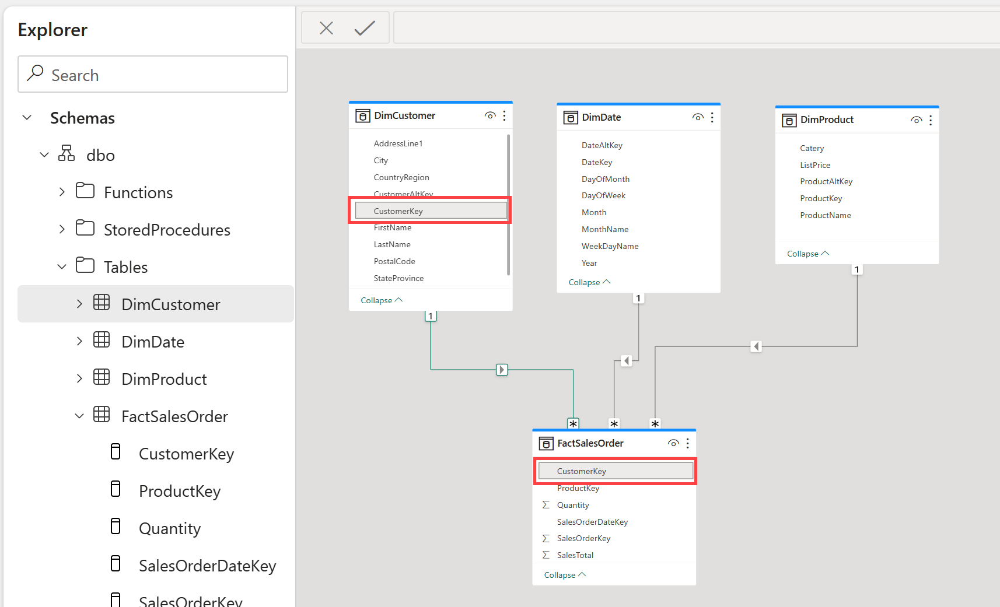
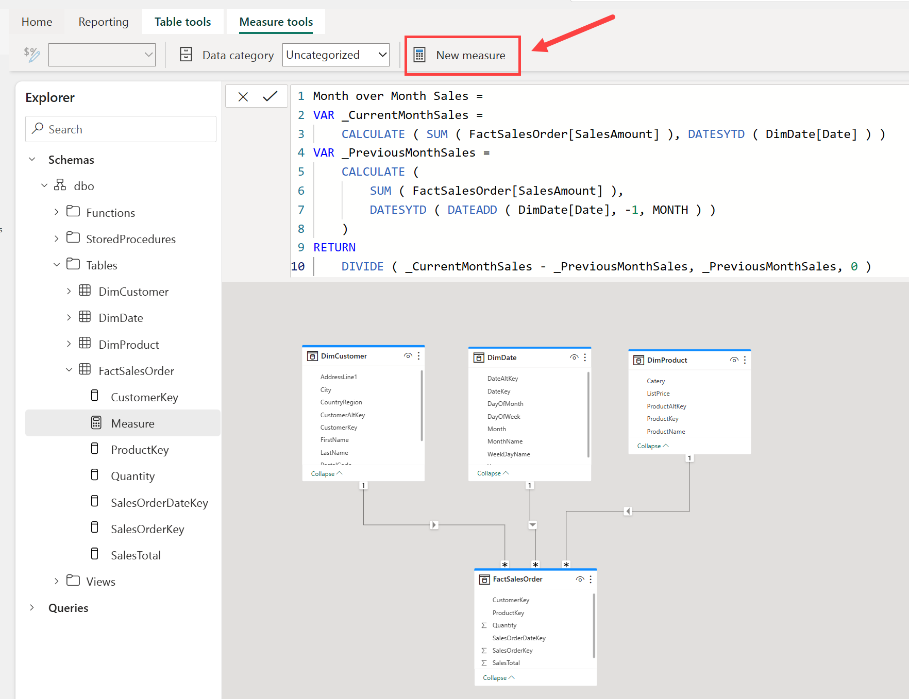
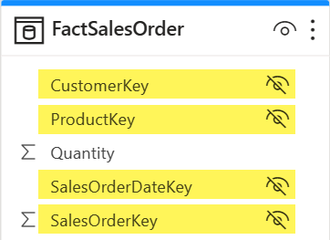
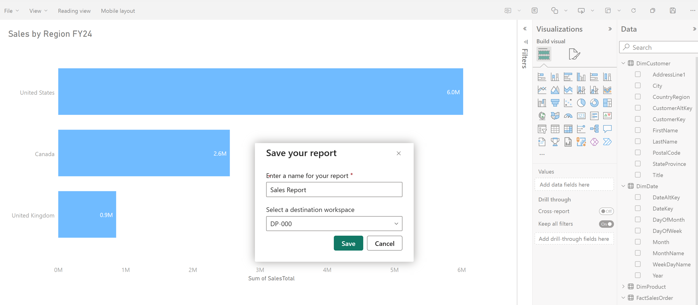

---
ms.custom:
  - build-2023
---
A *data model* defines the *relationships* between the different tables in the dataset, the rules for how data is aggregated and summarized, and the calculations or *measures* that are used to derive insights from the data. These relationships and measures are included in the dataset, which is then used to create reports in Power BI.

You can easily switch between the **Data**, **Query**, and **Model** view Fabric using the menu in the bottom left corner of the screen. The **Data** view shows the tables in the dataset, the **Query** view shows the SQL queries that are used to create the dataset, and the **Model** view shows the data model.

> [!TIP]
> See [Analyze data in a relational data warehouse](https://learn.microsoft.com/training/modules/design-multidimensional-schema-to-optimize-analytical-workloads/) to learn more about data models and data warehouse schema.

### Build relationships

*Relationships* allow you to connect tables in the data model. Create relationships between tables in your data warehouse using a click-and-drag interface in Fabric in the **Model** view.

>[!TIP]
>See [Create and manage relationships](https://learn.microsoft.com/power-bi/transform-model/desktop-create-and-manage-relationships) for detailed information on creating relationships.

### Create measures

*Measures* are the metrics that you want to analyze in your data warehouse. You can create measures in Fabric by using the **New measure** button in the **Model** view.

Measures are calculated fields that are based on the data in the tables in your data warehouse using the Data Analysis Expressions (DAX) formula language.

>[!NOTE]
>Fabric offers many tools to create data transformations. The creation of measures using DAX is one of many ways to create data transformations. To learn more about DAX, see [Use DAX in Power BI](https://learn.microsoft.com/training/paths/dax-power-bi/).

### Hide fields

Building out the data model is a critical component to preparing your data for use in downstream reporting.  To simplify things for your report builders, you can hide elements from view, either a table or a column. Right-click on the table or column and select **Hide**.  Hiding fields removes the table or column from the model view, but it will still be available for use in the dataset.

## Understand datasets

Every time a data warehouse is created, Fabric creates a *dataset* for analysts and/or business users to connect to for reporting.

*Datasets* are a semantic model with metrics that are used to create reports. Simply put, analysts use the data model you created in your warehouse, which is stored in a dataset. If you're familiar with Power BI, working with datasets created by the data warehouse experience will be straightforward.

Datasets are automatically kept in sync with the data warehouse, so you don't have to worry about maintaining them. You can also create custom datasets to meet your specific needs.

## Understand the default dataset

There's also a *default dataset* automatically created for you in Fabric. It inherits business logic from the parent lakehouse or warehouse, which initiates the downstream analytics experience for business intelligence and analysis. This dataset is managed, optimized, and kept in sync for you.

New tables in the Lakehouse are automatically added to the default dataset. Users can also manually select tables or views from the warehouse they want included in the model for more flexibility. Objects that are in the default dataset are created as a layout in the model view.

> [!NOTE]
> Default Datasets follow the current limitations for datasets in Power BI. See [Default Power BI datasets](https://learn.microsoft.com/fabric/data-warehouse/limitations) for more information.

## Visualize data

Fabric enables you to *visualize* the results of a single query or your entire data warehouse, without leaving the data warehouse experience. Exploring data while you work to ensure you have all the necessary data and transformations for your analysis is particularly useful.

Use the **New report** button to create a new Power BI report from the contents of your entire data warehouse. Using the **New report** button opens the Power BI service experience where you can build and save your report for use by the business.

