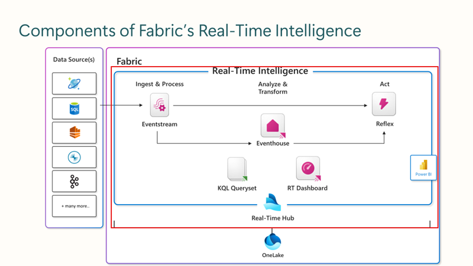
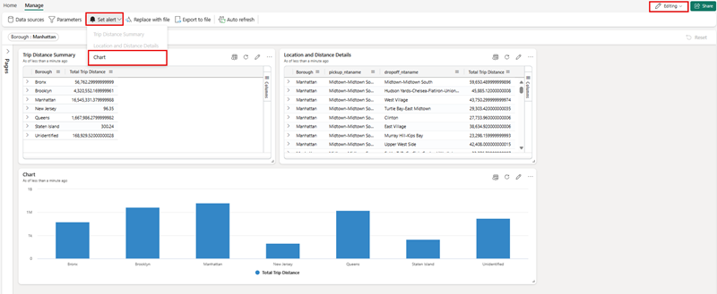
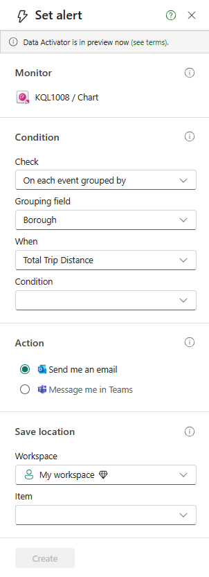

Fabric's Real-Time Intelligence solution provides an end-to-end streaming solution for high-speed data analysis across the Fabric service. It’s optimized for time-series data and supports automatic partitioning and indexing of any data format.

Real-Time Intelligence delivers high performance for data of various sizes, ranging from a few gigabytes to several petabytes. It can handle data from different sources and in various formats. Fabric's Real-Time Intelligence workload can be used for solutions like IoT and log analytics in many scenarios including manufacturing, oil and gas, and automotive.

## Understand Real-Time Intelligence in Microsoft Fabric

Real-Time Intelligence is a fully managed service that is optimized for streaming time-series data. With Real-Time Intelligence, you're able to get consistent performance searching all types of data at scale, including structured, unstructured, and semi-structured data. Additionally, it's integrated with the entire suite of Fabric capabilities, which allows a streamlined workflow from data loading to data visualization.

By Using Real-Time Intelligence in Fabric, you can:

- Ingest data from any source, in any data format.
- Run analytical queries directly on raw data without the need to build complex data models or create scripting to transform the data.
- Import data with by-default streaming that provides high performance, low latency, high freshness data analysis.
- Imported data undergoes default partitioning - both time and hash-based partitioning, and by-default indexing.
- Work with versatile data structures and query structured, semi-structured, or free text.
- Query raw data without transformation, with high performance, incredibly low response time, and using a wide variety of available operators.
- Scale to an unlimited amount of data, from gigabytes to petabytes, with unlimited scale on concurrent queries and concurrent users.
- Integrate seamlessly with other workloads and items in Microsoft Fabric.

## Explore the world of real-time data with Real-Time hub

The Real-Time Hub serves as your gateway to uncover and control the flow of your streaming data. It's a dynamic catalog that includes:

 

## Visualize data insights with Real-Time Dashboards

Data insights can be visualized through KQL querysets, Real-Time dashboards, and Power BI reports, with a rapid transition from data ingestion to visualization. These visualizations cater to both beginners and experts, allowing them to represent their data as charts and tables with minimal coding. Users can employ visual cues for filtering and aggregating query results, utilizing a comprehensive suite of built-in visualizations. Insights are accessible in Power BI Reports and Real-Time Dashboards, both of which can incorporate alerts based on the data insights.

Alerts can also be set within the non-table visualizations on the Real-Time Dashboards while in editing mode to provide notifications when an established threshold that you set has been met.

The alerts can notify you within Microsoft Teams or by sending an email.

### Kusto Query Language (KQL)

Kusto Query Language (KQL) is a declarative query language used to analyze and extract insights from structured, semi-structured, and unstructured data. KQL was designed specifically for searching large-scale log data efficiently and quickly, making it perfectly suited for cloud-based data analytics. We'll explore some basic KQL syntax later in this module, but for now, consider the following benefits of the KQL capabilities in Microsoft Fabric:

- It enables **efficiency in data exploration and data analysis** by allowing users to work with heterogeneous data sources and visualize the results in various ways.
- It supports **reproducible analyses** by allowing users to create notebooks with Kusto kernel that can capture code, results, and context on the analysis.
- It improves **DevOps troubleshooting experience** by allowing users to create runbooks or playbooks in notebooks with Kusto kernel that can detail how to troubleshoot and mitigate issues using telemetry data.
- It enriches **DevOps flow** by allowing users to add KQL files and KQL notebook files to their Git repositories and CI/CD pipelines.
- It provides **guidance and helps you build search queries from scratch** by using the KQL editor that quickly identifies potential errors and displays hints about how to resolve issues.
- It lets you **quickly paste long, complex queries directly into the editor** if you receive them from other sources.
- It allows you to **filter, present, and aggregate your data** using various operators and functions that are easy to read and author.
