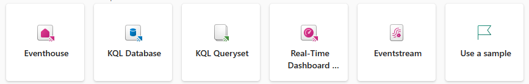
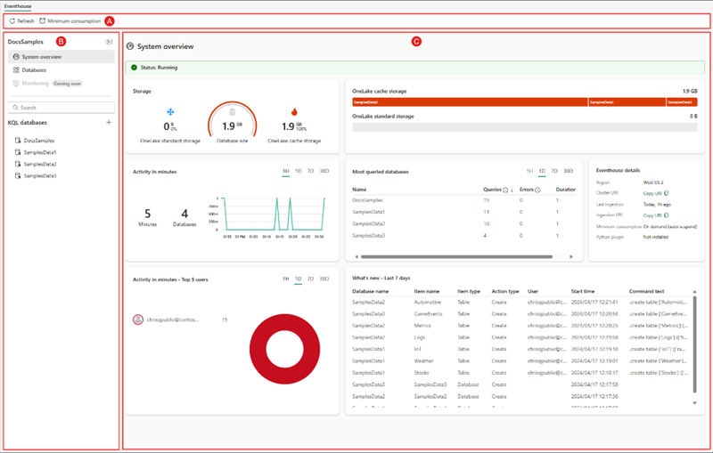
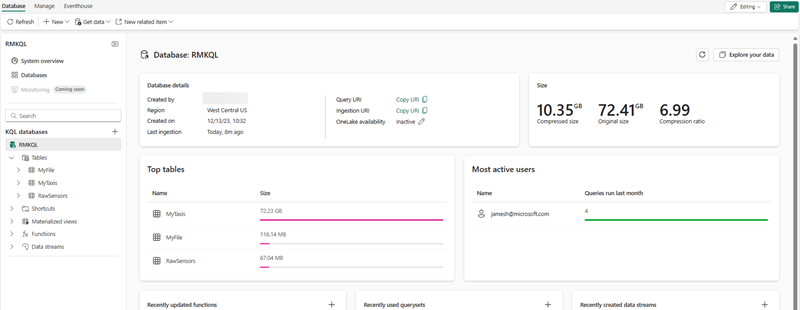

Let's explore the core elements of Real-Time Intelligence in Microsoft Fabric.

## Real-Time Intelligence core components

- **Event house**: Event houses are like a large, efficient library for data. They help organizations handle and analyze lots of data quickly, especially when it's important to get insights fast. Think of it as a supercharged database that can deal with data coming in nonstop, from different places, and in various forms. It's designed to grow with the data needs of a project, making sure everything will run smoothly without wasting resources.

   

- **KQL database**: is a Kusto database and an upper-level entity that hosts a collection of tables, stored functions, materialized views, shortcuts, and datastreams. 

    > [!NOTE]
    > **You can continue to create and use stand-alone KQL databases while event house is still in preview**. After this period, they will be managed with the event house as the management layer hosting **many** KQL databases.

- **KQL Queryset**: Use this tool to run queries, and view and manipulate query results on data from your KQL database. The KQL Queryset allows you to save queries for future use, or export and share queries with others. In addition, the KQL Queryset uses the Kusto Query language for query creation, and also supports T-SQL and some T-SQL functions. For more information about the query language, see [Kusto Query Language overview](/azure/data-explorer/kusto/query/?branch=release-public-preview).
- **Real-Time Dashboards**: to understand these, imagine a dashboard as a customizable control panel on your computer or game console. Each section, or "tile," shows you different information, like your score, health level, or map in a game. These tiles are set up to show specific data and can be arranged in different pages to keep things organized. Just like you can change settings in a game. You can tweak these tiles to show different data or look different visually. It's like having a bunch of mini-screens, each showing you something useful, and you can export complex data queries from Kusto Query Language (KQL) directly into these tiles as visuals. This dashboard isn't just about looking cool; it makes exploring data easier and faster. It's like having a high-performance gaming rig that lets you switch between screens and data without lag, giving you a smooth and integrated experience.
- **Eventstream**: Think of event streams in Microsoft Fabric as a super handy tool that lets you handle live data without any coding. It's like a high-tech funnel that collects, changes, and sends data to different places automatically. When you set up an eventstream in the system, you're basically creating a mini-factory that processes real-time data. You tell it where to get data from, where to send it, and how to change it along the way if needed. It's part of a bigger feature called Real-Time Intelligence, which is all about making sense of data as it happens.

## KQL Database objects

As with many databases, the KQL Database has many objects to handle your data storage, streaming, and querying needs to support your decision making systems downstream.
From the event house landing page, you can select on any of the databases and navigate to the individual database for exploring data, adding elements, and more.

- A **table** is a schema entity that contains a set of columns and rows of data. A table has a well-defined schema (an ordered list of column name and data type pairs). You can use the `.create table` command to create a new table, the `.show table` command to show the table schema, and the `.ingest` command to ingest data into a table.
- A **function** is a schema entity that encapsulates a subquery expression that can be invoked from within other KQL queries. A stored function has a name, an optional list of parameters, and a body that contains the subquery expression. You can use the `.create function` command to create a new stored function, and the `.show functions` command to show the stored functions in a database.
- A **materialized view** is a schema entity that stores precomputed results of a query for faster retrieval. A materialized view has a name, an optional list of parameters, and a body that contains the query expression. You can use the `.create materialized-view` command to create a new materialized view, and the `.show materialized-views` command to show the materialized views in a database.
- A **datastream** is a representation of all of the attached KQL eventstream connected to the KQL database
