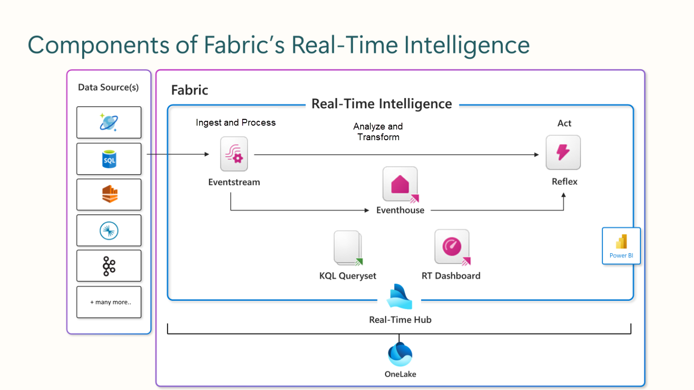
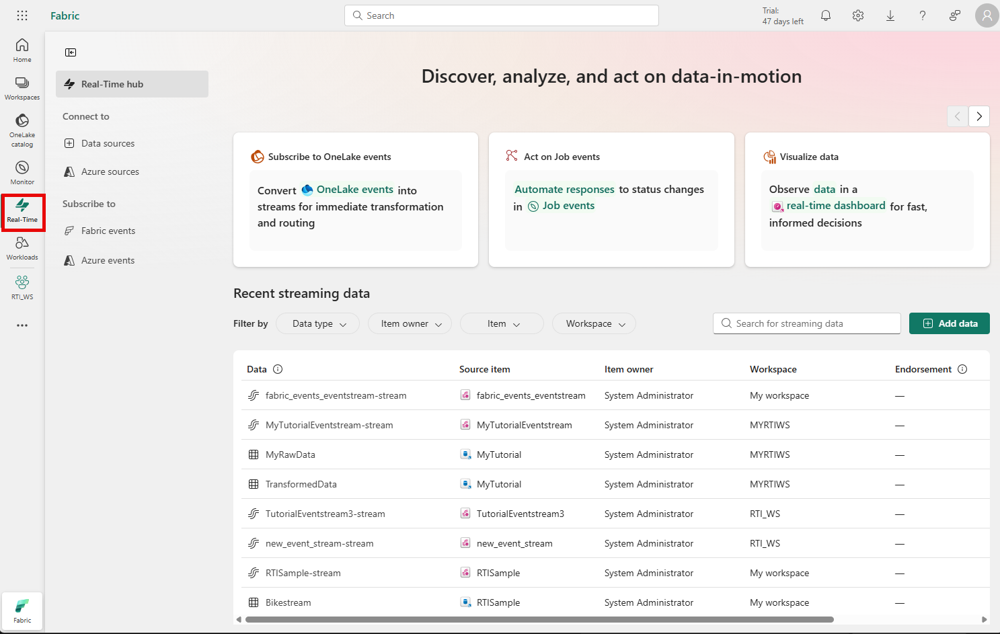

Fabric's Real-Time Intelligence solution provides an end-to-end streaming solution for real-time data analysis across the Fabric service.

Real-Time Intelligence delivers high performance for data of various sizes, ranging from a few gigabytes to several petabytes. It can handle data from different sources and in various formats. Fabric's Real-Time Intelligence workload can be used for solutions like IoT and log analytics in many scenarios including manufacturing, oil and gas, and automotive.

 

Using the Microsoft Fabric Real-Time Intelligence, you can:

- Create an *eventstream* to capture, transform, and ingest real-time data from various streaming sources.
- Store captured real-time data in an *eventhouse*, which includes one or more *KQL databases*.
- Query and analyze data in the eventhouse by using KQL queries, organized in a *KQL queryset*.
- Visualize real-time data in a *real-time dashboard* or by using Power BI.
- Configure alerts that use *Activator* to trigger automated actions.

## The Microsoft Fabric real-time hub

The Microsoft Fabric *real-time hub* provides a centralized place for managing real-time data sources.

 .

To view the real-time hub, select the **Real-Time** icon in the main Fabric menu bar.

In the real-time hub, you can:

- Find and connect to real-time data sources and create *eventstreams*.
- Subscribe to Fabric and Azure events, and create *eventstreams* and *Activator* alerts.
- Preview and manage your real-time data connections, including navigating to captured stream data in an *eventhouse*.
- Create *real-time dashboards* from event streams.
- Endorse and share real-time data resources across your organization.
