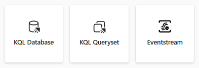
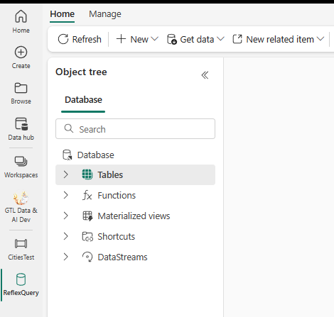

Let's explore the core elements of Synapse Real-Time Analytics (RTA) in Microsoft Fabric.

## Real-Time Analytics core components

- A **KQL database** is a Kusto database and an upper-level entity that hosts a collection of tables, stored functions, materialized views, shortcuts, and datastreams.
- Use the **KQL Queryset** to run queries, and view and manipulate query results on data from your Data Explorer database. The KQL Queryset allows you to save queries for future use, or export and share queries with others. In addition, the KQL Queryset uses the Kusto Query language for query creation, and also supports some SQL functions. For more information about the query language, see [Kusto Query Language overview](/azure/data-explorer/kusto/query/?branch=release-public-preview).
- The **Eventstream** feature allows you to integrate streaming data from multiple source types, which include Event hubs, custom apps, and sample data. Once you've established your source(s), you can then send the streaming data to multiple destinations including a Lakehouse, KQL Database, or a custom app.

## KQL Database objects

As with many databases, the KQL Database has many objects to support your data storage, streaming, and querying needs to support decision support systems downstream.

- A **table** is a schema entity that contains a set of columns and rows of data. A table has a well-defined schema (an ordered list of column name and data type pairs). You can use the `.create table` command to create a new table, the `.show table` command to show the table schema, and the `.ingest` command to ingest data into a table.
- A **function** is a schema entity that encapsulates a subquery expression that can be invoked from within other KQL queries. A stored function has a name, an optional list of parameters, and a body that contains the subquery expression. You can use the `.create function` command to create a new stored function, and the `.show functions` command to show the stored functions in a database.
- A **materialized view** is a schema entity that stores precomputed results of a query for faster retrieval. A materialized view has a name, an optional list of parameters, and a body that contains the query expression. You can use the `.create materialized-view` command to create a new materialized view, and the `.show materialized-views` command to show the materialized views in a database.
- A **datastream** is a representation of all of the attached KQL eventstreams connected to the KQL database

