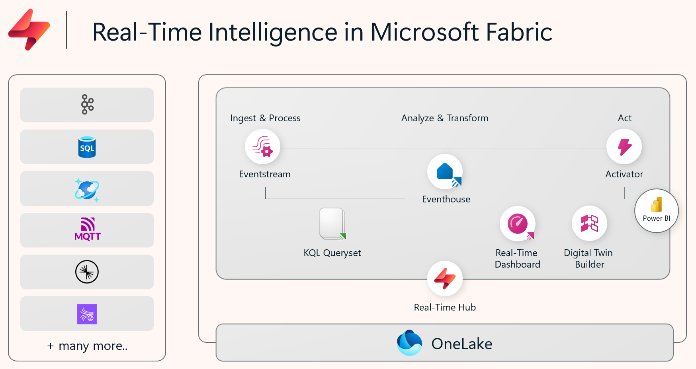

Fabric's Real-Time Intelligence solution provides an end-to-end streaming solution for real-time data analysis across the Fabric service.

Real-Time Intelligence delivers high performance for data of various sizes, ranging from a few gigabytes to several petabytes. It can handle data from different sources and in various formats. Fabric's Real-Time Intelligence workload can be used for solutions like IoT and log analytics in many scenarios including manufacturing, oil and gas, and automotive.

Real-Time Intelligence is a fully managed service that is optimized for streaming time-series data. With Real-Time Intelligence, you're able to get consistent performance searching all types of data at scale, including structured, unstructured, and semi-structured data. Additionally, it's integrated with the entire suite of Fabric capabilities, which enables a streamlined workflow from data ingestion to data visualization and automated event processing.

## The real-time hub

The Microsoft Fabric *real-time hub* serves as your gateway to uncover and control the flow of your streaming data and integrate it with other Fabric data and capabilities through OneLake.

 

Using the Microsoft Fabric real-time hub, you can:

- Create an *eventstream* to capture, transform, and ingest real-time data from various streaming sources.
- Store captured real-time data in an *eventhouse*, which includes one or more *KQL databases*.
- Query and analyze data in the event house by using KQL queries, organized in a *KQL queryset*.
- Visualize real-time data in a *real-time dashboard* or by using Power BI.
- Configure alerts that use *Activator* to trigger automated actions.

In the rest of this module, we'll explore these core elements of Real-Time Intelligence in Microsoft Fabric.
