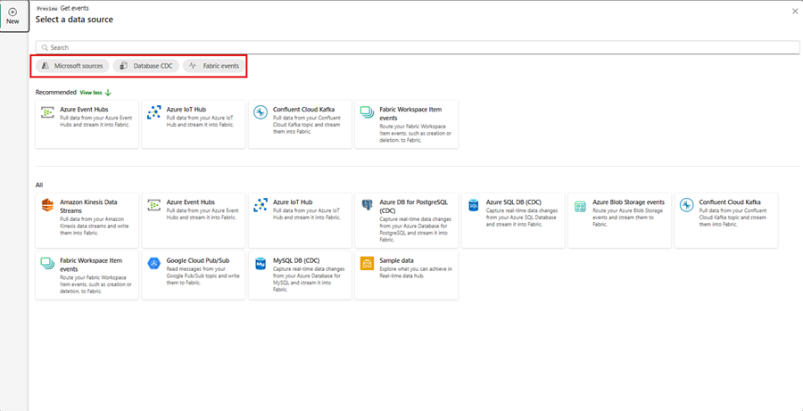
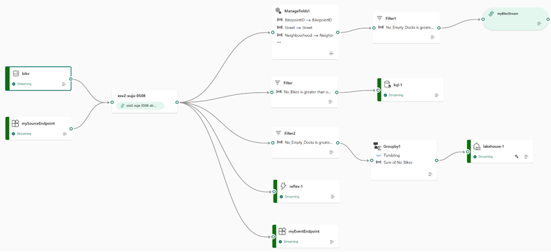

## Getting data into the Real-Time hub

The Real-Time Hub serves as your gateway to uncover and control the flow of your streaming data. It's a dynamic catalog that includes:

 

- **Event streams**: Gain access to all the active event streams within Fabric that you're permitted to view.
- **Microsoft Sources**: Quickly find and configure streaming sources available to you, such as Azure Event Hubs, Azure IoT Hub, and various Change Data Capture (CDC) options from Azure SQL DB, Azure Cosmos DB, and PostgreSQL DB.
- **Fabric Events**: Use event-driven features for instant notifications and data handling. Keep tabs on events from Fabric Workspace Items to Azure Blob Storage, which can initiate further processes or workflows. This action could involve starting a data pipeline or dispatching an email alert. Plus, you have the flexibility to route these events to different destinations through Event streams. Alerts allow you to interact both within your workspace and outside of it from the Real-Time hub by selecting the  ***Set alert*** button.

All this information is presented in an easy-to-digest format, ensuring seamless integration with your Fabric workloads.

## Source the event stream

The Microsoft Fabric Real-Time Intelligence experience's event streams feature allows for seamless integration of real-time events into Fabric. You can create an eventstream, which is an instance within Fabric, add sources of event data, apply optional transformations to the data, and route it to various destinations, all without the need for coding. This no-code approach simplifies the process of managing event data within Fabric.

[ ](../media/event-stream-sources-large.png#lightbox)

## Processing events within event streams

The drag and drop interface offers a straightforward and user-friendly method for constructing your event data workflows. This includes processing, transformation, and routing, all without the need for coding. An eventstream's data flow diagram provides a clear visual representation of the data's journey and structure. Additionally, the event processor editor's no-code environment enables you to design your event data processing logic simply by dragging and dropping elements into place.

- **Transformation Description**

When you create an eventstream with Enhanced capabilities enabled, all destinations support transformation operations. Without Enhanced capabilities, transformations are only available for Lakehouse and KQL Database destinations, which handle event processing before ingestion.

  - **Filter**: Use the Filter transformation to filter events based on the value of a field in the input. Depending on the data type (number or text), the transformation keeps the values that match the selected condition, such as is ```null``` or ```is not null```.
  - **Manage fields**: This transformation allows you to add, remove, change data type, or rename fields coming in from an input or another transformation.
  - **Aggregate**: Use the Aggregate transformation to calculate an aggregation (Sum, Minimum, Maximum, or Average) every time a new event occurs over a period of time. This operation also allows for the renaming of these calculated columns, and filtering or slicing the aggregation based on other dimensions in your data. You can have one or more aggregations in the same transformation.
  - **Group by**: Use the Group by transformation to calculate aggregations across all events within a certain time window. You can group by the values in one or more fields. It's like the Aggregate transformation allows for the renaming of columns, but provides more options for aggregation and includes more complex options for time windows. Like Aggregate, you can add more than one aggregation per transformation.
  - **Union**: Use the Union transformation to connect two or more nodes and add events with shared fields (with the same name and data type) into one table. Fields that don't match are dropped and not included in the output.
  - **Expand**: Use this array transformation to create a new row for each value within an array.
  - **Join**: this is a transformation to combine data from two streams based on a matching condition between them.

## Standard destination locations

We can see that by not choosing the enhanced capabilities, our destinations are limited.

| Destination | Description |
|-------------|-------------|
| **Custom app** | With this feature, you can seamlessly direct your real-time event traffic to a bespoke application. It enables the integration of your proprietary applications with the event stream, allowing for the immediate consumption of event data. This feature is advantageous when you aim to transfer real-time data to an independent system not hosted on the Microsoft Fabric. |
| **Lakehouse** | This destination empowers you to preprocess your real-time events prior to their ingestion into your lakehouse. The events are transformed into Delta Lake format and later stored in specific lakehouse tables, facilitating your data warehousing needs. For detailed guidance on utilizing the event processor for real-time data handling, refer to the 'Process event data with event processor editor' section. |
| **KQL database** | This destination offers the capability to funnel your real-time event data into a KQL database, granting you the power to employ the robust Kusto Query Language (KQL) for data interrogation and analysis. Housing your data within the KQL database unlocks the potential for enhanced comprehension of your event data and the creation of comprehensive reports and dashboards. You have the flexibility to opt for one of two data ingestion approaches: either direct ingestion or preprocessing of events prior to ingestion.|
| **Reflex** | This destination facilitates a direct linkage of your real-time event data with a Reflex. A Reflex is an intelligent entity equipped with all necessary details to establish data connections, monitor specific conditions, and execute actions. Upon the event data meeting certain predefined criteria or identifying particular patterns, the Reflex autonomously initiates suitable responses, such as notifying users or triggering Power Automate workflows. | 

## Enhanced destination locations

When you choose the enhanced capabilities, you're able to use the standard destinations along with ***derived stream***.

| Destination | Description |
|-------------|-------------|
| **Derived stream** | The derived stream is a specialized destination created post-application of stream operations like Filter or Manage Fields to an eventstream. It represents the altered default stream after processing, which can be routed to various destinations within Fabric and monitored in the Real-Time hub. |

You're now able to attach to multiple destinations within an event stream at the same time without impacting or colliding with each other.

[ ](../media/real-time-events-workflow-large.png#lightbox)


