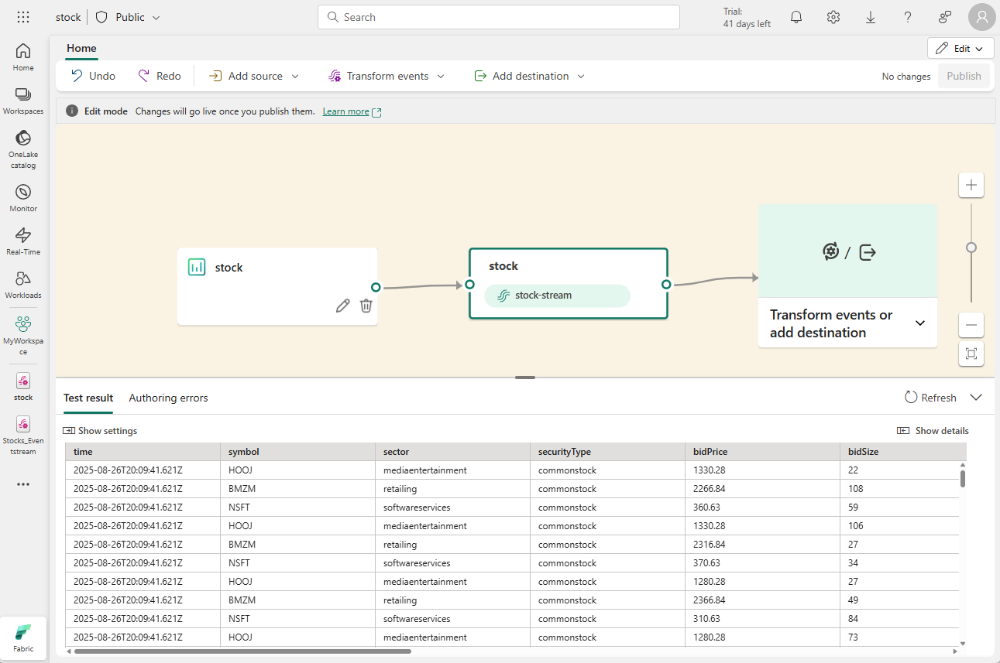

Eventstreams in Microsoft Fabric are used to capture, transform, and load real-time data from a wide range of streaming data sources. When you set up an eventstream in the system, you're defining a data processing engine that runs perpetually to ingest and transform real-time data. You tell it where to get data from, where to send it, and how to change it along the way if needed.



## Data sources for eventstreams

Eventstreams in Microsoft Fabric support a wide range of data sources, including:

- **External services**, like Azure Storage, Azure Event Hubs, Azure IoT Hubs, Apache Kafka hubs, Change Data Capture (CDC) feeds in relational database services, and others.
- **Fabric events**, such as changes to items in a Fabric workspace, data changes in OneLake data stores, and events associated with Fabric jobs.
- **Sample data**, which includes a range of samples that can help you explore real-time analytics scenarios in Microsoft Fabric.

> [!TIP]
> For more information about supported sources, see **[Supported sources for Fabric Real-Time hub](/fabric/real-time-hub/supported-sources)**.

## Data transformations in eventstreams

You can transform the data as it flows in the eventstream, enabling you to filter, summarize, and reshape it before storing it. Available transformations include:

  - **Filter**: Use the Filter transformation to filter events based on the value of a field in the input. Depending on the data type (number or text), the transformation keeps the values that match the selected condition, such as is ```null``` or ```is not null```.
  - **Manage fields**: This transformation allows you to add, remove, change data type, or rename fields coming in from an input or another transformation.
  - **Aggregate**: Use the Aggregate transformation to calculate an aggregation (Sum, Minimum, Maximum, or Average) every time a new event occurs over a period of time. This operation also allows for the renaming of these calculated columns, and filtering or slicing the aggregation based on other dimensions in your data. You can have one or more aggregations in the same transformation.
  - **Group by**: Use the Group by transformation to calculate aggregations across all events within a certain time window. You can group by the values in one or more fields. It's like the Aggregate transformation allows for the renaming of columns, but provides more options for aggregation and includes more complex options for time windows. Like Aggregate, you can add more than one aggregation per transformation.
  - **Union**: Use the Union transformation to connect two or more nodes and add events with shared fields (with the same name and data type) into one table. Fields that don't match are dropped and not included in the output.
  - **Expand**: Use this array transformation to create a new row for each value within an array.
  - **Join**: this is a transformation to combine data from two streams based on a matching condition between them.

> [!TIP]
> For more information about supported transformations, see **[Process event data with event processor editor](/fabric/real-time-intelligence/event-streams/process-events-using-event-processor-editor)**.

## Data destinations in eventstreams

You can load the data from your stream into the following destinations:

- **Eventhouse**: This destination lets you ingest your real-time event data into an eventhouse, where you can use Kusto Query Language (KQL) to query and analyze the data. 
- **Lakehouse**:	This destination gives you the ability to transform your real-time events before ingesting them into your lakehouse. Real-time events convert into Delta Lake format and then store in the designated lakehouse tables.
- **Derived stream**:	Derived stream is used to redirect the output of your eventstream to another eventstream. The derived stream represents the transformed default stream following stream processing.
- **Fabric Activator**: This destination lets you directly connect your real-time event data to a Fabric Activator; which is an intelligent agent that can automate actions based on values in the stream.
- **Custom endpoint**: With this destination, you can route your real-time events to a custom endpoint. This destination is useful when you want to direct real-time data to an external system or custom application outside Microsoft Fabric.

> [!TIP]
> For more information about supported sources, see **[Add and manage a destination in an eventstream](/fabric/real-time-intelligence/event-streams/add-manage-eventstream-destinations)**.
