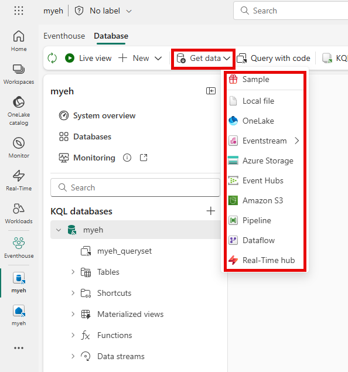

# Ingesting and transforming real-time data
One of the first steps in building a Real-Time Intelligence solution is getting data.  Real-Time Intelligence offers two main ways to ingest streaming data: using Eventstreams or directly ingesting data into a KQL database in an Eventhouse. 

## Eventstreams for data ingestion and transformation

Eventstreams are a way to bring real-time events into Fabric, to transform them, and then route data to a destination. 


The process of creating an eventstream involves connecting to a data source, optionally processing or transforming the data, then routing it to a destination. The image shows the three main components of an eventstream: **sources** where data originates, **transformations** optional processing applied to the data, and **destinations** where the processed data is sent.

Think of an eventstream like a water pipe system. The source is your faucet, transformations are filters along the way and you need a destination like a sink or bucket to collect and use the water.

Next, let's review each component of an eventstream.

## Data sources for eventstreams

Once you create an eventstream in Fabric, you can connect it to a wide range of data sources. You can stream data from Microsoft sources and also ingest data from third-party platforms including:

- **Microsoft sources**, like Azure Event Hubs, Azure IoT Hubs, Azure Service Bus, Change Data Capture (CDC) feeds in database services, and others.
- **Azure events**, like Azure Blob Storage events.
- **Fabric events**, such as changes to items in a Fabric workspace, data changes in OneLake data stores, and events associated with Fabric jobs.
- **External sources**, such as Apache Kafka, Google Cloud Pub/Sub, and MQTT (Message Queuing Telemetry Transport) (preview)

> [!TIP]
> To see all supported sources, see **[Supported sources](/fabric/real-time-intelligence/event-streams/add-manage-eventstream-sources?pivots=enhanced-capabilities#supported-sources)**.

## Event transformations in eventstreams

Raw data from a source system is rarely in the exact format you need for analysis or storage.  Transformations are what make your data useful and actionable. You can transform the data as it flows in the eventstream, enabling you to filter, summarize, and reshape it before storing it. Available transformations include:

 - **SQL Code (preview)**: Define your own custom data transformation logic using SQL expressions.
  - **Filter**: Use the Filter transformation to filter events based on the value of a field in the input. Depending on the data type (number or text), the transformation keeps the values that match the selected condition, such as is ```null``` or ```is not null```.
  - **Manage fields**: This transformation allows you to add, remove, change data type, or rename fields coming in from an input or another transformation.
  - **Aggregate**: Use the Aggregate transformation to calculate an aggregation (Sum, Minimum, Maximum, or Average) every time a new event occurs over a period of time. This operation also allows for the renaming of these calculated columns, and filtering or slicing the aggregation based on other dimensions in your data. You can have one or more aggregations in the same transformation.
  - **Group by**: Use the Group by transformation to calculate aggregations across all events within a certain time window. You can group by the values in one or more fields. It's like the Aggregate transformation allows for the renaming of columns, but provides more options for aggregation and includes more complex options for time windows. Like Aggregate, you can add more than one aggregation per transformation.
  - **Union**: Use the Union transformation to connect two or more nodes and add events with shared fields (with the same name and data type) into one table. Fields that don't match are dropped and not included in the output.
  - **Expand**: Use this array transformation to create a new row for each value within an array.
  - **Join**: this is a transformation to combine data from two streams based on a matching condition between them.

> [!TIP]
> For more information about supported transformations, see **[Process event data with event processor editor](/fabric/real-time-intelligence/event-streams/process-events-using-event-processor-editor)** and **[Process events using SQL code editor](/fabric/real-time-intelligence/event-streams/process-events-using-sql-code-editor)**.

## Data destinations in eventstreams

Streaming data flows continuously and is temporary and ephemeral. It would be lost if not captured somewhere. The destination in an eventstream is what makes your real-time data processing actionable. It's where your processed data becomes available for queries, reports, dashboards, alerts, actions, or integration with other systems. You can load the data from your stream into the following destinations:

- **Eventhouse**: This destination lets you ingest your real-time event data into an eventhouse, where you can use Kusto Query Language (KQL) to query and analyze the data.
- **Lakehouse**:	This destination gives you the ability to transform your real-time events before ingesting them into your lakehouse. Real-time events convert into Delta Lake format and then store in the designated lakehouse tables.
- **Derived stream**:	Derived stream is used to redirect the output of your eventstream to another eventstream. The derived stream represents the transformed default stream following stream processing.- **Fabric Activator**: Directly connect your real-time event data to an event detection engine that automatically triggers actions when specific patterns or conditions are detected in your streaming data. When data reaches certain thresholds or matches patterns, Activator can send notifications, launch Power Automate workflows, or trigger other automated responses.
- **Custom endpoint**: With this destination, you can route your real-time events to a custom endpoint. This destination is useful when you want to direct real-time data to an external system or custom application outside Microsoft Fabric.

> [!TIP]
> For more information about supported destinations, see **[Add and manage a destination in an eventstream](/fabric/real-time-intelligence/event-streams/add-manage-eventstream-destinations)**.

## Direct ingestion to a KQL database in an eventhouse
Data can also be directly ingested into a KQL (Kusto Query Language) database in an eventhouse. Some examples of data ingestion sources include: local files, Azure storage, Amazon S3, Azure Event Hubs, OneLake and more. Data ingestion can be configured using **connectors** or through the **Get data** option in a KQL database as shown in this image.




> [!TIP]
> For more information about supported ingestion sources for KQL databases in eventhouses, see **[Data sources](/fabric/real-time-intelligence/get-data-overview)** and **[Data connectors overview](/fabric/real-time-intelligence/data-connectors/data-connectors)**.

## Data transformation with update policies

When directly ingesting data into a KQL database, data first lands in the database, then can be transformed using **update policies**. This is different from eventstream transformations that occur during stream processing, before routing data to a destination.

Update policies are automation mechanisms triggered when new data is written to a table. They run a query to transform ingested data and save the result to a destination table. 