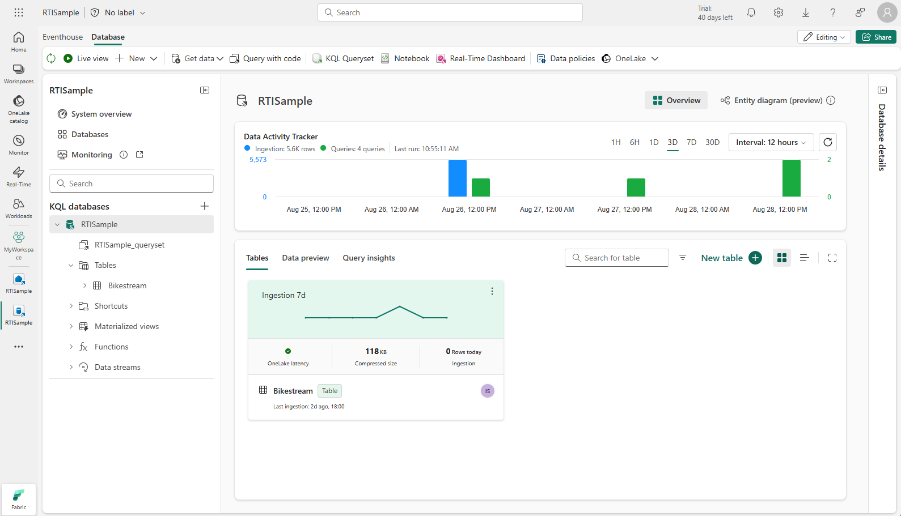

Eventhouses are where you store real-time data, often ingested by an eventstream and loaded into tables for further processing and analysis.



Within an eventhouse, you can create:

- **KQL databases**: real-time optimized data stores that host a collection of tables, stored functions, materialized views, and shortcuts.
- **KQL querysets**: Collections of KQL queries that you can use to work with data in KQL database tables. A KQL queryset supports queries written using Kusto Query Language (KQL) and a subset of the Transact-SQL language.

## Querying data

To query data from a table in a KQL database, you can use the **Kusto Query Language (KQL)**, which is used to write queries in Azure Data Explorer, Azure Monitor Log Analytics, Microsoft Sentinel, and Microsoft Fabric. KQL is a read-only request to process data and return results. KQL queries are made of one or more query statements.

### KQL query statements

A query statement consists of a table name followed by one or more operators that `take`, `filter`, `transform`, `aggregate`, or `join` data. For example, the following query retrieves 10 rows from a table named **stock**:

```kql
stock
| take 10
```

A more complex example might aggregate the data to find the average stock price per stock symbol in the last five minutes:

```kql
 stock
 | where ["time"] > ago(5m)
 | summarize avgPrice = avg(todecimal(bidPrice)) by symbol
 | project symbol, avgPrice
```

> [!TIP]
> To learn more about KQL, see **[Kusto Query Language (KQL) overview](/kusto/query/)**.

### Using SQL

KQL is optimized for querying large volumes of data, particularly with a time-based element; so it's a great fit for real-time data analysis. However, many data professionals are already familiar with SQL syntax; so KQL databases in eventhouses support a subset of common SQL expressions.

For example, the equivalent SQL to the *take 10* KQL query discussed previously would be:

```sql
SELECT TOP 10 * FROM stock;
```

### Using Copilot to help with queries

Microsoft Fabric includes Copilot for Real-Time Intelligence, which can help you write the queries you need to extract insights from your eventhouse data. Copilot uses AI to understand the information you're looking for and can generate the required query code for you.

> [!TIP]
> To learn more about Copilot for Real-Time Intelligence, see **[Copilot for Real-Time Intelligence](/fabric/get-started/copilot-real-time-intelligence)**.
