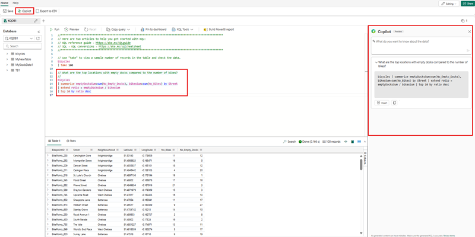
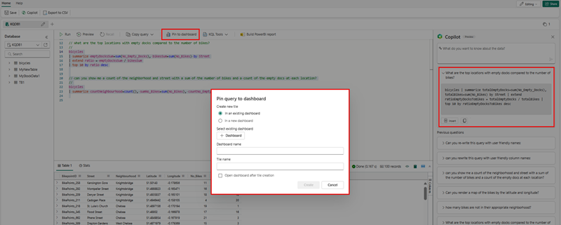
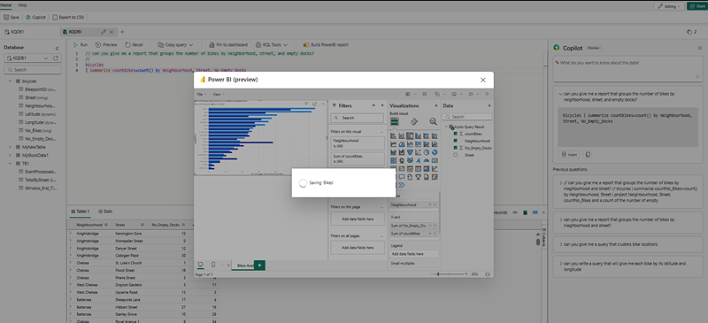

To query data from a table in a KQL database, you can use the **Kusto Query Language (KQL)**, which is used to write queries in Azure Data Explorer, Azure Monitor Log Analytics, Azure Sentinel, and Microsoft Fabric. KQL is a read-only request to process data and return results. KQL queries are made of one or more query statements.

A query statement consists of a table name followed by one or more operators that `take`, `filter`, `transform`, `aggregate`, or `join` data. For example:

KQL queries are created using relational operators to filter and transform data using a syntax similar to SQL. However, KQL syntax includes extensions that enable advanced text and pattern matching, statistical analysis, time-series projections, geo-spatial, and machine learning algorithms.

## Create and load tables in KQL

In most cases, you create tables and define their source using the graphical tools in Microsoft Fabric. However, you can use KQL statements to create and load tables.

To create a table and ingest data into it,  you can use the **`.create table`** command, which creates a new empty table with a specified schema. You need to provide the table name, the column names and their data types, and optionally some properties such as docstring or folder. For example:

```kusto
 .create table sales (
     SalesOrderNumber: string,
     SalesOrderLineItem: int,
     OrderDate: datetime,
     CustomerName: string,
     EmailAddress: string,
     Item: string,
     Quantity: int,
     UnitPrice: real,
     TaxAmount: real)
```

This command creates a table called **sales** with 9 columns of different data types.

You can ingest data into a table in multiple ways, including the `ingest into` command, as shown in this example:

```kql
 .ingest into table sales 'https://<StorageAccountName>.blob.core.windows.net/container/<TableName>.csv' 
 with (ignoreFirstRecord = true)
```

## Retrieve data from a table

A basic KQL query consists of selecting data from a table and applying filters and transformations to the data. In the following example, we're going to just query all the data from the `sales` table.

```kql
sales
```

The output from this query would look similar to the following example:

|SalesOrderNumber|SalesOrderLineItem|OrderDate|CustomerName|EmailAddress|Item|Quantity|UnitPrice|TaxAmount|
|--|--|--|--|--|--|--|--|--|
|SO43701|1|2019-07-01T00:00:00Z|Christy Zhu|christy12@adventure-works.com|Mountain-100 Silver 44|1|3399.99|271.9992|
|SO43704|1|2019-07-01T00:00:00Z|Julio Ruiz|julio1@adventure-works.com|Mountain-100 Black 48|1|3374.99|269.9992|
|SO43705|1|2019-07-01T00:00:00Z|Curtis Lu|curtis9@adventure-works.com|Mountain-100 Silver 38|1|3399.99|271.9992|
|SO43700|1|2019-07-01T00:00:00Z|Ruben Prasad|ruben10@adventure-works.com|Road-650 Black 62|1|699.0982|55.9279|
|SO43703|1|2019-07-01T00:00:00Z|Albert Alvarez|albert7@adventure-works.com|Road-150 Red 62|1|3578.27|286.2616|
|SO43697|1|2019-07-01T00:00:00Z|Cole Watson|cole1@adventure-works.com|Road-150 Red 62|1|3578.27|286.2616|
|SO43699|1|2019-07-01T00:00:00Z|Sydney Wright|sydney61@adventure-works.com|Mountain-100 Silver 44|1|3399.99|271.9992|
|...|...|...|...|...|...|...|...|...|

The query output can then be further analyzed using visualization tools or integrated with other programs to create custom dashboards and automated workflows.

The next example returns five rows from the sales table in the KQL database by using the `take` statement, which is a simple and quick way to view a small sample of records when browsing data.

```kql
sales
| take 5
```

This time, the results include five rows:

|SalesOrderNumber|SalesOrderLineItem|OrderDate|CustomerName|EmailAddress|Item|Quantity|UnitPrice|TaxAmount|
|--|--|--|--|--|--|--|--|--|
|SO43701|1|2019-07-01T00:00:00Z|Christy Zhu|christy12@adventure-works.com|Mountain-100 Silver 44|1|3399.99|271.9992|
|SO43704|1|2019-07-01T00:00:00Z|Julio Ruiz|julio1@adventure-works.com|Mountain-100 Black 48|1|3374.99|269.9992|
|SO43705|1|2019-07-01T00:00:00Z|Curtis Lu|curtis9@adventure-works.com|Mountain-100 Silver 38|1|3399.99|271.9992|
|SO43700|1|2019-07-01T00:00:00Z|Ruben Prasad|ruben10@adventure-works.com|Road-650 Black 62|1|699.0982|55.9279|
|SO43703|1|2019-07-01T00:00:00Z|Albert Alvarez|albert7@adventure-works.com|Road-150 Red 62|1|3578.27|286.2616|

## Filter with the `where` clause

In KQL, `where` is a clause that is used to filter the rows of a table based on a specified condition. The `where` clause is followed by a Boolean expression that evaluates to `true` or `false` for each row in the table. Rows for which the expression evaluates to `true` are included in the result, while rows for which the expression evaluates to `false` are excluded.

The `contains` operator is used in the `where` clause of the query to filter the rows of the ***sales*** table based on whether the **Item** column contains the string "Mountain-100".

```kql
sales
| where Item contains 'Mountain-100'
```

The results include only sales for items containing "Mountain-100":

|SalesOrderNumber|SalesOrderLineItem|OrderDate|CustomerName|EmailAddress|Item|Quantity|UnitPrice|TaxAmount|
|--|--|--|--|--|--|--|--|--|
|SO43701|1|2019-07-01T00:00:00Z|Christy Zhu|christy12@adventure-works.com|Mountain-100 Silver 44|1|3399.99|271.9992|
|SO43704|1|2019-07-01T00:00:00Z|Julio Ruiz|julio1@adventure-works.com|Mountain-100 Black 48|1|3374.99|269.9992|
|SO43705|1|2019-07-01T00:00:00Z|Curtis Lu|curtis9@adventure-works.com|Mountain-100 Silver 38|1|3399.99|271.9992|
|SO43699|1|2019-07-01T00:00:00Z|Sydney Wright|sydney61@adventure-works.com|Mountain-100 Silver 44|1|3399.99|271.9992|
|...|...|...|...|...|...|...|...|...|

KQL works well when you want to work with time series data. For example, to filter the sales data to show orders that occurred between two datetime values. You can take advantage of many time series functions, including `now()`, which returns the current time. This example returns all orders that occurred within the last day (24 hours).

```kql
sales
| where OrderDate between (now(-1d) .. now())
```

The results are filtered to include only orders within the specified time period.

|SalesOrderNumber|SalesOrderLineItem|OrderDate|CustomerName|EmailAddress|Item|Quantity|UnitPrice|TaxAmount|
|--|--|--|--|--|--|--|--|--|
|SO49171|1|2023-05-01T22:01:00Z|Mariah Foster|mariah21@adventure-works.com|Road-250 Black 48|1|2181.5625|174.525|
|SO49172|1|2021-05-01T23:55:00Z|Brian Howard|brian23@adventure-works.com|Road-250 Red 44|1|2443.35|195.468|
|SO49173|1|2021-05-02T01:10:00Z|Linda Alvarez|linda19@adventure-works.com|Mountain-200 Silver 38|1|2071.4196|165.7136|
|...|...|...|...|...|...|...|...|...|

## Sort query results

This query uses the `sort` operator to retrieve sales of "Mountain-100" items sorted so that the most recent sales are shown first:

```kql
sales
| where Item contains 'Mountain-100'
| sort by OrderDate desc
```

The results look similar to this example:

|SalesOrderNumber|SalesOrderLineItem|OrderDate|CustomerName|EmailAddress|Item|Quantity|UnitPrice|TaxAmount|
|--|--|--|--|--|--|--|--|--|
|SO43699|1|2023-05-01T00:00:00Z|Sydney Wright|sydney61@adventure-works.com|Mountain-100 Silver 44|1|3399.99|271.9992|
|SO43705|1|2023-04-20T00:00:00Z|Curtis Lu|curtis9@adventure-works.com|Mountain-100 Silver 38|1|3399.99|271.9992|
|SO43704|1|2023-04-12T00:00:00Z|Julio Ruiz|julio1@adventure-works.com|Mountain-100 Black 48|1|3374.99|269.9992|
|SO43701|1|2023-03-27T00:00:00Z|Christy Zhu|christy12@adventure-works.com|Mountain-100 Silver 44|1|3399.99|271.9992|
|...|...|...|...|...|...|...|...|...|

## Summarize and aggregate

You can use the `summarize` operator to group data by a column and create a new column with an aggregation for the group. For example, the following query returns the total quantity of each item that has sold.

```kql
sales
| summarize ItemsSold= sum(Quantity) by Item
```

The results include a column based on the aggregation function used (in this case `sum()`)

|Item|ItemsSold|
|--|--|
|Water Bottle - 30 oz.|2,097|
|Patch Kit/8 Patches|1,621|
|Mountain Tire Tube|1,581|
|Road Tire Tube|1,212|
|...|...|

## Using Copilot to assist with queryset queries
One new feature within the Microsoft Real-Time Intelligence tooling is the ability to use [Copilot for Real-Time Intelligence](/fabric/get-started/copilot-real-time-analytics?branch=main). Copilot gives you the ability to write natural language prompts instead of writing or having to quickly learn KQL queries. 

When your administrator enables Copilot, you see the option in the top menubar of your querysets. When you ask a question about your data, Copilot will generate the KQL Code to answer your question. You can create several queries within the queryset using this no-code approach to gather useful information for user consumption.

[ ](../media/copilot-large.png#lightbox)

Once you have queries within the queryset, you can then Pin them to an existing dashboard or create a new dashboard. To accomplish this, select the queries you want pinned, and then select the **Pin to dashboard**. This gives you a window to perform other actions.

[ ](../media/copilot-pin-to-dashboard-large.png#lightbox)

You also have the ability to add a queryset query to a Power BI Report by highlighting your preferred query and then selecting the **Build PowerBI report**.

[ ](../media/copilot-build-power-bi-report-large.png#lightbox)

> [!NOTE]
> You can only select one query at a time using the **Pin to Dashboard** or the **Build PowerBI report** but you can append dashboard elements to existing dashboards.
