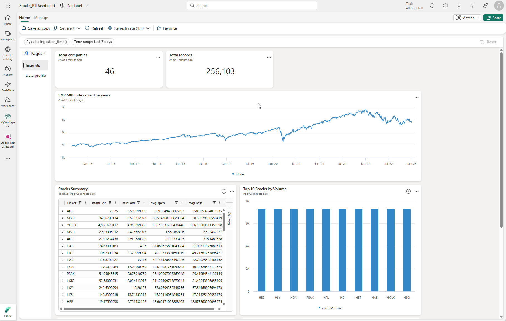
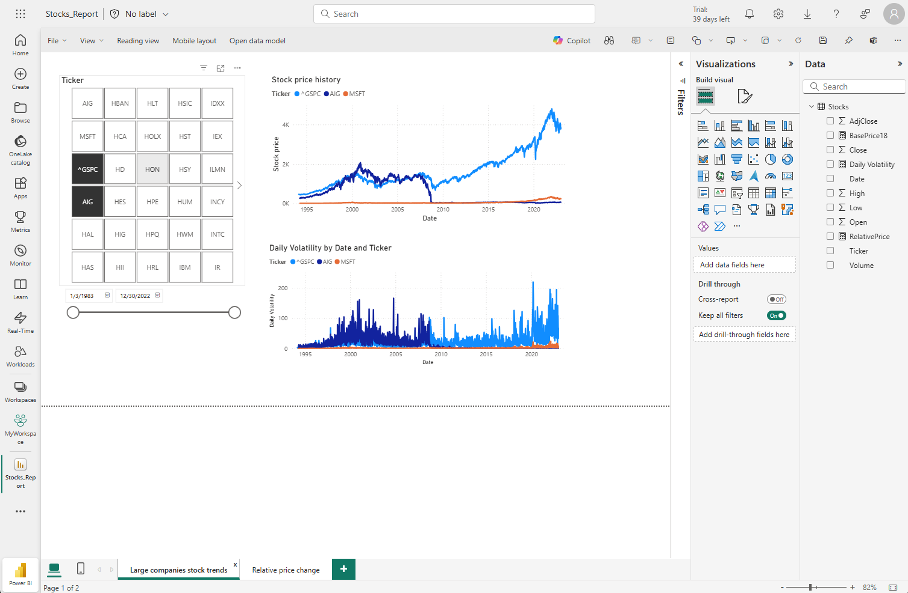

Real-time dashboards provide a way to pin data visualizations to a single visual interface, enabling you to surface real-time insights at a glance. Each *tile* in a dashboard shows you different information based on a KQL query that extracts real-time data from tables in an eventhouse.

## Creating a real-time dashboard

You can create a real-time dashboard in a workspace and then configure its source, or you can create one directly from a KQL queryset in an eventhouse.

> [!NOTE]
> To create a real-time dashboard, an administrator for your Fabric tenant must have enabled the feature at the tenant level

Dashboards are composed of one or more *tiles*, each containing a visualization based on a KQL query expression. By default, the visualization shows the results of the query as a table; but you can edit the tile to customize how the data is displayed.

When published, tiles enable users to explore the data they contain interactively by drilling into the data and using a visual interface to filter and aggregate the data, and change the visualization type.

> [!TIP]
> To learn more about real-time dashboards, see **[Create a Real-Time Dashboard](/fabric/real-time-intelligence/dashboard-real-time-create)**.

## Visualizing real-time data with Power BI

Since Power BI is a core component of the Fabric platform, you can also visualize data in a KQL database as a Power BI report.

> [!TIP]
> To learn more about using Power BI with real-time data in Fabric, see **[Visualize data in a Power BI report](/fabric/real-time-intelligence/create-powerbi-report)**.
