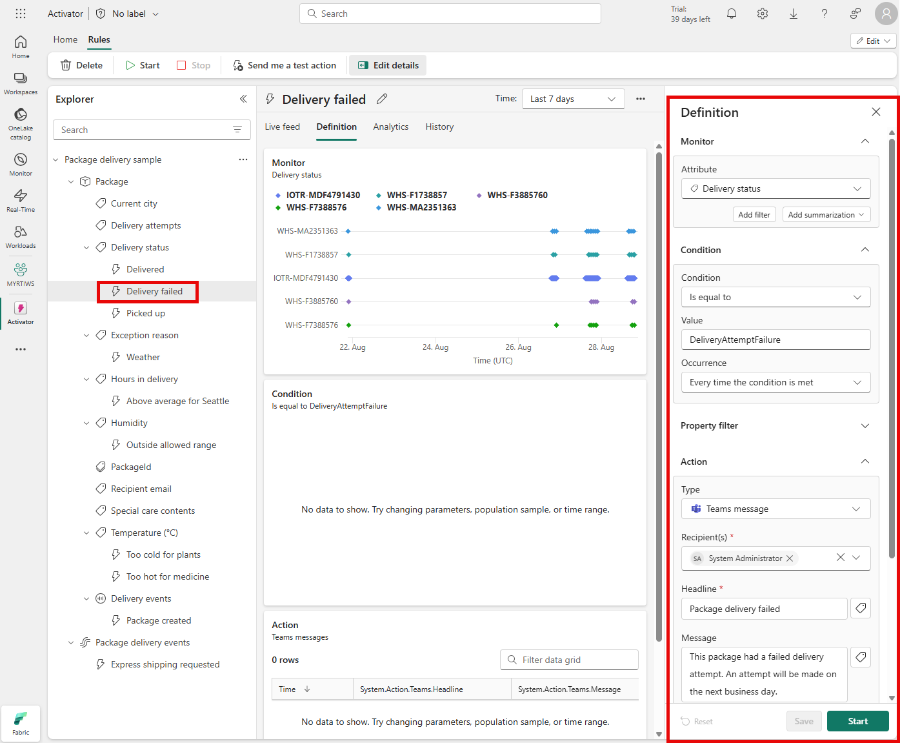

Activator is a technology in Microsoft Fabric that enables automated processing of events that trigger actions. For example, you can use Activator to notify you by email when a value in an eventstream deviates from a specific range or to run a notebook to perform some Spark-based data processing logic when a real-time dashboard is updated.

## Use cases for Activator

Activator can help you in various scenarios, such as dynamic inventory management, real-time customer engagement, and effective resource allocation in cloud environments. It's a potent tool for any circumstance that requires real-time data analysis and actions.

Use Activator to:

- Initiate marketing actions when product sales drop.
- Send notifications when temperature changes could affect perishable goods.
- Flag real-time issues affecting the user experience on apps and websites.
- Trigger alerts when a shipment hasn't been updated within an expected time frame.
- Send alerts when a customer's account balance crosses a certain threshold.
- Respond to anomalies or failures in data processing workflows immediately.
- Run ads when same-store sales decline.
- Alert store managers to move food from failing grocery store freezers before it spoils.

## Understand Activator key concepts

Activator operates based on four core concepts: *Events, Objects, Triggers,* and *Properties*. Understanding these four principles enables you to utilize the capabilities of Activator more effectively.

- **Events** - Activator considers all data sources as a sequence of events, each representing an observation about the status of a particular object. These events can occur frequently, as with IoT sensors, or less frequently, such as when monitoring package scanning in shipping locations.
- **Objects** - Activator’s objects can be tangible items like vehicles or packages, or abstract concepts like advertising campaigns or user sessions. When creating a Reflex item, you model the object by connecting one or more event streams. You then select a column for the object ID, and specifying the fields to become properties of the object.
- **Triggers** - Activator’s triggers are designed to monitor your events and data, initiating specified actions once certain conditions within these events are fulfilled.
- **Properties** - Activator’s properties are beneficial for reusing logic across various triggers. You could, for instance, set up a property on a smart lighting system to track the average brightness levels during the busiest hours of the day. This average could then be used in numerous triggers to correctly tweak the lighting and save energy.

## Interoperability with other Fabric experiences

- Activator can be used in multiple ways with *EventStreams*.
- One of Activator's strengths is its integration capabilities with other Fabric experiences. 
- Activator can ingest data from *EventStreams*, *Power BI* reports, and *Real-Time Dashboards*.

> [!TIP]
> For more information about Activator, see **[What is Activator?](/fabric/real-time-intelligence/data-activator/activator-introduction)**.
