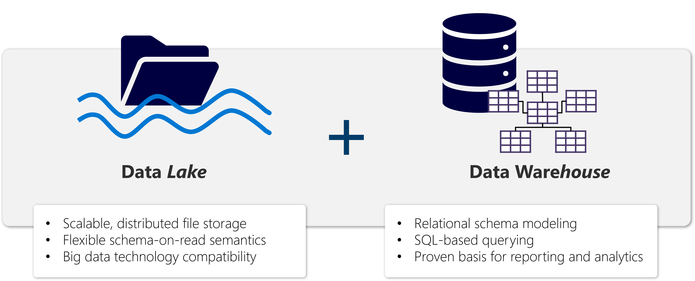

A **Lakehouse** presents as a database and is built on top of a data lake using Delta format tables. Lakehouses combine the SQL-based analytical capabilities of a relational data warehouse and the flexibility and scalability of a data lake. Lakehouses store all data formats and can be used with various analytics tools and programming languages. As cloud-based solutions, lakehouses can scale automatically and provide high availability and disaster recovery.

Some benefits of a lakehouse include:

- Lakehouses use Spark and SQL engines to process large-scale data and support machine learning or predictive modeling analytics.
- Lakehouse data is organized in a *schema-on-read format*, which means you define the schema as needed rather than having a predefined schema.
- Lakehouses support ACID (Atomicity, Consistency, Isolation, Durability) transactions through Delta Lake formatted tables for data consistency and integrity.
- Lakehouses are a single location for data engineers, data scientists, and data analysts to access and use data.

A Lakehouse is a great option if you want a scalable analytics solution that maintains data consistency. It's important to evaluate your specific requirements to determine which solution is the best fit.

## Microsoft Fabric lakehouses

In Microsoft Fabric, you can create a lakehouse in any *premium* tier workspace. After creating a lakehouse, you can load data - in any common format - from various sources; including local files, databases, or APIs. Data ingestion can also be automated using Data Factory Pipelines or Dataflows (Gen2) in Microsoft Fabric. Additionally, you can create Fabric *shortcuts* to data in external sources, such as Azure Data Lake Store Gen2 or a Microsoft OneLake location outside of the lakehouse's own storage. The Lakehouse Explorer enables you to browse files, folders, shortcuts, and tables; and view their contents within the Fabric platform.

After you've ingested the data into the Lakehouse, you can use Notebooks or Dataflows (Gen2) to explore and transform it.

> [!NOTE]
> Dataflows (Gen2) are based on Power Query - a familiar tool to data analysts using Excel or Power BI that provides visual representation of transformations as an alternative to traditional programming.

Data Factory Pipelines can be used to orchestrate Spark, Dataflow, and other activities; enabling you to implement complex data transformation processes.

After transforming your data, you can query it using SQL, use it to train machine learning models, perform real-time analytics, or develop reports in Power BI.

You can also apply data governance policies to your Lakehouse, such as data classification and access control.
