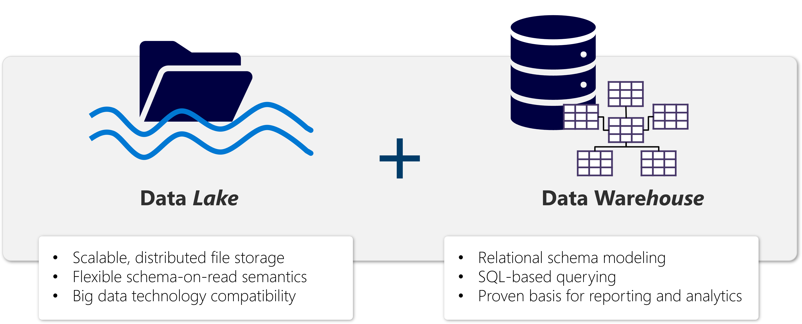

Traditional analytics architectures often force you to choose between two approaches. Data lakes offer flexibility and scalability but lack the structure and performance needed for business analytics. Data warehouses provide strong analytical capabilities but struggle with diverse data formats and can be costly to scale. **Lakehouses** bridge this gap by bringing database-like capabilities directly to your data lake, eliminating the need to maintain separate systems for different workloads.

## Understand lakehouse design

A lakehouse organizes data into two main areas: **Tables** and **Files**. Understanding this separation helps you design effective data workflows.

**Tables folder**: This folder contains Delta Lake tables that provide structured, queryable data. Tables in this folder:

- Support SQL queries through the SQL analytics endpoint
- Enforce schemas and support ACID transactions
- Can be accessed in Power BI for reporting
- Benefit from automatic optimization and maintenance

**Files folder**: This folder stores raw or semi-structured data files in their native format. Files in this folder:

- Support any file format (CSV, JSON, Parquet, images, documents)
- Provide flexibility for data exploration and processing
- Can be staged before transformation into tables
- Don't enforce schema or support direct SQL queries

This separation lets you maintain both raw data (for compliance or reprocessing) and structured tables (for analytics) within the same lakehouse. You can process files using Spark notebooks or Dataflows Gen2, then load the results into tables for querying and reporting.

## Understand Delta Lake tables

At the heart of a lakehouse are **Delta Lake tables**. Delta Lake is an open-source storage layer that brings reliability to data lakes. When you create a table in a lakehouse, the data is stored in Delta format in the underlying OneLake storage.

Delta Lake tables provide several key advantages:

- **ACID transactions**: Delta Lake ensures data consistency even when multiple users read and write data simultaneously.
- **Schema enforcement**: Delta Lake validates that the data you write matches the table schema, preventing corrupt data.
- **Time travel**: Delta Lake maintains a transaction log that lets you query previous versions of your data or roll back changes.
- **Efficient updates and deletes**: Unlike traditional data lake files, Delta tables support efficient update and delete operations.

Each Delta table consists of Parquet data files plus a transaction log that tracks all changes. This architecture enables both batch and streaming workloads to work reliably with the same data.

## Manage lakehouse access

When you centralize data in your lakehouse, protecting that data becomes critical. Fabric provides layered access controls to secure lakehouse data at multiple levels.

Use **workspace roles** for collaborators who need access to all items in the workspace. Use **item-level sharing** to grant read-only access for specific needs, such as analytics or Power BI report development.

For granular control, the SQL analytics endpoint supports **row-level** and **column-level security**, so you can restrict what specific users see when they query through SQL. If you organize tables into schemas, you can also apply **schema-level permissions** to control access by business domain.

Fabric lakehouses also support data governance features, including sensitivity labels, and can be extended by using Microsoft Purview with your Fabric tenant.

> [!NOTE]
> For more information, see the [Security in Microsoft Fabric](/fabric/security/security-overview) documentation.

## Build a foundation for intelligent analytics

The data you structure in a lakehouse doesn't just serve traditional reports and dashboards. Well-organized lakehouse data becomes the foundation that intelligent experiences across Microsoft Fabric depend on.

When you create tables with clear schemas, consistent naming conventions, and descriptive column names, you make that data accessible to both human analysts and AI-powered tools. Fabric IQ data agents can query your lakehouse tables through the SQL analytics endpoint, translating natural language questions into SQL queries that return accurate answers. The quality of those answers depends directly on how well you structure and document your data.

Copilot capabilities in Fabric also benefit from well-structured lakehouse data. Copilot in Power BI can generate reports and answer business questions when it can reason over clearly defined tables and relationships. The same lakehouse data can feed semantic models that support natural language exploration across Microsoft 365 experiences.

This means the investment you make in organizing, naming, and structuring lakehouse data pays dividends beyond your immediate analytics needs. Good data engineering practices in the lakehouse create a reusable foundation for intelligent experiences across the platform.
