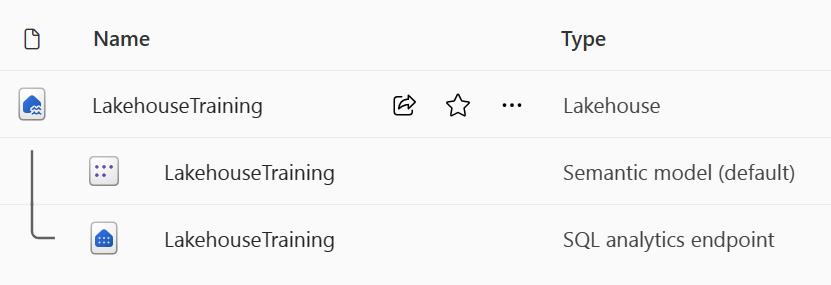

Now that you understand the core capabilities of a Microsoft Fabric Lakehouse, let's explore how to work with one.

## Create and explore a lakehouse

You create and configure a new Lakehouse in the Data Engineering workload. Each lakehouse produces three named items in the Fabric-enabled workspace:

- **Lakehouse** is the lakehouse storage and metadata, where you interact with files, folders, and table data.
- **Dataset (default)** is an automatically created data model based on the tables in the lakehouse. Power BI reports can be built from the dataset.
- **SQL Endpoint** is a read-only SQL endpoint through which you can connect and query data with Transact-SQL.

You can work with the data in the lakehouse in two modes:

- **Lakehouse** enables you to add and interact with tables, files, and folders in the Lakehouse.
- **SQL Endpoint** enables you to use SQL to query the tables in the lakehouse and manage its relational data model.

## Ingest data into a lakehouse

There are many ways to load data into a Fabric lakehouse, including:

- **Upload**: Upload local files or folders to the lakehouse. You can then explore and process the file data, and load the results into tables.

- **Dataflows (Gen2)**: Import and transform data from a range of sources using Power Query Online, and load it directly into a table in the lakehouse.

- **Notebooks**: Use notebooks in Fabric to ingest and transform data, and load it into tables or files in the lakehouse.

- **Data Factory pipelines**: Copy data and orchestrate data processing activities, loading the results into tables or files in the lakehouse.

## Access data using shortcuts

Another way to access and use data in Fabric is to use *shortcuts*. Shortcuts enable you to integrate data into your lakehouse while keeping it stored in external storage.

Shortcuts are useful when you need to source data that's in a different storage account or even a different cloud provider. Within your Lakehouse you can create shortcuts that point to different storage accounts and other Fabric items like data warehouses, KQL databases, and other Lakehouses.

Source data permissions and credentials are all managed by OneLake. When accessing data through a shortcut to another OneLake location, the identity of the calling user will be utilized to authorize access to the data in the target path of the shortcut. The user must have permissions in the target location to read the data.

Shortcuts can be created in both Lakehouses and KQL databases, and appear as a folder in the lake. This allows Spark, SQL, Real-Time Analytics and Analysis Services to all utilize shortcuts when querying data.

> [!NOTE]
> For more information on how to use shortcuts, see [OneLake shortcuts documentation](/fabric/onelake/onelake-shortcuts) in the Microsoft Fabric documentation.