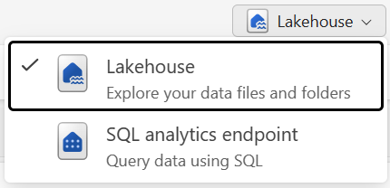

Your lakehouse needs data before it can deliver insights. Whether you're loading files from local storage, connecting to data across clouds, or building transformation pipelines, understanding ingestion and transformation techniques is essential. Start by creating a lakehouse and exploring the tools available to get your data in and ready for analysis.

## Create and explore a lakehouse

You create lakehouses within a Fabric-enabled workspace. A lakehouse has two main storage areas and a SQL analytics endpoint.

- **Tables**: Stores Delta Lake tables that provide structured, queryable data. These tables support SQL queries, enforce schemas, and provide ACID transaction guarantees. You can query them through the SQL analytics endpoint and analyze them with Power BI.
- **Files**: Stores raw or semi-structured data files in their native format (CSV, JSON, Parquet, and others). These files don't enforce a schema and provide flexibility for data exploration and processing before transformation into tables.

When you create a lakehouse, **schemas are enabled by default**. A schema named **dbo** is created automatically. Schemas let you organize tables into logical groups based on business domains or functions, such as `sales`, `marketing`, or `hr`. You can create other schemas to keep tables organized as your lakehouse grows. Schema-enabled lakehouses also support schema-level permissions and cross-workspace queries using the four-part namespace (`workspace.lakehouse.schema.table`).

> [!TIP]
> Clear schema organization improves discoverability for everyone working with the lakehouse, including Fabric IQ data agents that translate natural language questions into SQL queries against your tables.

You can work with your lakehouse in two modes:

- **Lakehouse explorer**: Add and interact with tables, files, and folders. This mode allows you to manage data, upload files, create tables, and make changes to your lakehouse. You can also add reference lakehouses to the explorer pane, so you can browse and manage tables across multiple lakehouses side by side.
- **SQL analytics endpoint**: Query Delta tables using T-SQL in *read-only* mode. You can create views, functions, and apply SQL security, but you can't modify the underlying data.

## Ingest data into a lakehouse

Ingesting data into your lakehouse is the first step in your ETL (extract, transform, load) process. Use any of the following methods to bring data into your lakehouse.

- **Upload**: Upload local files or folders directly through the lakehouse explorer.
- **Load to Table**: Select a file or folder in the lakehouse explorer and choose **Load to Table** to create a Delta table without writing code. This no-code option supports Parquet and CSV files, and lets you append or overwrite data in new or existing tables.
- **Dataflows Gen2**: Import and transform data using Power Query.
- **Notebooks**: Use Apache Spark to ingest, transform, and load data programmatically.
- **Data Factory pipelines**: Use the Copy data activity to move data from external sources.

Consider your data loading pattern when ingesting data. You can load raw data as files for staging and later processing, or load directly into tables when the data is already in a supported format.

> [!NOTE]
> For more information on ingestion options, see the [Options to get data into the Fabric Lakehouse](/fabric/data-engineering/load-data-lakehouse) documentation.

## Access data using shortcuts

Shortcuts let you integrate data into your lakehouse without copying it. A shortcut references data in external storage and makes it appear as a folder in your lakehouse.

Shortcuts are valuable because they reduce the amount of times you have to copy data. You can create a shortcut to a different storage account, another cloud provider, or other items in Fabric. OneLake manages source data permissions and credentials. When you access data through a shortcut to another OneLake location, OneLake uses your identity to authorize access to the target data. You must have permissions in the target location to read the data.

You can also create **schema shortcuts** that map an entire schema to a folder of Delta tables in another lakehouse or in Azure Data Lake Storage Gen2. All referenced tables appear as local tables within the schema.

> [!NOTE]
> For more information on how to use shortcuts, see the [OneLake shortcuts documentation](/fabric/onelake/onelake-shortcuts).

## Transform data in a lakehouse

Most data requires transformation before loading into tables. You might ingest raw data directly into the Files area, then transform and load it into tables. Regardless of your ETL design, you can transform and load data using the same tools available for ingestion.

- **Notebooks** are favored by data engineers familiar with programming languages including PySpark, SQL, and Scala. Copilot in notebooks can generate transformation code from natural language descriptions and explain existing Spark code.
- **Dataflows Gen2** are suited for users familiar with Power BI or Excel, since they use the Power Query interface.
- **Pipelines** provide a visual interface to orchestrate ETL processes. Pipelines can include multiple activities that run in sequence or parallel.
