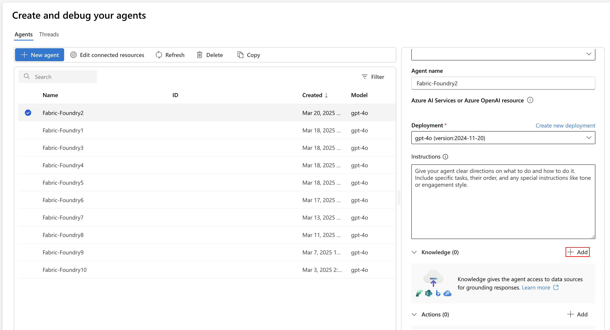
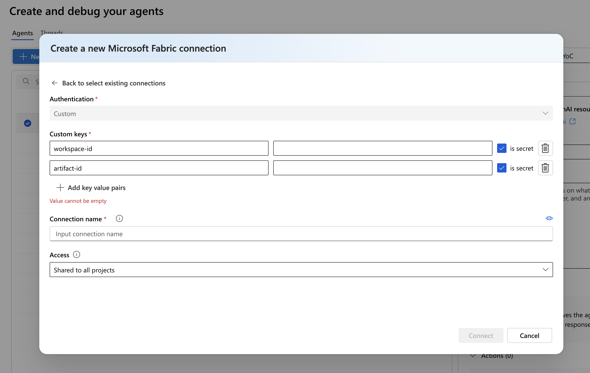

Integrating **Azure AI Foundry Agents** with **Microsoft Fabric data agents** enables organizations to use advanced data analysis and conversational AI capabilities. By connecting these two services, you can expose enterprise data through interactive Q&A, allowing users to explore and retrieve information via natural language.

## Why integrate Azure AI Foundry with Fabric Data Agents?

Integrating these services allows users to **interact with enterprise data** through chat interfaces, making data exploration more accessible. This approach helps users obtain **data-driven insights** that can support decision-making. 

With **Identity Passthrough** (On-Behalf-Of) authorization, all data access is governed by the user’s permissions, supporting enterprise security and compliance. 

The integration also reduces the steps required to **connect AI agents to enterprise data**, lowering development effort and complexity.

## Prerequisites

Before you begin, make sure that:

- You have created and **published** a Fabric data agent endpoint.
- Developers and end users in Azure AI Foundry have at least the Azure AI User **RBAC role** assigned.
- Developers and end users have at least **read access** to both the Fabric data agent and its underlying data sources.

## How to integrate Azure AI Foundry with Fabric Data Agents?

### 1. Create and publish a Fabric Data Agent

Build your Fabric data agent and publish it to obtain an endpoint. This endpoint is used to connect with the Azure AI Foundry Agent.

### 2. Configure access and permissions

Ensure all users and developers have the necessary roles and permissions as outlined in the prerequisites.

### 3. Update agent instructions

In Azure AI Foundry, update your agent’s instructions to describe the Fabric data agent and the type of data it provides. For example:

_“For customer and product sales related data, please use the Fabric tool.”_

### 4. Add the Fabric tool to your agent

In the Azure AI Foundry portal, navigate to your agent’s setup screen.
Under the “Knowledge” section, select “Add” and choose “Microsoft Fabric.”

> 

Follow the prompts to add the Fabric tool. You can only add one Fabric tool per agent.

To connect, you’ll need the workspace-id and artifact-id from your published Fabric data agent endpoint (for example, `https://fabric.microsoft.com/groups/<workspace_id>/aiskills/<artifact-id>`).

> 

Add these values as a new connection, marking them as secret if necessary.
Once added, you can select from existing connections for future use.

### 5. Test the integration

Once configured, test your agent by sending queries. Select **Try in playground** to test its performance. The agent determines when to leverage the Fabric data agent and generate responses based on the data the user is authorized to access.