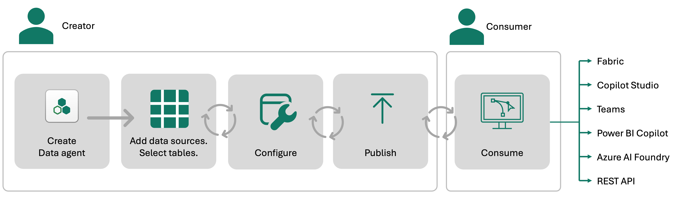
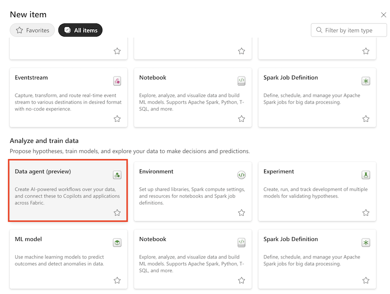
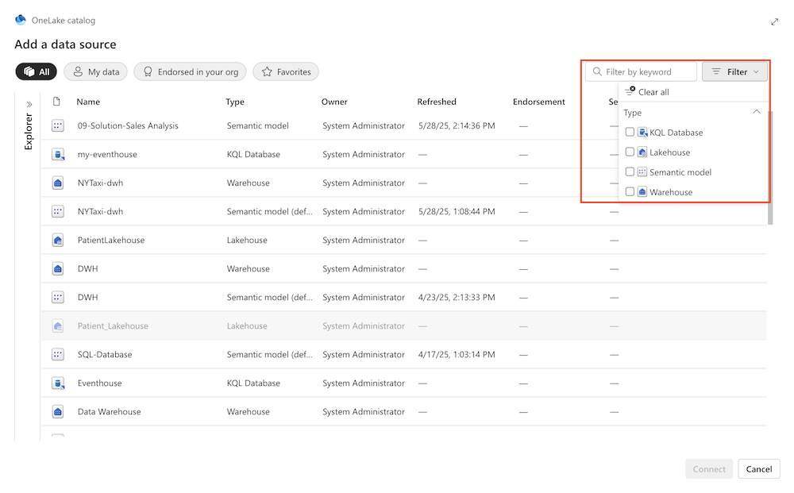
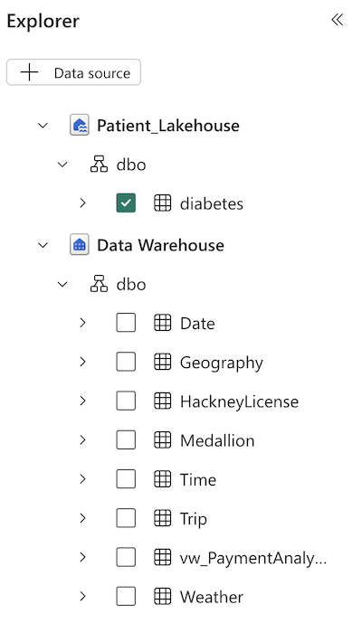
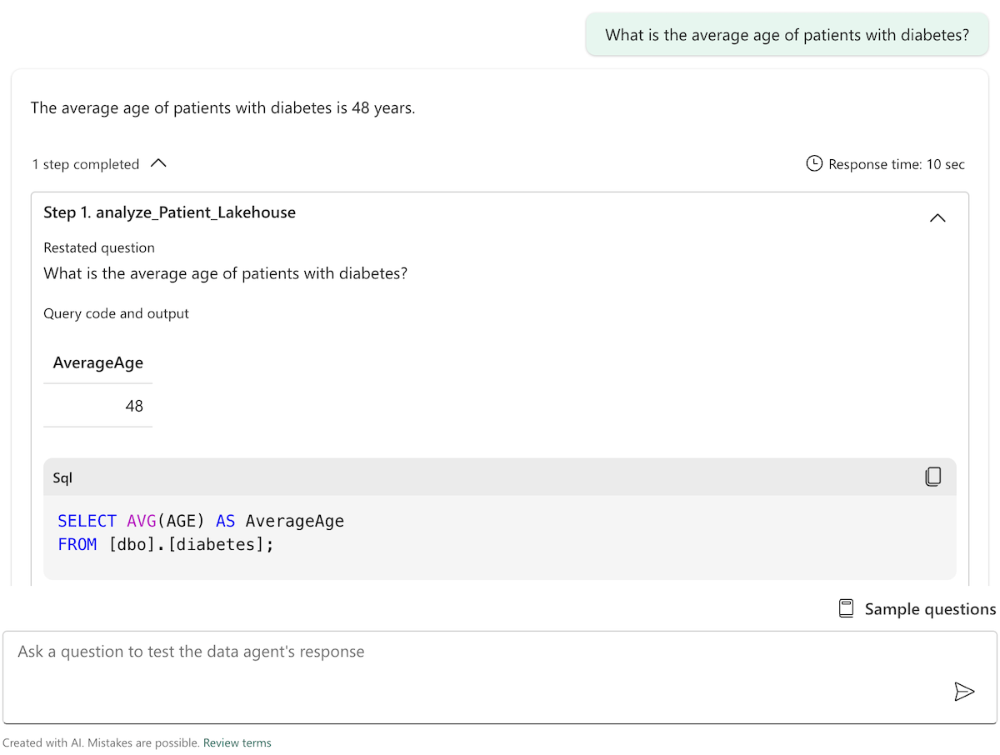
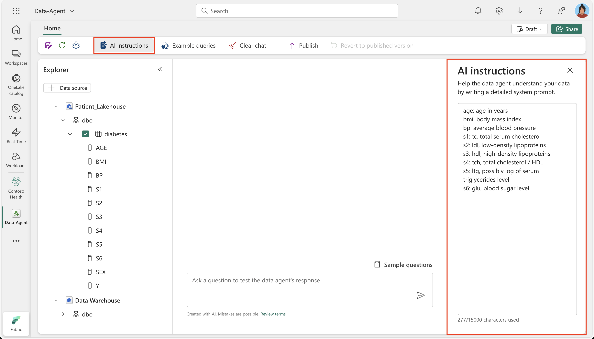
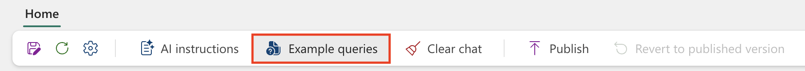
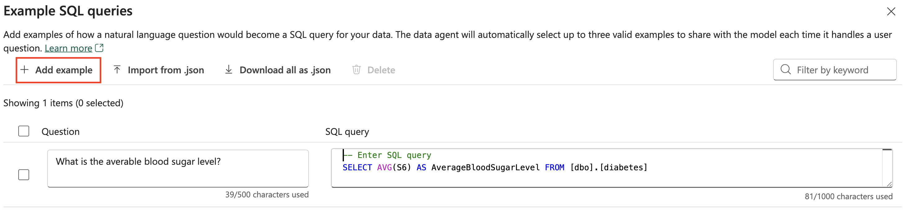
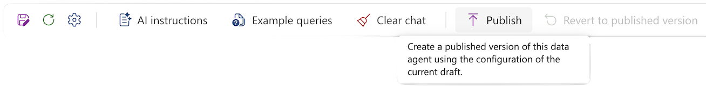

Let's walk through the process of creating, configuring, and consuming a Fabric data agent to enable conversational AI experiences for querying enterprise data.

There are several steps involved creating, validating, and sharing a Fabric data agent in Fabric. The process is straightforward and you can begin testing the Fabric data agent resources in minutes.

> [!div class="mx-imgBorder"]
> 

## Prerequisites

Before you begin, make sure that:

- You have a paid F2 or higher Fabric capacity.
- You have the [Fabric data agent tenant](/fabric/data-science/data-agent-tenant-settings) settings and [Copilot tenant switch](/fabric/data-science/data-agent-tenant-settings) enabled
- You have at least one of these: A warehouse, a lakehouse, one or more Power BI semantic models, or a KQL database with data.

## 1. Create a Data Agent

To begin, navigate to your workspace in Microsoft Fabric:
- Select the **"+ New Item"** button.
- Choose **"Fabric data agent"** from the list of options.
- Provide a meaningful name for your data agent and proceed to configure it.

> 

## 2. Select data sources

Once you’ve created a Fabric data agent, you can connect up to five data sources in any combination. These can include lakehouses, warehouses, Power BI semantic models, and KQL databases. For instance, you might add five Power BI semantic models, or mix sources—such as two semantic models, one lakehouse, and one KQL database.

Each data source must be added individually. Use the **OneLake catalog** to locate and connect the appropriate data sources. Use filters to narrow down the data source types for easier selection.

> 

After adding a data source, the Explorer in the left pane of the Fabric data agent page displays the available tables from each source. You can use the checkboxes to control which tables are accessible to the AI, as shown in the following screenshot.

> 

> [!TIP]
> 
> Make sure to use descriptive names for both tables and columns. Descriptive names help the AI generate more accurate and reliable queries.

### Ask questions

After you add the data sources and select the relevant tables for each data source, you can start asking questions. The agent analyzes the constructed prompt, and decides which tool to invoke to retrieve the answer. It uses natural language to SQL, DAX, or KQL to query the data.

The Fabric data agent currently doesn't perform advanced analytics, machine learning, or causal inference. It simply retrieves and processes structured data based on the user's query.

The agent displays both the final result and the intermediate steps it followed to arrive at the answer. This improves transparency and enables you to review and validate each step if needed. By expanding the dropdown, you can view the full sequence of steps the Fabric data agent took to generate the response, as shown in the following screenshot.

> 

> [!NOTE]
> 
> It’s important to note that the data agent only supports **read** operations—it doesn't create, update, or delete data.

## 3. Configure the Data Agent

The Fabric data agent provides various configuration options that let you tailor its behavior to better align with your organization’s needs. These settings offer flexibility and greater control over how data is processed and presented.

### Add Instructions

You can provide specific instructions to guide the AI’s behavior, helping it better understand how to interpret and respond to queries. Any predefined examples (for example, sample questions and answers) or specific instructions, help refine the AI's understanding of the question, and guide how the AI interacts with the data. You can write up to 15,000 characters in plain English-language text.

To add them in the Fabric data agent instructions pane, select **AI instructions** as shown in the following screenshot:

> 

For example, you can specify the exact data source to use for certain types of questions. Or, provide descriptions for certain tables or columns.

### Provide Example Queries

You can improve the accuracy of Fabric data agent responses by providing example queries specific to each data source, such as lakehouses, warehouses, or KQL databases. This technique, known as **Few-Shot Learning** in generative AI, helps guide the agent to produce answers that more closely match your expectations.

> [!NOTE]
> 
> Power BI semantic model data don't support adding sample query/question pairs at this time. 

To add or edit example queries, select the **Example queries** button to open the example queries pane, as shown in the following screenshot:

> 

For each data source, you can select **Add or edit example queries** to input the relevant examples, as shown in the following screenshot:

> 

## 4. Publish the Data Agent

When you're satisfied with the data agent's functionality, select **Publish** to make it accessible. Provide a detailed description of the data agent to help others understand its purpose and functionality. Other AI systems/orchestrators use the same description to effectively invoke the Fabric data agent in an automated way.

> 

After you publish the Fabric data agent, you'll have two versions of it. One version is the current draft version, which you can continue to refine and improve. The second version is the published version, which you can share with your colleagues who want to query the Fabric data agent to get answers to their questions. 

## 5. Consume the Data Agent

The published data agent can be consumed in various platforms, including:

- **Microsoft Fabric**
- **Copilot Studio**
- **Microsoft Teams**
- **Power BI Copilot**
- **Azure AI Foundry**
- **Custom applications via API**

These integrations enable conversational AI experiences, allowing users to query data in natural language and retrieve actionable insights.

## Best pactices

**Use Clear Instructions**: Ensure that the instructions provided to the AI are clear and concise. This helps in generating accurate responses. If your AI resource consistently misinterprets certain words, acronyms, or terms, you can try to provide clear definitions in this section, to ensure that the AI understands and processes them correctly. This becomes especially useful for domain-specific terminology or unique business jargon.

The Fabric data agent is currently designed to handle **simple queries**. Complex queries that require many joins or sophisticated logic tend to have lower reliability.

Don't include **too many columns and tables** in one Fabric data agent, as this might lower Fabric data agent performance.

The **Fabric data agent sharing** feature allows you to share your Fabric data agents with others, with a range of permission models. When you share the Fabric data agent, you must also share access to the underlying data it uses. The Fabric data agent honors all user permissions to the data, including Row-Level Security (RLS) and Column-Level Security (CLS).

