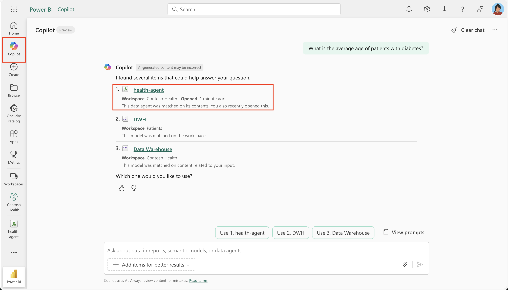
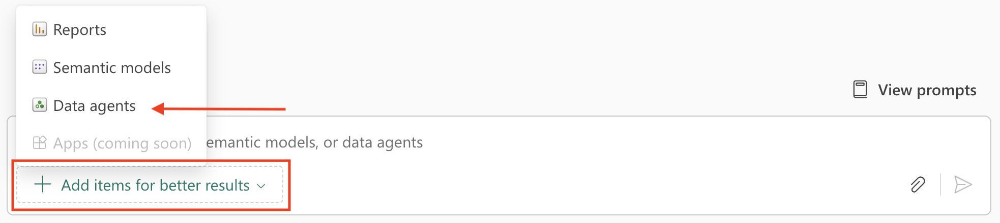

Copilot in Power BI enables users to ask natural language questions and receive answers from their available Fabric resources. With Copilot, you can interact with data across Power BI semantic models, reports, and Fabric data agents in a single conversational interface. This integration reduces the need to switch between different items.

> [!NOTE]
> This feature is currently in preview.

## Prerequisites

- Access to Copilot in Power BI
- Required permissions for the relevant Fabric data agents and Power BI items

## Ways to Use Fabric data agents in Copilot

There are two ways you can use Fabric data agents with Power BI. Either, you use Copilot search to find and invoke a Fabric data agent, or, if you already know which data agent to use, you can manually add that data agent to the Copilot session.

### Use Copilot search to find and invoke a Fabric data agent

When you ask a question in Copilot, it automatically scans all items you have access to, such as Power BI semantic models, Power BI reports, and Fabric data agents. Based on your query, Copilot ranks and suggests the most relevant items. You can then choose from these suggestions to receive the most appropriate answer.

> 

### Directly add a Fabric data agent

If you already know which data agent you want to use, you can manually add it to your Copilot session. Start by selecting **Add items for better results**, then choose **Data agents** to open the OneLake catalog. 

From there, select the desired data agent from the list. Once added, the data agent is attached to your question, and Copilot will use it for relevant follow-up questions. 

> 

If your question falls outside the scope of the attached data agent, you may need to indicate a topic change so Copilot can search across all available resources again.

## Interaction flow with a Fabric data agent

When you interact with a Fabric data agent through Copilot in Power BI, the following steps occur:

1. **Rephrase the question:** Copilot may rephrase your question for clarity or context.

2. **Send the query:** The question is sent to the selected Fabric data agent.

3. **Answer retrieval:** The data agent identifies the most relevant data source (such as a lakehouse, warehouse, semantic model, or KQL database) and queries it. Data security protocols like Row-Level Security (RLS) and Column-Level Security (CLS) are enforced based on your permissions.

4. **Response delivery:** The Fabric data agent sends the answer back to Copilot.

5. **User presentation:** Copilot presents the answer directly in the conversation interface.
