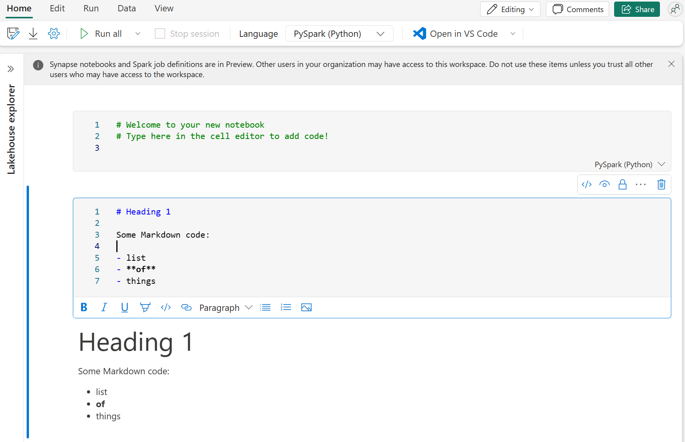

 

First, let's discuss what Fabric notebooks offer over the other ingestion options. Unlike manual uploads, notebooks provide automation, ensuring a smooth and systematic approach. Dataflows offer a UI experience; however, they aren't as performant with large datasets. Pipelines allow you to orchestrate the Copy Data, and may require dataflows or notebooks for transformations. Therefore, notebooks provide a comprehensive, automated solution for ingestion and transformation.

## Explore Fabric notebooks

Fabric notebooks can be easily created in many parts of the Fabric service. Notebooks are stored in the workspace they're created from, which may not be the same workspace where the lakehouse exists.

Similar to other notebooks, Fabric notebooks allow you to have multiple code or Markdown cells. Notebooks are excellent for initial testing, as you can see the code output directly in-line with the code and make quick changes. You can also run individual cells, freeze cells, or run all cells in a notebook.



By default, Fabric notebooks use PySpark, which uses the Spark engine to allow a multi-threaded, distributed transaction for speedy processes. You can use Html, Spark (Scala), Spark SQL, and SparkR (R) as well, however they may not have the full benefit of the distributed system.

## Connect to external sources

Now that we know the notebook basics, let's look at connecting to external sources. An excellent ethos in programming is to do the easy way first. Fabric Notebooks offer intuitive [**shortcuts**](/fabric/onelake/onelake-shortcuts) for certain platforms. However, if your data resides elsewhere, you need another method. Here's a basic example of connecting to Azure blob storage with Spark:

```python
# Azure Blob Storage access info
blob_account_name = "azureopendatastorage"
blob_container_name = "nyctlc"
blob_relative_path = "yellow"
blob_sas_token = "CountingCrows" 

# Construct the path for connection
wasbs_path = f'wasbs://{blob_container_name}@{blob_account_name}.blob.core.windows.net/{blob_relative_path}?{blob_sas_token}'
print('Blob Storage connection path:', wasbs_path)

# Read parquet data from Azure Blob Storage path
blob_df = spark.read.parquet(wasbs_path)

# Show the Azure Blob DataFrame
blob_df.show()
```

`Blob Storage connection path: wasbs://nyctlc@azureopendatastorage.blob.core.windows.net/yellow?CountingCrows`

## Configure alternate authentication

The previous example connects to the source and reads the data into a data frame. Depending on your source, you may need a different authentication type, such as Service Principal, OAuth, etc. Here's an example connecting to an Azure SQL Database with a Service Principal:

```Python
# Azure SQL Database JDBC URL with Service Principal (Active Directory Integrated)
jdbc_url = "jdbc:sqlserver://wisteria.database.windows.net:1433;database=ADW2016;encrypt=true;trustServerCertificate=false;hostNameInCertificate=*.database.windows.net;loginTimeout=30;Authentication=ActiveDirectoryIntegrated"
client_id = "YOUR_CLIENT_ID"
client_secret = "YOUR_CLIENT_SECRET"
tenant_id = "YOUR_TENANT_ID"

properties = {
    "user": client_id,
    "password": client_secret,
    "driver": "com.microsoft.sqlserver.jdbc.SQLServerDriver",
    "tenantId": tenant_id
}

# Read entire table from Azure SQL Database
table_name = "YourTableName"
sql_df = spark.read.jdbc(url=jdbc_url, table=table_name, properties=properties)

# Show the Azure SQL DataFrame
sql_df.show()
```

We have now successfully connected to external data with Spark and read it into a data frame in a Fabric notebook. We discuss how to load the data into a file or table next.
