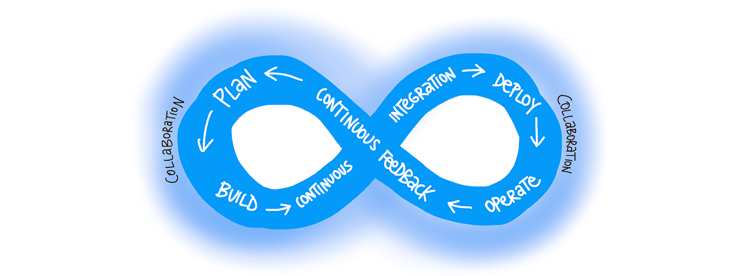
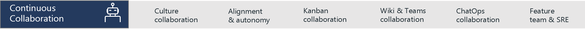
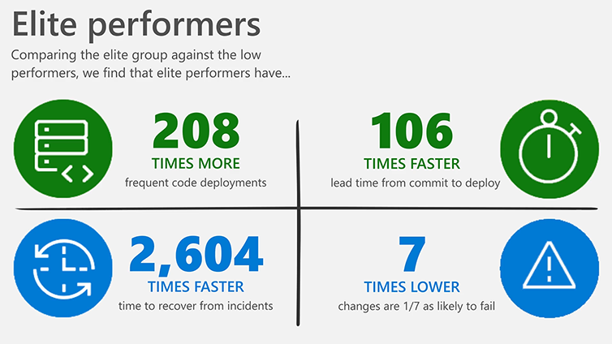

**DevOps is the union of people, process, and products to enable continuous delivery of value to our end users.**

Typically, the goal for Development is to deliver more features faster, and the goal of Operations is to achieve better system stability. DevOps aligns these disciplines by using a framework of best practices proven to increase speed to market while improving system stability.

For Microsoft, DevOps encompasses the entire software delivery lifecycle, from idea to applications running in production.

### One holistic DevOps view for Microsoft Services

After considerable debate, collaboration, and refinement, we agreed on the following DevOps view for Microsoft Services:

- First, we identified **four pillars** that support DevOps, derived from People/Process/Product: Culture, Lean Product, Architecture, and Technology.
- Then we identified **eight functions, or capabilities**, which include various practices within each function or across functions:
  - Continuous Planning
  - Continuous Integration
  - Continuous Delivery
  - Continuous Operations
  - Continuous Quality
  - Continuous Security
  - Continuous Collaboration
  - Continuous Improvement

**What is new?** Continuous Everything. The process is a journey and requires a growth mindset to continually evolve and improve.

> [!NOTE]
> Please note that each capability lists example practices; it is not an exhaustive list.

### DevOps capabilities and practices

Here’s our DevOps taxonomy of capabilities and practices that go into a world-class DevOps practice.

:::row:::
   :::column span="":::
      
   :::column-end:::
   :::column span="":::
      
   :::column-end:::
   :::column span="":::
      
   :::column-end:::
   :::column span="":::
      
   :::column-end:::
:::row-end:::
:::row:::
   :::column span="4":::
      
   :::column-end:::
:::row-end:::
:::row:::
   :::column span="4":::
      
   :::column-end:::
:::row-end:::
:::row:::
   :::column span="4":::
      
   :::column-end:::
:::row-end:::
:::row:::
   :::column span="4":::
      
   :::column-end:::
:::row-end:::

> [!NOTE]
> Please note that each capability lists example practices; it is not an exhaustive list.

### DevOps benefits

The 2019 State of DevOps Report is based on research that provides the most comprehensive view of the growing DevOps industry.

According to this report, elite performers:

- Deploy code **208 times more frequently** than low performers
- Have **106 times faster** change lead time from commit to deploy than low performers
- Change failure rates that are **seven times better** than low performers
- Restore service **2,604 times faster** than low performers

These results show that by focusing on DevOps values, teams aren't trading speed to market for stability. They can achieve both at the same time.

