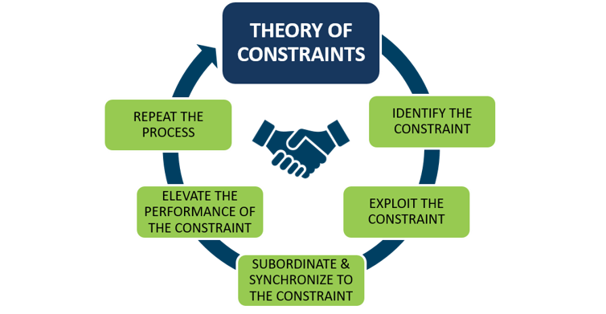

**Culture** is an essential foundation to DevOps because it requires a growth and continuous learning mindset to succeed. Leadership support is one of the critical elements to its success.

Before we discuss what DevOps culture looks like, let’s consider the role of culture in an organization’s ability to adopt DevOps. According to Gartner:

>Cultural resistance and low levels of process discipline will create significant failure rates for DevOps initiatives.

Gene Kim, author of the *Phoenix Project and DevOps Handbook*, says:

>DevOps is a journey full of challenges, and rarely are those challenges simply because of the wrong technology or the wrong processes. In fact, the biggest and most difficult obstacles tend to be cultural. And, if you get the culture wrong, even if you get everything else right, you’re headed for frustration, extra cost, and likely failure.

### What is culture?

For our purposes, culture is the social heritage of a group. It's a pattern of responses discovered, developed, or invented during the group's history of handling problems that arise from interactions among its members, and between them and their environment.

Culture determines:

- What is acceptable or unacceptable.
- What is important or unimportant.
- What is right or wrong.
- What is workable or unworkable.
- Who you hire, fire, and promote.

### Why do DevOps initiatives fail?

Gartner research shows that through 2023, 90% of DevOps initiatives will fail because of the **limitations of management approaches used by leadership**.

> [!IMPORTANT]
> The primary responsibility of leadership is the creation of an environment that enables a successful DevOps culture.

 People who work in creative endeavors don’t need “beer in the break room” to motivate them. Creative people instead need mastery, autonomy, and **purpose**.

 When people asked what is the most important part of Microsoft's success – is it vision, strategy, or execution? – Microsoft CEO Satya Nadella said they're all important, but in the end, it was their purpose and growth mindset.

### The 12 examples of a DevOps mindset

Here are 12 examples of a **DevOps mindset**: leadership mindset, customer focused, lean thinking, system thinking, remove waste, theory of constraints, alignment and autonomy, shift-left testing, security mindset, hypothesis-driven development, live-site, and measure outcomes, not activity mindset.

#### Leadership mindset

Gartner makes the following recommendations:

- Identify transformational leaders by prioritizing specific behavioral characteristics necessary to lead a DevOps initiative, placing less emphasis on technical skillsets.
- Develop transformational leaders by embracing failure as a learning opportunity.
- Manage transformational leaders by empowering them to make decisions free of second-guessing and by providing clear goals and key metrics.

Because DevOps is transformative, Infrastructure & Operations (I&O) leaders must identify candidates who are visionary, adaptive, motivating, empowering, and accountable.

#### Customer-focused mindset

What does it mean to be **customer-focused**?

- Listen to and communicate with our customers
- Measure what is important
- Embrace the red in Production
- Build, measure, and learn
- Use feature toggling for graceful deployment
- Collect data broadly but carefully

#### Lean-thinking mindset

**Value:** The lean-thinking mindset begins with a detailed understanding of what value the customer assigns to product and services. The organization focuses on eliminating waste so they can deliver the value the customer expects at the highest level of profitability.

The value stream encompasses the product’s entire lifecycle, from the raw materials through the customer’s use, and eventual disposal of the product. To eliminate waste, the ultimate goal of Lean, there must be an accurate and complete understanding of the value stream.

**Flow:** Understanding flow is essential to eliminate waste. If the value stream stops moving forward at any point, waste is the inevitable by-product. The lean manufacturing principle of flow is about creating a value chain without interruption in the production process and where each activity is in step with every other.

**Pull:** The lean principle of pull helps ensure flow by making sure that nothing is made ahead of time, which builds up a work-in-process inventory and stops the synchronized flow. Rather than using the traditional American manufacturing approach of pushing work through based on a forecast and schedule, the pull approach dictates that nothing is made until the customer orders it.

**Perfection:** Lean practitioners strive to achieve perfection. The march toward perfect process happens as continuous improvements address root causes of quality problems and production waste. The relentless pursuit of perfection is what drives users of the approach to dig deeper, measure more, and change more often than their competitors.

#### System-thinking mindset

A **system-thinking mindset** emphasizes the performance of the entire system, not the performance of a specific silo of work or department.

Focus on all business value streams that are enabled by IT. In other words, it begins when requirements are identified by the business or IT, built in Development, and then transitioned into IT Operations, where the value is then delivered to the customer as a service.

#### Removing waste mindset

A **lean mindset** focuses on identifying and removing the seven deadly wastes that aren't of value to the customer:

- Partially Done Work
- Extra Process
- Extra Features
- Task Switching
- Waiting
- Motion
- Defects

#### Thinking theory of constraints

The **theory of constraints** is a methodology for identifying and removing constraints (also referred to as bottlenecks) that limit throughput. In practice, start by identifying the most important factor that stands in the way of achieving a goal. Work to minimize that factor until it's not a limiting one anymore.

#### Balancing alignment and autonomy mindsets

It’s necessary to achieve a balance between alignment and autonomy. Too much alignment leads to less innovation, less motivation, and less collaboration. Too much autonomy leads to more chaos, confusion, and conflict, while also leading to less consistency.

#### Shift-left testing mindset

**Shift-left** testing is an approach used to speed software testing and facilitate development by moving the testing process to an earlier point in the development cycle. Shifting left is a reference to moving testing to the left on a timeline. It helps build quality and identify issues earlier to reduce the waste of rework.

Shift-left testing is designed to be a better model for fast-lane development because traditional testing models that wait until later in the development cycle can bottleneck development.

#### Security mindset

To achieve a **security mindset**, teams need to:

- Promote awareness.
- Define their principles.
- Live by their principles.

#### Hypothesis-driven development mindset

Using a Lean Product approach to develop in shorter cycles and using **hypothesis-driven development** helps create small experiments to get feedback from our customers and data-driven decisions.

The hypothesis-driven development approach:

- Starts from an assumption – something accepted as true without proof
- Articulates the assumption to be tested
- Performs experimentation and testing
- Examines evidence – an indicator of the outcome

#### Live-site mindset

For a DevOps team, there’s no place like production. Everything they do is about making customers’ experience better.

To create a stable, high-performance site, apply Continuous Operations best practices in a disciplined and ongoing manner to keep the site healthy.

Key factors of our **live-site culture** include:

- Detect before customers feel the pain
- Drive with data
- Root cause is the key
- Configure as code
- Automate to survive
- Be open and learn

#### Measure outcome, not activity mindset

The way you measure people will lead how people behave. You should measure usage, velocity and live site health, not lines of code, team burndown, and number of bugs found.

> [!TIP]
> Be careful with your measurement to lead to an optimal outcome!
