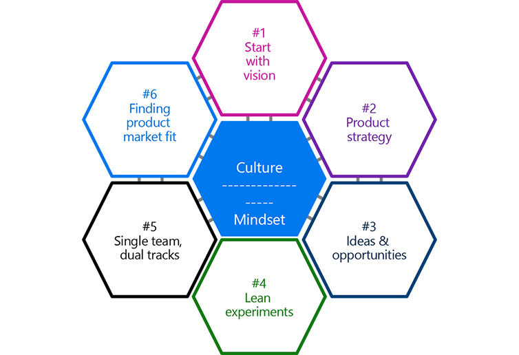

The next pillar in our view of DevOps is **Lean Product**.

According to Richard Banfield, great product companies have four things in common:

- **Vision** is about creating a vivid story of the future we envision with our product in the world in 2-5 years.
- **Strategy** is the set of steps that we believe we need to get there. And, our plan is to change course as we learn more along the way.
- **Priorities** help us focus on delivering the highest business value items first, and on executing in an incremental fashion.
- Measuring **outcomes** aligns our hypotheses with reality and helps us make better data-driven decisions.

> [!TIP]
> Lean Product Management arose from the need for a clear product vision and a product strategy.

When envisioning a product, we all tend to like our own ideas, but we can't assess how good those ideas actually are. Moreover, all of us are susceptible to confirmation bias - our beliefs are often focused on the information that upholds them while at the same time tending to ignore the information that challenges them. We need a scientific method to test and measure the value a product improvement would bring.

> [!IMPORTANT]
> Using Lean Product Discovery focuses on solving the right problems, finding value, and confirming that our product roadmaps align with customer needs.

### Why Lean Product Management?

The highest form of waste is building a product that no one will buy or use!

> [!IMPORTANT]
> Lean Product Management is critical because the impact of building the wrong product has an exponential impact on waste as it is planned and executed.

If the right problems aren’t being solved for our customers, we aren't building based on value.

Consider a discussion between a consultant and the customer, where the ever-confident consultant provides a precise estimate:

>**Consultant:** We can build this product for you in 44,562.524 hours. Our delivery team is standing by to start.
>
>**Customer:** Great! Which problem are you trying to solve?

When defining the scope of a product in a Services world, a precise solution to an approximate problem is very dangerous. It’s impossible to estimate the solution to a problem that has no prior answer or isn’t well understood. Products need to be discovered, not just defined.

Innovation can’t be easily estimated. As a team gets deeper into problem solving, they'll have a better understanding of the problem and the possible solutions or tradeoffs. The more innovation required, the more uncertain the scope.

Just because you have a precise estimate, don’t assume it’s accurate. Make sure the estimate is supported by discovery.

> [!IMPORTANT]
> Lean Product Management prevents you from creating false precision.

### What is Lean Product Management?

> [!IMPORTANT]
> **Lean Product Management** refers to a way of discovering products that embraces user-centrism. It acknowledges that product teams are on a continuous journey of solving well-understood user problems in as lean a manner as possible.
>
> Lean Product Management separates the concerns of **why** a product matters, **what** the product is, and **how** it is built.

**The Lean Product Management manifesto** values:

- Customer problems and needs over internal requirements
- Data-driven experiments over preconceived solutions
- Customer problem roadmaps over feature roadmaps
- Idea generation and collaboration over solution mandates

### Big concepts and principles of Lean Product Management

:::row:::
   :::column span="":::
      A principle is a fundamental truth or proposition that serves as the foundation for a system of belief or behavior or for a chain of reasoning.

There are six principles of Lean Product Management:

1. Start with vision
1. Product strategy
1. Ideas and opportunities
1. Lean experiments
1. Single team, dual tracks
1. Finding product market fit.

#### Principle #1: Start with vision

The first Lean Product Management principle is that it’s important to **start with a vision**. Tell a **vivid story**, perhaps in a diagram or a video. Then use the story to spark ideas, set a clear destination, and unite the team.

#### Principle #2: Product strategy

The second Lean Product Management principle is that **product strategy** is the expected path to get from today to the vision. But because nothing ever goes as planned, plan for detours and alternate routes and focus on delivering business outcomes.

#### Principle #3: Ideas and opportunities

The third Lean Product Management principle uses the Lean Discovery framework, which helps sort the generated ideas and opportunities to validate and align the product roadmap with customers.

A backlog is usually just an organized list of ideas, some good, and some bad. But will they drive toward well-identified business outcomes?

An opportunity backlog is an organized set of **ideas and opportunities** for the team to explore in Product Discovery.

The output of Product Discovery is the product backlog, which is an organized set of work that is **value-tested** for the team to build in delivery.

#### Principle #4: Lean experiments

The fourth Lean Product Management principle advocates lean experiments.

Using hypothesis-driven experimentation during the development process helps validate the business impact of changes by doing small experiments and collecting user data.

#### Principle #5: Single team, dual tracks

The fifth Lean Product Management principle is about the **dual tracks of discovery and delivery**.

Dual-track agile is a development methodology that builds on agile, with a discovery and a delivery track running in parallel. 

The **discovery track** runs one or two sprints ahead of the delivery track. You run experiments to invalidate ideas that might otherwise contribute to developing a product that's not as useful as it could be, and you discover potential challenges.

The **delivery track** executes agile product development sprints to build on the successful findings from the discovery track.

You focus on running experiments to invalidate ideas that might otherwise pass as valid and contribute to developing a product that's not as useful as it could be. Experiments that validate ideas become prototypes, which can be used as a specification.

Using the Lean Discovery process as part of a product sprint helps to maximize feature impact and minimize waste before diving into delivery.

#### Principle # 6: Finding product market fit

Finally, the sixth Lean Product Management principle says that understanding your customer also means knowing where the market is in its lifecycle.

Assessing **product market fit** requires patience and tracking as your customers react in various phases of adoption. For example, a Minimum Viable Product (MVP) is an important milestone, but it's tough to prove if it was enough. Product market fit is about reaching real adoption targets, such as revenue target, number of subscriptions, and so on.

Innovators influence early adopters, early adopters influence early majority, and so on. Partner with innovators to help discover the early product, and to bring credibility to the later users.
