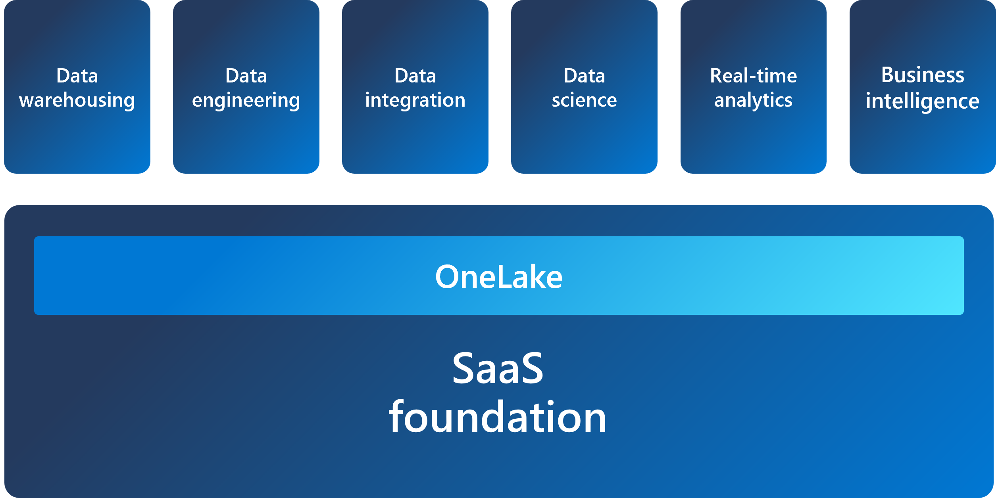
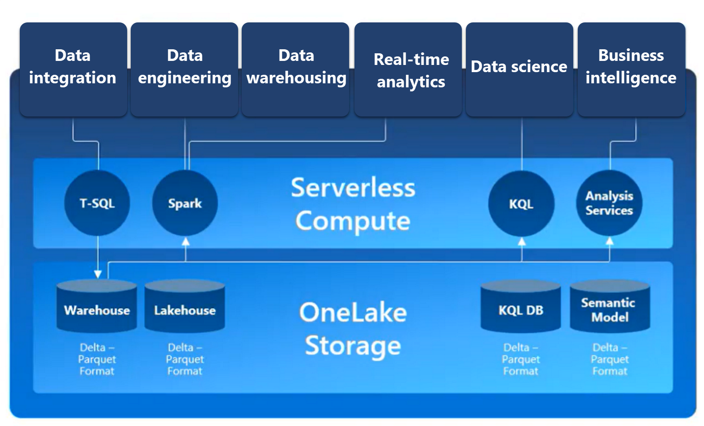

Scalable analytics can be complex, fragmented, and expensive. With Microsoft Fabric, you don't have to spend all of your time combining various services from different vendors. Instead, you can use a single product that is easy to understand, set up, create, and manage. Fabric offers persona-optimized experiences and tools in an integrated user interface.

In addition to a simple, shared user experience, Fabric is a unified *software-as-a-service* (SaaS) offering, with all your data stored in a single open format in OneLake. OneLake is accessible by all of the analytics engines in the platform. Fabric offers scalability, cost-effectiveness, accessibility from anywhere with an internet connection, and continuous updates and maintenance provided by Microsoft.

## Explore OneLake

*OneLake* is Fabric's lake-centric architecture that provides a single, integrated environment for data professionals and the business to collaborate on data projects. Fabric's OneLake architecture facilitates collaboration between data team members and saves time by eliminating the need to move and copy data between different systems and teams. OneCopy is a key component of OneLake that allows you to read data from a single copy, without moving or duplicating data.

Think of it like OneDrive for data; OneLake combines storage locations across different regions and clouds into a single logical lake, without moving or duplicating data. Similar to how Office applications are prewired to use your organizational OneDrive, all the compute workloads in Fabric are preconfigured to work with OneLake. Fabric's data warehousing, data engineering (Lakehouses and Notebooks), data integration (pipelines and dataflows), real-time analytics, and Power BI all use OneLake as their native store without needing any extra configuration.

OneLake is built on top of *Azure Data Lake Storage* (ADLS) and data can be stored in any format, including Delta, Parquet, CSV, JSON, and more.

What this means is that all of the compute engines in Fabric automatically store their data in OneLake. Data that is stored in OneLake is then directly accessible by all of the compute engines without needing to be moved or copied. For tabular data, the analytical engines in Fabric will write data in delta-parquet format and all engines interact with the format seamlessly.

One important feature of OneLake is the ability to create shortcuts, which are embedded references within OneLake that point to other files or storage locations. Shortcuts allow you to quickly source your existing cloud data without having to copy it, and enables Fabric experiences to derive data from the same source to always be in sync.

## Explore Fabric's experiences

Fabric offers a set of analytics experiences that are designed to accomplish specific tasks and work together seamlessly. Fabric's experiences include:

- **Synapse Data Engineering**: data engineering with a Spark platform for data transformation at scale.
- **Synapse Data Warehouse**: data warehousing with industry-leading SQL performance and scale to support data use.
- **Synapse Data Science**: data science with Azure Machine Learning and Spark for model training and execution tracking in a scalable environment.
- **Synapse Real-Time Analytics**: real-time analytics to query and analyze large volumes of data in real-time.
- **Data Factory**: data integration combining Power Query with the scale of Azure Data Factory to move and transform data.
- **Power BI**: business intelligence for translating data to decisions.

Fabric provides a comprehensive data analytics solution by unifying all these experiences on a single platform.

## Explore security and governance

Fabric's OneLake is centrally governed and open for collaboration. Data is secured and governed in one place, while remaining discoverable and accessible to users who should have access across your organization. Fabric administration is centralized in the *admin center*.

In the admin center you can manage groups and permissions,  configure data sources and gateways, and monitor usage and performance. You can also access the Fabric admin APIs and SDKs in the admin center, which you'd use to automate common tasks and integrate Fabric with other systems.

> [!NOTE]
> For more information about Fabric administration, see [What is Microsoft Fabric admin](/fabric/admin/microsoft-fabric-admin).

Your Fabric tenant is natively integrated with Microsoft Purview Information Protection. Fabric uses Microsoft Purview Information Protection’s sensitivity labels to help your organization classify and protect sensitive data, from ingestion to export.
