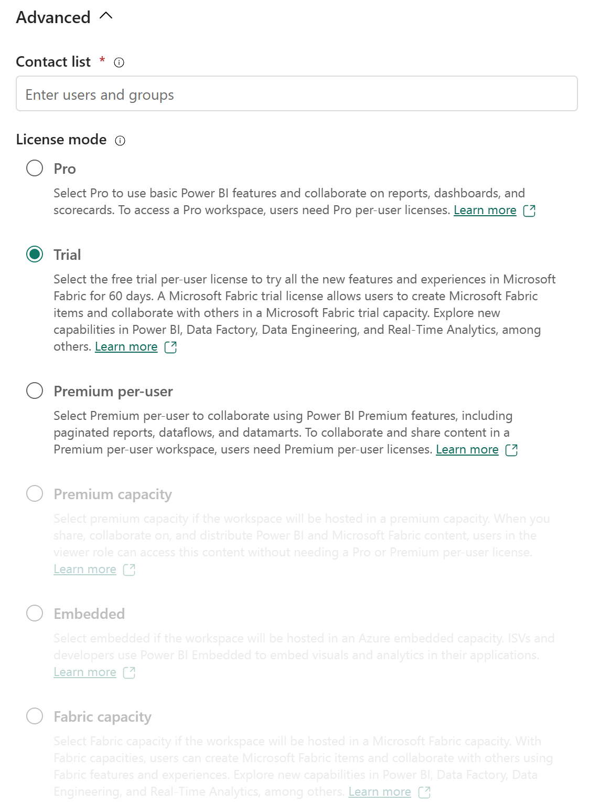
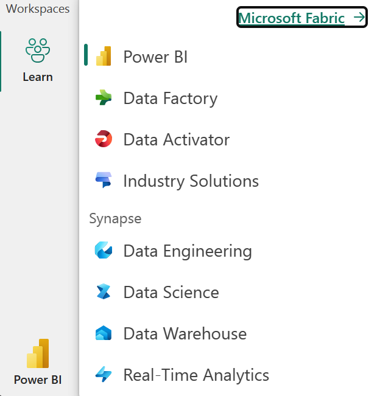

Before you can explore the end-to-end capabilities of Microsoft Fabric, it must be enabled for your organization. You may need to work with your IT department to enable Fabric for your organization. The permissions required to enable Fabric are either:

- *Fabric admin*
- *Power Platform admin*
- *Microsoft 365 admin*

Fabric can be enabled at the tenant level or capacity level, meaning that it can be enabled for the entire organization or for specific groups of users. If you don't have access to Fabric, contact your Fabric administrator to find out if it's available to you. The Fabric administrator was formerly the Power BI administrator role.

## Enable Microsoft Fabric

If you have admin privileges, you can access the **Admin center** from the **Settings** menu in the upper right corner of the Power BI service. From here, you enable Fabric in the **Tenant settings.**

Admins can make Fabric available to either the entire organization or specific groups of users, who can be organized based on their Microsoft 365 or Microsoft Entra security groups. Admins can also *delegate* the ability to enable Fabric to other users, at the capacity level.

> [!NOTE]
> If your organization isn't using Fabric or Power BI today, you can sign up for a [free Fabric trial](/fabric/get-started/fabric-trial) to explore the different workloads.

## Create Fabric enabled workspaces

All Fabric items (lakehouses, notebooks, pipelines, etc.) are stored in OneLake and accessed via Fabric workspaces. To enable Fabric in a workspace, choose a Trial or Fabric Capacity license mode.

> [!NOTE]
> For more information on enabling Premium capacity in a workspace, see [Fabric capacity settings](/power-bi/collaborate-share/service-create-the-new-workspaces#premium-capacity-settings).

## Create items in Fabric

After you create your Fabric enabled workspace, you can start creating items in Fabric. You can create items in Fabric using the **Create** menu in the upper left corner of the Power BI service.

## Explore Fabric workloads

Fabric workloads refer to the different capabilities included in Fabric. You can switch between workloads using the workload switcher in the bottom left corner of the navigation pane.

You may notice that Fabric workloads look similar to other Microsoft data offerings. Fabric is built on Power BI and Azure Data Lake Storage, and includes capabilities from Azure Synapse Analytics, Azure Data Factory, Azure Databricks, and Azure Machine Learning. What makes Fabric unique is that it brings these capabilities together in a single, SaaS integrated experience without the need for access to Azure resources.
