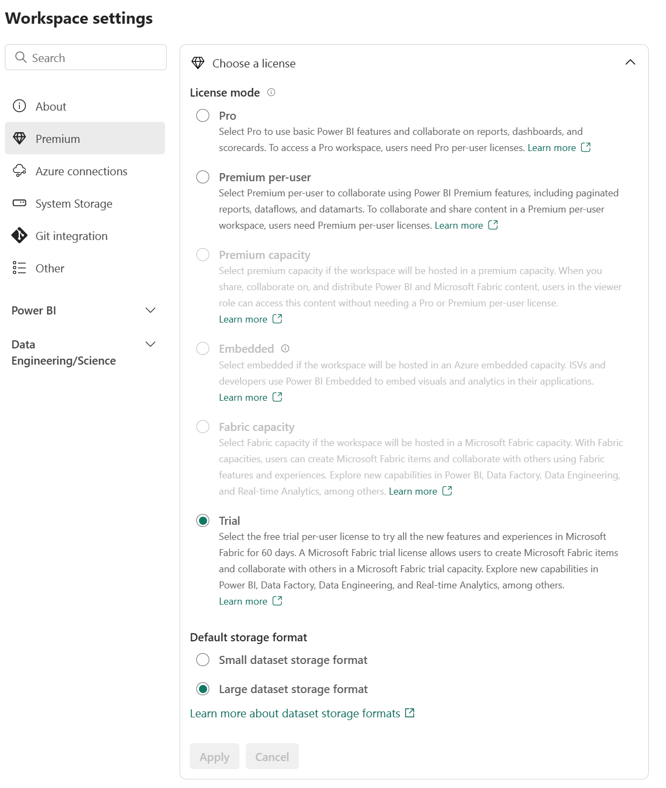

Before you can explore the end-to-end capabilities of Microsoft Fabric, it must be enabled for your organization. You may need to work with your IT department to enable Fabric for your organization. The permissions required to enable Fabric are either:

- *Fabric admin*
- *Power Platform admin*
- *Microsoft 365 admin*

Fabric can be enabled at the tenant level or capacity level, meaning that it can be enabled for the entire organization or for specific groups of users. If you don't have access to Fabric, contact your Fabric administrator to find out if it's available to you. Note that the Fabric administrator is a new role as of June 2023. This was formerly the Power BI administrator role.

> [!IMPORTANT]
> You'll need a trial license to use Fabric. See [Get a trial license](/fabric/get-started/fabric-trial) for more information.

## Check your access

If you'd like to check to see if you have access to Fabric in your organization's tenant, sign-in to Power BI and look for the **Power BI icon** in the bottom of the left navigation pane. If you see the Power BI icon, select to see the experiences available within Fabric. If the icon isn't present, Fabric is not available to you.

> [!NOTE]
> To find out if Fabric is available to you, contact your Fabric administrator. For more information about how admins can enable Fabric, see [Enable Microsoft Fabric for your organization](/fabric/admin/fabric-switch).

## Enable Microsoft Fabric

If you have admin privileges, you can access the **Admin center** from the **Settings** menu in the upper right corner of the Power BI service. From here, you enable Fabric in the **Tenant settings.**

Admins can make Fabric available to either the entire organization or specific groups of users, who can be organized based on their Microsoft 365 or Azure Active Directory security groups. Admins can also *delegate* the ability to enable Fabric to other users, at the capacity level.

## Create Fabric enabled workspaces

All Fabric items (lakehouses, notebooks, pipelines, etc.) are stored in OneLake and accessed via Fabric workspaces.

Workspaces must be in Premium capacity to use Fabric. If you don't have access to Premium capacity, you aren't able to use Fabric. Select **Trial** in the **Premium capacity settings** section of the **Workspace settings** page to enable Premium capacity for your workspace.

> [!NOTE]
> For more information on enabling Premium capacity in a workspace, see [Premium capacity settings](/power-bi/collaborate-share/service-create-the-new-workspaces#premium-capacity-settings).

## Create resources in Fabric

After you've created your Fabric enabled workspace, you can start creating resources in Fabric. You can create resources in Fabric using the **Create** menu in the upper left corner of the Power BI service.

## Explore Fabric experiences

Fabric experiences refer to the different capabilities included in Fabric. You can switch between experiences using the experience switcher in the bottom left corner of the navigation pane.

You may notice that Fabric experiences look similar to other Microsoft data offerings. Fabric is built on Power BI and Azure Data Lake Storage, and includes capabilities from Azure Synapse Analytics, Azure Data Factory, Azure Databricks, and Azure Machine Learning. What makes Fabric unique is that it brings these capabilities together in a single, SaaS, integrated experience without the need for access to Azure resources.
