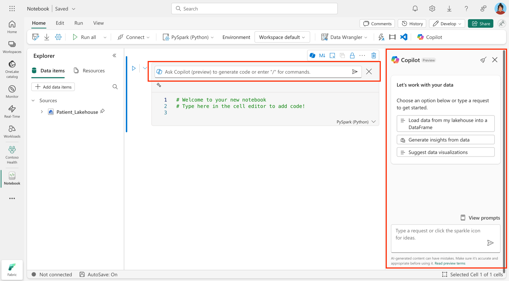

Copilot for Data Engineering and Data Science in Microsoft Fabric is an AI-powered assistant designed to enhance productivity and simplify workflows. It provides contextualized code suggestions and natural language responses for tasks across data engineering and data science domains. It lights up directly in a notebook, allowing you to interact with your data and code seamlessly.

## Key concepts

- **AI-assisted code generation**: Copilot generates code snippets tailored to tasks such as data loading, applying transformations, and saving Pandas/Spark dataframes inside notebooks. Use natural language to describe your data integration requirements, and Copilot will generate the necessary code and steps.

- **Code explanation**: Provides explanations for existing code, helping you understand complex queries and tasks

- **Visualization**: It can create visualizations based on your data, helping you to quickly understand trends and patterns.

- **Machine learning**: Copilot can assist in building and training machine learning models, providing code snippets and guidance throughout the process.

Here's an example of how you can interact with Copilot in the Notebook:

> [!div class="mx-imgBorder"]
> 

### Benefits

By using Copilot for Data Engineering and Data Science, you can streamline your workflows, reduce errors, and focus on deriving insights and building models from your data. Here are some key benefits:

- **Efficiency**: Automates repetitive tasks and accelerates development.  
- **Accessibility**: Reduces the learning curve for new users by enabling natural language interactions.  
- **Accuracy**: Provides context-aware suggestions that align with your data's structure.  
- **Collaboration**: Enhances team productivity with clear documentation and shared insights.

