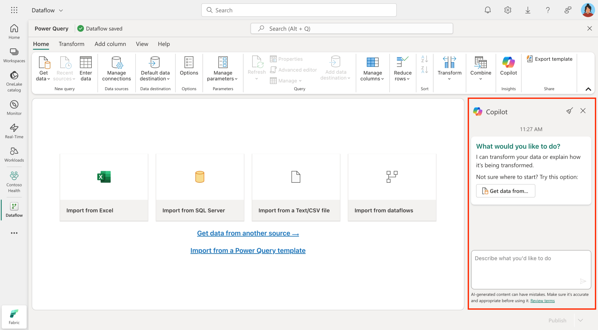
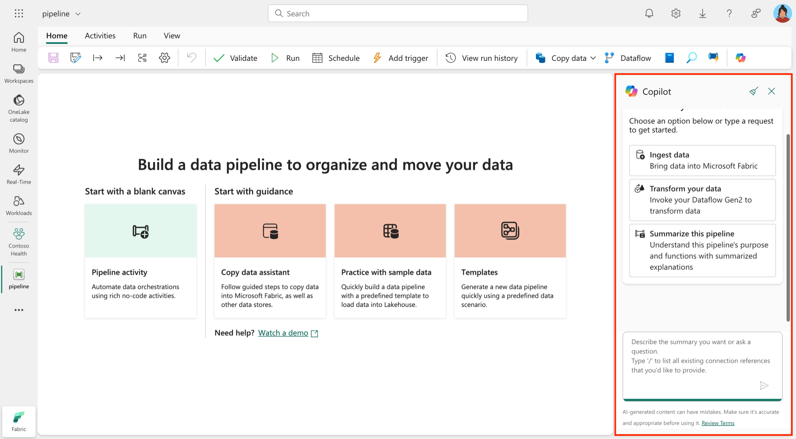

Copilot for Data Factory in Microsoft Fabric is an AI-powered assistant designed to simplify and enhance data integration workflows. It acts as a subject-matter expert (SME), enabling you to create, transform, and manage dataflows and pipelines using natural language inputs.

## Copilot for Dataflow Gen2

- **Query generation**: Copilot can create new queries or modify existing ones based on user input. It can also generate sample data or reference existing queries to streamline the data preparation process.

- **Data transformation**: Dataflow Gen2 allows you to define transformation steps for your data using natural language. Copilot generates the required Mashup code to perform these transformations, such as filtering, aggregating, or reshaping data.

- **Code explanation**: For complex queries, Copilot explains the generated Mashup code, helping you understand the logic and purpose of each transformation step.

Here's an example of how you can interact with Copilot in the Dataflow Gen2 editor:

> [!div class="mx-imgBorder"]
> 

## Copilot for Data Pipelines

- **Pipeline generation**: Using natural language, you can describe your desired pipeline, and Copilot will generate the necessary Data Pipeline activities. This simplifies the creation of complex pipelines.

- **Error troubleshooting**: Copilot helps resolving pipeline issues by providing clear error explanations and actionable troubleshooting guidance. This ensures smoother workflows and reduces downtime.

- **Pipeline summarization**: Copilot can summarize the content and relationships of activities within a pipeline, providing a clear overview of its structure and functionality.

Here's an example of how you can interact with Copilot in the Data Factory pipeline editor:

> [!div class="mx-imgBorder"]
> 

## Benefits

By using Copilot for Data Factory, you can streamline their data integration processes, reduce errors, and focus on deriving value from your data. Here are some key benefits:

- **Efficiency**: Automates the creation and management of dataflows and pipelines, saving time and effort.  
- **Accessibility**: Enables both citizen and professional data engineers to work effectively using natural language inputs.  
- **Error reduction**: Provides actionable insights and fixes for pipeline errors, reducing downtime.  
- **Collaboration**: Enhances team productivity with clear pipeline summaries and code explanations.