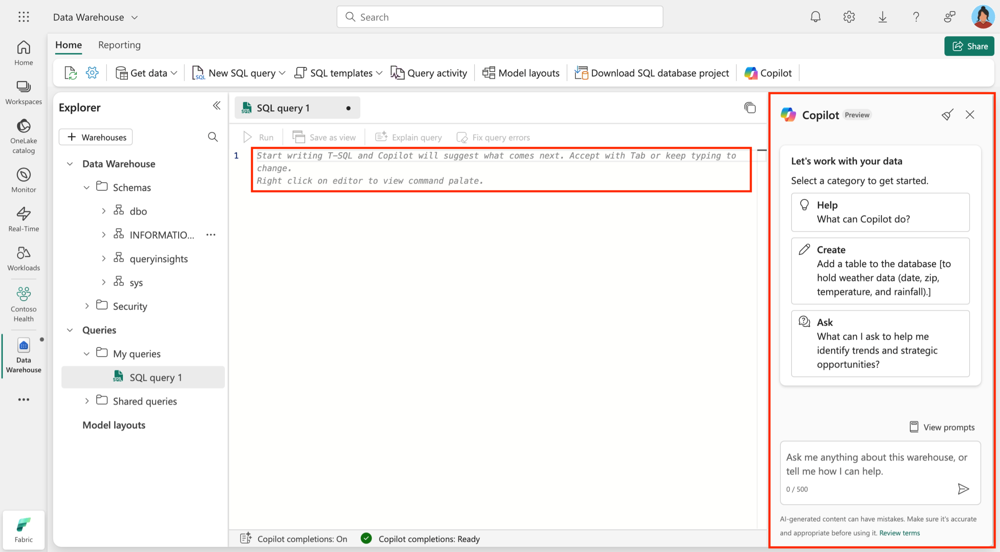

Copilot in Fabric for Data Warehouse is an AI-powered assistant that supports data warehousing tasks. It integrates with the SQL analytics endpoint and Warehouse in Microsoft Fabric, providing T-SQL code generation and related suggestions.

## Key concepts

The following concepts describe how Copilot in Fabric Data Warehouse works.

**Natural language to SQL** makes it easier for users who struggle with writing complex T-SQL queries. Instead of spending time learning syntax or searching for examples, simply describe what you want in plain language—such as "Show all agents who sell properties in California"—and Copilot generates the query for you. This reduces barriers for new users and speeds up analysis for experienced ones.

With **Code completion**, users often find themselves stuck or unsure about the next steps when writing queries. Copilot proactively suggests completions as you type in the query editor. For example, if you start typing a SELECT statement, Copilot can recommend the next columns or clauses, helping you write queries faster and with fewer errors. Accept suggestions with the Tab key, or keep typing to ignore them.

**Quick actions** address common frustrations like debugging errors or understanding unfamiliar code. If you encounter an error in your SQL, Copilot can offer to fix it or explain what went wrong. This guidance helps you learn from mistakes and improves your confidence in writing and troubleshooting queries.

For those who struggle to understand the structure of their data warehouse, **Intelligent insights** provide context-aware suggestions. Copilot analyzes schema and metadata—such as table names, columns, and relationships—to ensure that generated queries fit your data model. This reduces the risk of referencing incorrect tables or columns and helps you discover new connections in your data.

Finally, **Schema-driven context** ensures privacy and accuracy. Copilot uses only the schema information, not the actual data, to generate queries. This means you can safely use Copilot without worrying about exposing sensitive information, while still benefiting from accurate and relevant query suggestions.

By understanding and applying these concepts, you can overcome common challenges in data warehousing, work more efficiently, and make smarter decisions with Copilot in Fabric.

Here's an example of how you can interact with Copilot in the Fabric Warehouse editor:

> [!div class="mx-imgBorder"]
> 

We’ll explore this topic in more detail in a later module.

## Benefits

Using Copilot for Data Warehouse can streamline SQL workflows and support focusing on analysis. Key benefits:

- **Efficiency**: Automates query generation and provides intelligent code completions, saving time and effort.  
- **Accessibility**: Allows you to interact with the data warehouse using natural language, reducing the need for advanced SQL knowledge.  
- **Error reduction**: Offers quick fixes and explanations for SQL queries, helping you debug and optimize their code.  
- **Privacy**: Operates based on schema and metadata without accessing the actual data, ensuring data security.  
