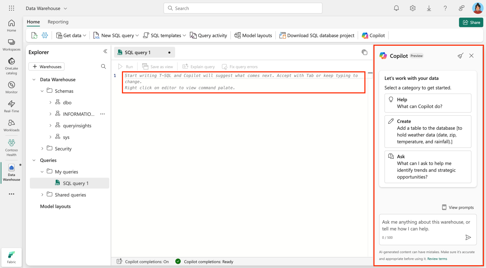

Copilot in Fabric for Data Warehouse is an AI-powered assistant designed to streamline data warehousing tasks. It integrates seamlessly with the SQL analytics endpoint and Warehouse in Microsoft Fabric, providing intelligent insights and T-SQL code generation to enhance productivity and simplify workflows.

## Key concepts

1. **Natural language to SQL**  
   Copilot enables you to generate T-SQL queries using natural language prompts. For example, you can ask Copilot to "Show all agents who sell properties in California," and it generates the corresponding SQL query.

2. **Code completion**  
   Copilot enhances coding efficiency by providing AI-powered code completions. As you start writing T-SQL in the query editor, Copilot suggests completions to help you write queries faster. The **Tab** key accepts the code suggestion, or keeps typing to ignore the suggestion.

3. **Quick actions**  
   Copilot offers quick actions such as fixing errors in SQL queries or explaining the logic behind them. These actions help you debug and understand you queries more effectively.

4. **Intelligent insights**  
   Copilot uses schema and metadata information, such as table and column names, primary keys, and foreign keys, to provide smart suggestions and insights. This ensures that the generated queries align with the structure of your data warehouse.

5. **Schema-driven context**  
   Copilot uses the schema of your data warehouse, including table and column names, to generate accurate queries. However, it doesn't access the actual data in the tables, ensuring data privacy.

Here's an example of how you can interact with Copilot in the Fabric Warehouse editor:

> [!div class="mx-imgBorder"]
> 

## Benefits

By using Copilot for Data Warehouse, you can streamline your SQL workflows, reduce errors, and focus on deriving insights from your data. Here are some key benefits:

- **Efficiency**: Automates query generation and provides intelligent code completions, saving time and effort.  
- **Accessibility**: Allows you to interact with the data warehouse using natural language, reducing the need for advanced SQL knowledge.  
- **Error reduction**: Offers quick fixes and explanations for SQL queries, helping you debug and optimize their code.  
- **Privacy**: Operates based on schema and metadata without accessing the actual data, ensuring data security.  
