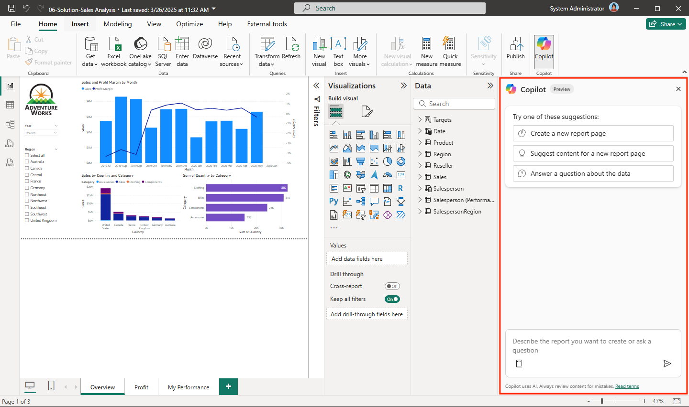

Copilot for Power BI is an AI-powered assistant designed to enhance the report creation and data exploration experience. It uses generative AI to help you interact with your data, create reports, and gain insights more efficiently. Copilot is available in both Power BI Desktop and the Power BI Service.

## Key concepts

1. **Natural language interaction**  
   Copilot allows you to ask questions about your data or request specific visuals using natural language. For example, you can ask Copilot to "Show the top categories by sales" or "Create a summary of this report."

2. **Report creation**  
   Copilot can generate report pages based on user prompts. It suggests visuals, fields, and measures to include, ensuring that the report aligns with your requirements.

3. **Narrative visuals**  
   Copilot can create narrative summaries for report pages or entire reports. These summaries provide context and insights, making it easier to understand the data.

4. **DAX query assistance**  
   Copilot helps you write DAX (Data Analysis Expressions) queries by generating code based on natural language prompts. This feature simplifies complex calculations and enhances productivity.

5. **Semantic model insights**  
   Copilot can summarize and document the semantic model, including measures and relationships. It also suggests synonyms to improve the Q&A experience in reports.

6. **Quick actions**  
   Copilot provides quick actions such as fixing errors in DAX queries or explaining the logic behind them. These actions help you debug and optimize your reports.

Here's an example of how you can interact with Copilot in the Power BI Desktop:

> [!div class="mx-imgBorder"]
> 

## Benefits

By using Copilot for Power BI, users can streamline their reporting workflows, reduce errors, and focus on deriving actionable insights from their data. Here are some key benefits:

- **Efficiency**: Automates report creation and data exploration, saving time and effort.  
- **Accessibility**: Enables you to interact with their data using natural language, reducing the need for advanced technical skills.  
- **Insights**: Provides narrative summaries and intelligent suggestions to help you understand your data better.  
- **Collaboration**: Enhances the documentation of semantic models, making it easier for teams to work together.  
