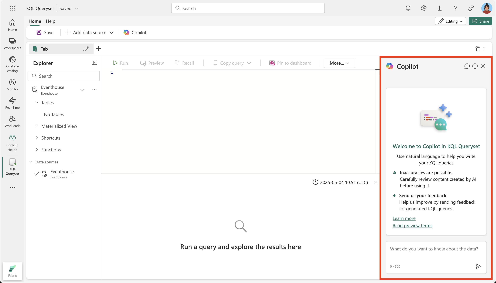

Copilot for Real-Time Intelligence in Microsoft Fabric is an AI-powered assistant designed to help you analyze and gain insights from real-time data streams. It uses generative AI to simplify complex queries and provide actionable intelligence, enabling faster decision-making.

## Key concepts

- **Natural language to query**: Copilot allows you to interact with real-time data using natural language. For example, you can ask Copilot to "Show the top-performing regions in the last hour," and it generates the necessary KQL (Kusto Query Language) query to retrieve the data.

- **Conversational interactions**: Copilot supports conversational interactions which allows you to clarify, adapt, and extend your queries dynamically, all while maintaining the context of your previous inputs. You can refine the initial KQL generated by Copilot, or ask follow-up questions to explore the data further.

Here's an example of how you can interact with Copilot in the Fabric KQL queryset Editor:

> [!div class="mx-imgBorder"]
> 

## Benefits

By using Copilot for Real-Time Intelligence, you can streamline your workflow, reduce errors, and focus on deriving actionable insights from real-time data streams. Here are some key benefits:

- **Efficiency**: Automates the creation of queries and visualizations, saving time and effort.  
- **Accessibility**: Enables users to interact with real-time data using natural language, reducing the need for advanced technical skills.  
- **Insights**: Provides actionable intelligence and visualizations to support faster decision-making.  

