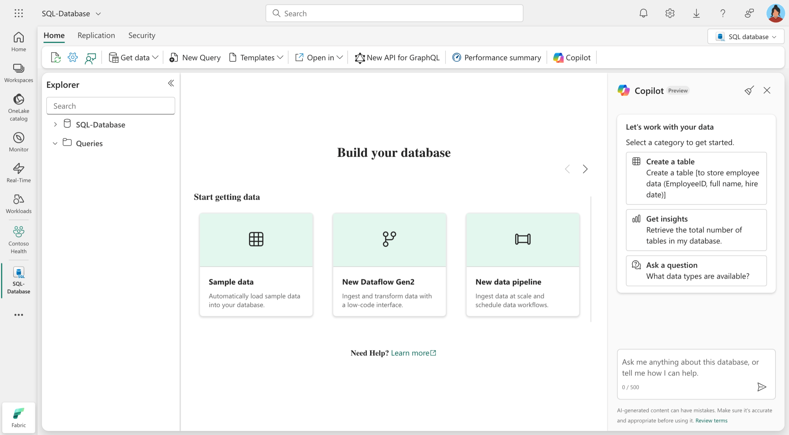

Copilot for SQL Database in Microsoft Fabric is an AI-powered assistant designed to simplify database management and query development. It uses generative AI to help you interact with your SQL databases more efficiently, enabling faster query creation, debugging, and optimization.

### Key concepts

- **Natural language to SQL**: Copilot allows you to generate SQL queries using natural language prompts. For example, you can ask Copilot to "List all customers who made purchases last month," and it generates the corresponding SQL query.

- **Code completion**: Copilot enhances productivity by providing intelligent code completions as you write SQL queries. This feature helps you write accurate and efficient queries faster.

- **Quick actions**: Copilot offers quick actions such as fixing errors in SQL queries or explaining the logic behind them. These actions help you debug and understand their queries more effectively.

- **Schema awareness**: Copilot uses the schema and metadata of the SQL database, such as table and column names, to provide accurate and context-aware query suggestions.

- **Error handling and debugging**: Copilot helps identifying and resolving issues in SQL queries. It provides actionable recommendations to fix errors and optimize query performance.

- **Query explanation**: Copilot can explain the logic of SQL queries in natural language, making it easier for you to understand complex queries and learn best practices.

Here's an example of how you can interact with Copilot in the Fabric SQL Database editor:

> [!div class="mx-imgBorder"]
> 

## Benefits

By using Copilot for SQL Database, you can streamline your database workflows, reduce errors, and focus on deriving actionable insights from your data. Here are some key benefits:

- **Efficiency**: Automates query generation and provides intelligent code completions, saving time and effort.  
- **Accessibility**: Enables users to interact with SQL databases using natural language, reducing the need for advanced SQL knowledge.  
- **Error reduction**: Offers quick fixes and explanations for SQL queries, helping you debug and optimize your code.  
- **Insights**: Provides schema-aware suggestions and explanations to enhance understanding and productivity.  
