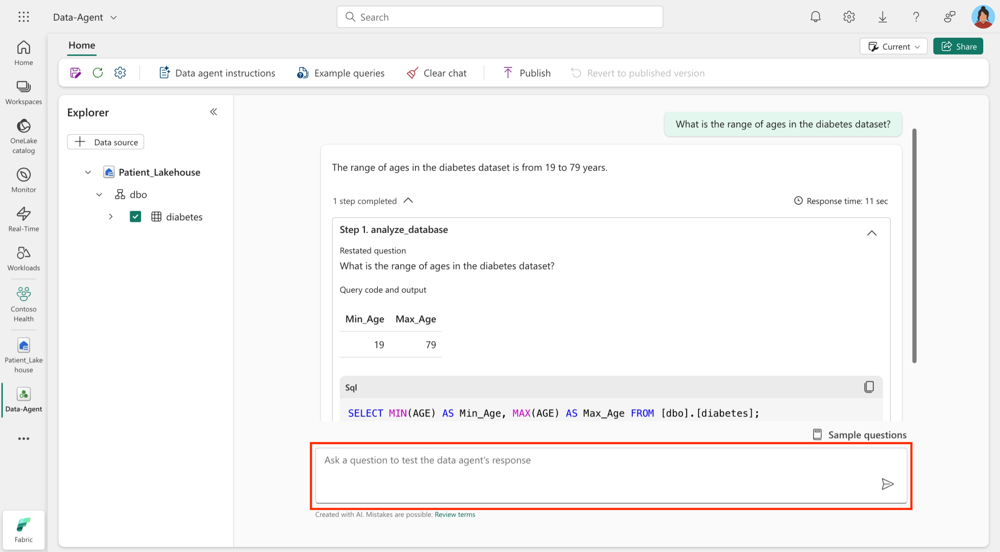

Fabric data agents in Microsoft Fabric are AI-powered tools designed to make data insights more accessible and actionable. They allow users to interact with organizational data stored in Fabric OneLake using natural language, enabling even nontechnical users to ask questions and receive precise, context-rich answers.

## Key concepts

- **Conversational Q&A**: Fabric data agents enable you to ask plain English-language questions about your data and receive relevant answers. This eliminates the need for technical expertise in AI or a deep understanding of the data structure.

- **Data source integration**: A Fabric data agent can connect to a variety of data sources, including lakehouses, warehouses, KQL databases, and Power BI semantic models. This flexibility allows organizations to tailor the agent to their specific data needs.

- **Schema awareness**: Fabric data agents use the schema and metadata of connected data sources to generate accurate and context-aware responses. They use structured queries (SQL, DAX, or KQL) to retrieve data while maintaining read-only access.

- **Customizability**: Organizations can fine-tune Fabric data agents by adding custom instructions, examples, and guidance. This ensures that the agent aligns with organizational terminology and provides responses tailored to specific use cases.

- **Secure and contextual responses**: Fabric data agents enforce strict read-only access and adhere to user permissions. They ensure that responses are focused on the context of the selected data sources, reducing the risk of irrelevant or misleading answers.

- **Integration with external systems**: Fabric data agents can integrate with tools like Microsoft Copilot Studio, Azure AI Foundry, and Microsoft Teams, making them versatile for broader use cases beyond Fabric.

Here's an example of how you can interact with Copilot in a Fabric data agent:

> [!div class="mx-imgBorder"]
> 

## Benefits

By using Fabric data agents, organizations can empower their teams to engage with data more effectively, fostering collaboration, and driving data-informed decisions. Here are some key benefits:

- **Accessibility**: Lowers the barrier to data insights by enabling natural language interactions.  
- **Efficiency**: Simplifies data exploration and eliminates the need to write complex queries.  
- **Customization**: Allows organizations to tailor the agent to their specific needs and terminology.  
- **Collaboration**: Facilitates a culture of data-driven decision-making by making insights accessible to everyone.  
- **Security**: Ensures data privacy by adhering to user permissions and maintaining read-only access.  
