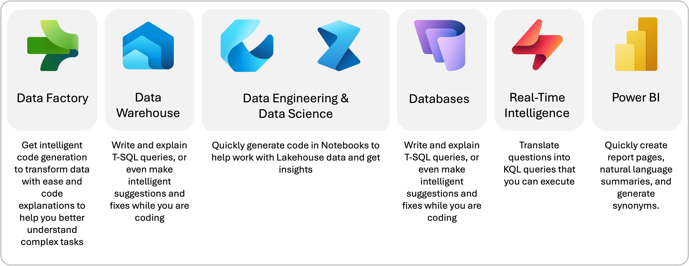

Let's first understand the context of Microsoft Fabric and its components.

## What is Microsoft Fabric?

Microsoft Fabric is an end-to-end data analytics platform that unifies various tools and services to empower users to manage, analyze, and visualize data seamlessly. It integrates data engineering, data science, real-time analytics, and business intelligence into a single, cohesive experience.

Microsoft Fabric simplifies complex data workflows, enabling users to focus on deriving insights rather than managing infrastructure. It provides a unified platform that enhances collaboration, reduces operational overhead, and accelerates decision-making by delivering actionable insights efficiently.

## What is Copilot for Fabric?

Copilot for Fabric is an AI-powered assistant designed to enhance productivity and simplify workflows across Microsoft Fabric. It uses generative AI to help users transform and analyze data, generate insights, and create visualizations and reports with ease.

Copilot for Fabric streamlines complex tasks by providing intelligent code suggestions, automating routine processes, and enabling natural language interactions. This allows users to focus on higher-value activities, reduces the learning curve for new users, and accelerates the journey from raw data to actionable insights.

In the next sections, we'll explore the various components of Copilot for Fabric, including Copilot for Data Factory, Copilot for SQL Database, Copilot for Real-Time Intelligence, and Fabric Data Agents. Each component is designed to address specific use cases and enhance the overall data analytics experience within Microsoft Fabric.

> [!div class="mx-imgBorder"]
> 
