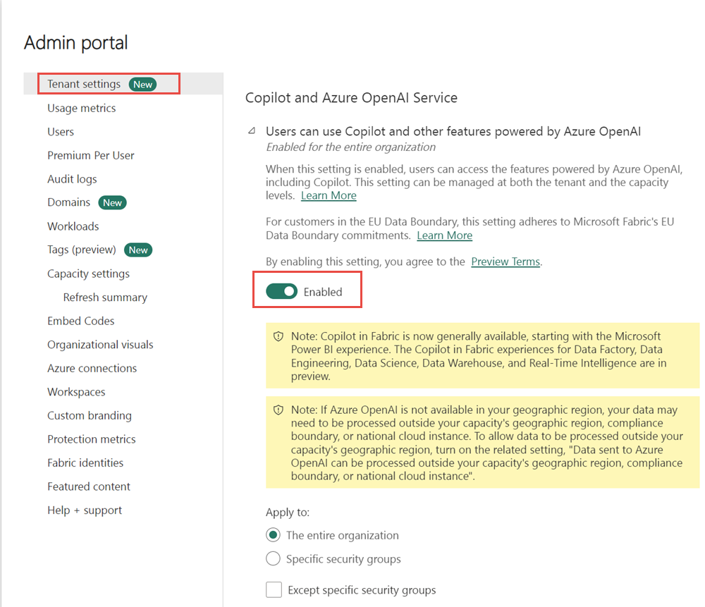
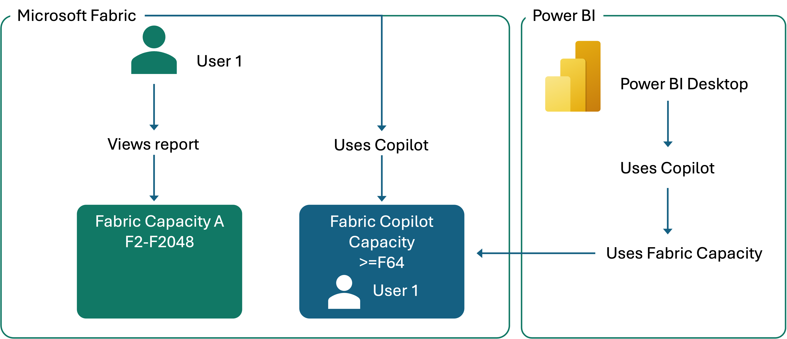
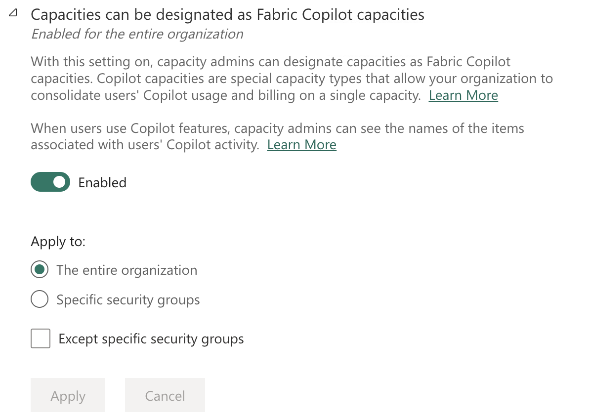
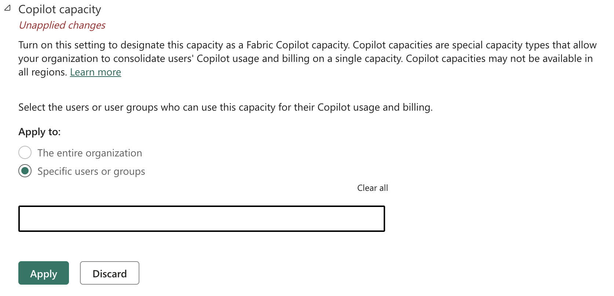

Before you can use Copilot's capabilities within Microsoft Fabric, certain prerequisites and configurations are necessary. Typically, the IT department enables Copilot in Fabric for your organization.

## Configure a Fabric capacity 

Copilot is currently supported in preview, in specific regions. Administrators should verify that their tenant or capacity is within a supported region. Not all regions support all Copilot features. If located outside the US or EU Data Boundary, Copilot is disabled by default.

Ensure that your organization has a Fabric capacity of F2 or higher. Copilot is enabled by default for these capacities but can be managed through the admin portal if adjustments are needed.

Administrators can manage Copilot settings via the Fabric admin portal, including enabling or disabling the feature and designating specific capacities for Copilot usage.

> [!div class="mx-imgBorder"]
> 

> [!NOTE]
> Copilot isn't supported for Fabric trial SKUs (Stock Keeping Units). Only paid SKUs (F2 or higher) are eligible.

## Designate a capacity as a Fabric Copilot capacity

Fabric Copilot capacity is a feature that allows users to utilize Copilot even if their Power BI reports aren't on a P1/F2 capacity. Administrators can designate a capacity as a Copilot capacity. It ensures that all Copilot consumption is billed to this capacity. It simplifies access and usage for users, as they no longer need specific capacity assignments.

> [!div class="mx-imgBorder"]
> 

Capacity administrators can give Copilot access to end users directly, rather than requiring creators to move their content into a specific workspace or link a specific F2 or higher capacity. End users can use Copilot with all the content they consume.

As an administrator, you can turn on this feature and assign specific groups or the entire organization to manage capacities as Fabric Copilot capacities. 

> [!div class="mx-imgBorder"]
> 

Capacity administrators must designate user access to each Copilot capacity. Select the users or user groups who can use this capacity for their Copilot usage and billing.

> [!div class="mx-imgBorder"]
> 

## Limitations

- The Fabric Copilot capacity has to reside on at least an F2 or P1 SKU.
- Only one Fabric Copilot capacity is supported per user. If a user is assigned to multiple Copilot capacities, the newest created Copilot capacity registers the user's Copilot usage.
- Data is processed in the region where you're using Copilot and AI Skills. Usage and billing records that contain the metadata of the Fabric items or workspaces, are available to the Copilot capacity administrator.