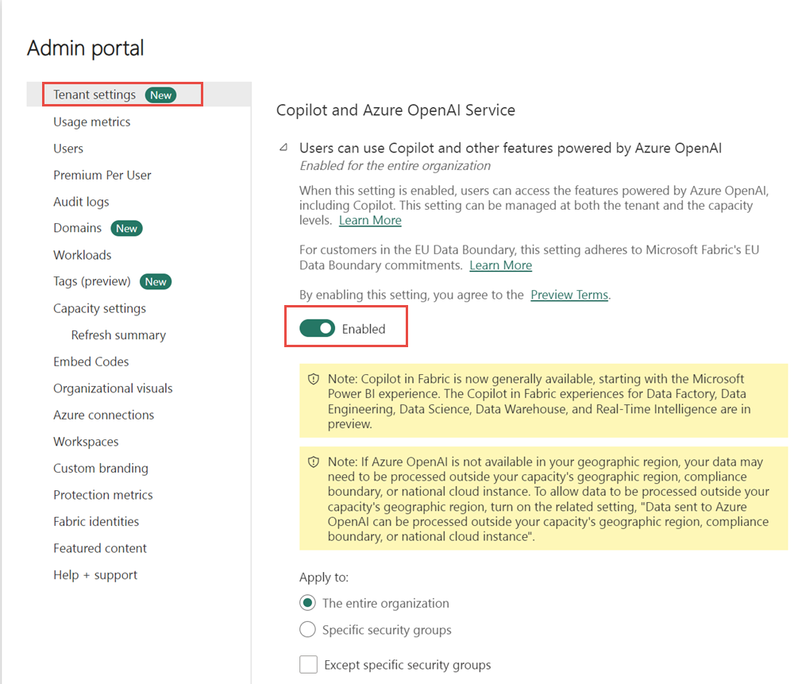
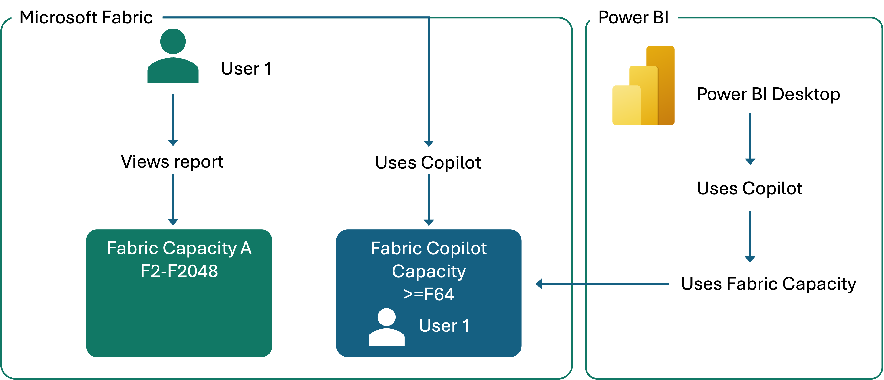
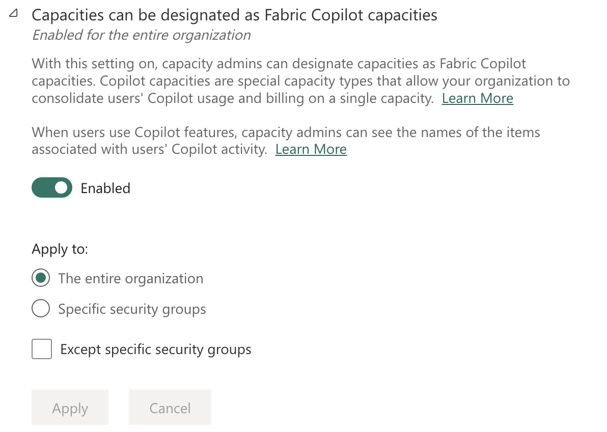
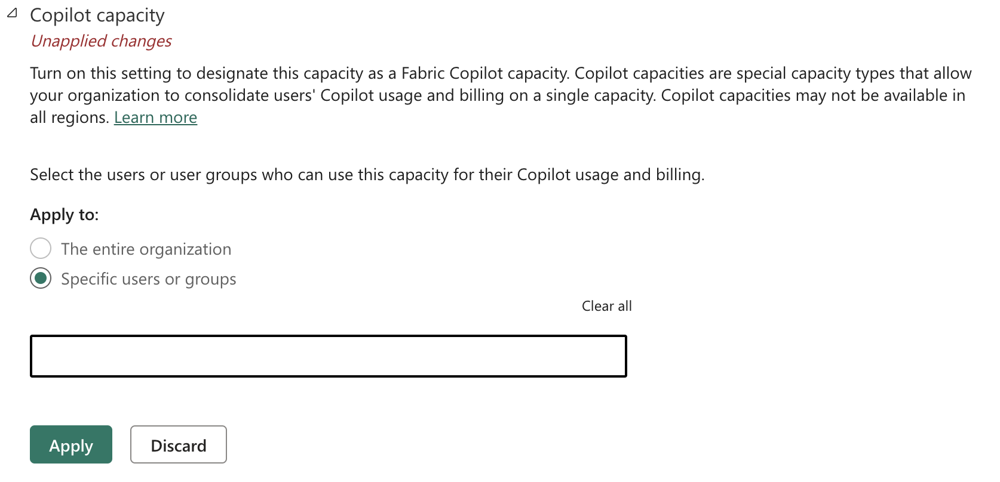

Before you can use Copilot's capabilities within Microsoft Fabric, certain prerequisites and configurations are necessary. Typically, the IT department enables Copilot in Fabric for your organization.

**Copilot in Microsoft Fabric is enabled by default** for all paid Fabric capacities (F2 or higher, and P SKUs). Administrators can disable Copilot from the admin portal if your organization isn't ready to adopt it. Enabling Copilot for your entire tenant without adequate planning can lead to higher capacity utilization—consider enabling it for specific security groups only after completing the prerequisites.

## Prerequisites

Enabling Copilot safely involves several steps across multiple admin surfaces:

| Step | Where | Description |
| --- | --- | --- |
| 1 | Azure portal | Confirm your organization has a supported paid SKU (F2 or higher, or P SKU). Pro and PPU workspaces don't directly support Copilot; users on those workspaces must be assigned to a Fabric Copilot capacity. |
| 2 | Azure portal | Verify your Fabric capacity is in a supported region. |
| 3 | Microsoft 365 admin center | Create one or more security groups to control who can use Copilot. Using security groups lets you stage rollout—for example, after users complete prerequisite training. |
| 4 | Fabric tenant settings | Enable the relevant Copilot tenant settings. |
| 5 | Capacity settings | If tenant settings are delegated to capacity administrators, enable Copilot in the delegated capacity settings and scope it to the appropriate security groups. |
| 6 | Workspace settings | Assign a workspace and provision workspace access for Copilot users. Fabric items using Copilot must reside in this workspace, but they can reference data from other workspaces or capacities. |
| 7 | Power BI Desktop settings | To use Copilot in Power BI Desktop, select a supported workspace backed by Fabric capacity. |

## Configure a Fabric capacity

Ensure that your organization has a Fabric capacity of F2 or higher. Copilot is enabled by default for these capacities but can be managed through the admin portal if adjustments are needed.

> [!NOTE]
> Copilot isn't supported for Fabric trial SKUs (Stock Keeping Units). Only paid SKUs (F2 or higher) are eligible.

Administrators can manage Copilot settings via the Fabric admin portal, including enabling or disabling the feature. This setting can be managed at both the tenant and the capacity levels. When this setting is enabled, the service may execute background jobs at no charge to the tenant capacity to support end user experiences.  

> [!div class="mx-imgBorder"]
> 

> [!IMPORTANT]
> Administrators should verify that their tenant or capacity is within a supported region. Not all regions support all Copilot features. If located outside the US or EU Data Boundary, the cross-region processing setting is disabled by default but can be enabled. When this setting is enabled, data sent to Azure OpenAI can be processed outside your capacity's geographic boundary or national cloud boundary.

## Configure data residency settings

The **Copilot and Azure OpenAI Service** tenant settings group includes additional settings that control where data is processed and stored. These settings are disabled by default and are relevant for capacities outside the EU data boundary and the US:

- **Data sent to Azure OpenAI can be processed outside your capacity's geographic region, compliance boundary, or national cloud instance**: Allows Copilot to operate using Azure OpenAI resources in another region when Azure OpenAI isn't available in your capacity's region.

- **Data sent to Azure OpenAI can be stored outside your capacity's geographic region, compliance boundary, or national cloud instance**: Applies to Copilot in Notebooks and the Data agent. When enabled, these experiences can store data in an Azure OpenAI region outside your capacity's geographic boundary.

- **Conversation history stored outside your capacity's geographic region, compliance boundary, or national cloud instance**: Required for fully conversational agentic AI experiences in Copilot in Notebooks and Fabric data agents. These experiences store conversation history across user sessions to maintain context. History is stored within the Azure security boundary for up to 28 days. Users can delete their conversation history at any time by clearing the chat.

> [!NOTE]
> The storage and conversation history settings apply only to Copilot in Notebooks and Fabric data agents. For other Copilot experiences, prompts are processed by Azure OpenAI but not stored across sessions.

## Standalone Power BI Copilot experience

The **Users can access a standalone, cross-item Power BI Copilot experience** setting enables a full-screen Copilot experience accessible from the Power BI left navigation bar. Users can ask questions about any report, semantic model, or Fabric data agent they have permission to access—without opening a specific report first. This setting also enables the **Power BI agent** in Microsoft 365.

> [!IMPORTANT]
> As of September 2025, this setting is **enabled by default** for all tenants where Copilot is already turned on. To opt out and hide the Copilot icon from the left navigation, an admin must turn this setting off manually. The standalone experience requires the main Copilot setting to be enabled at the **tenant level** (not just at the capacity level). The experience is only available for tenants in supported Fabric regions.

**Default:** Enabled (as of September 2025)

The **Only show approved items in the standalone Copilot in Power BI experience** setting restricts the standalone Copilot search to items explicitly marked as **Approved for Copilot** by content owners. Tenant admins can enable this to limit exposure; workspace admins can then broaden content availability for their own workspaces. This setting applies to both the standalone Copilot experience and the Power BI agent.

**Default:** Disabled

## Designate a capacity as a Fabric Copilot capacity

Fabric Copilot capacity lets users use Copilot even if their Power BI reports aren't on a P1/F2 capacity. Administrators can designate a capacity as a Copilot capacity. All Copilot consumption is then billed to this capacity. This approach removes the need for individual capacity assignments for Copilot usage.

> [!div class="mx-imgBorder"]
> 

Capacity administrators can give Copilot access to end users directly, rather than requiring creators to move their content into a specific workspace or link a specific F2 or higher capacity. End users can use Copilot with all the content they consume.

As an administrator, you can turn on this feature and assign specific groups or the entire organization to manage capacities as Fabric Copilot capacities. 

> [!div class="mx-imgBorder"]
> 

Capacity administrators must designate user access to each Copilot capacity. Select the users or user groups who can use this capacity for their Copilot usage and billing.

> [!div class="mx-imgBorder"]
> 

## Limitations

- The Fabric Copilot capacity has to reside on at least an F2 or P1 SKU.
- Fabric Copilot capacity is only supported in the Fabric tenant's home region.
- Only one Fabric Copilot capacity is supported per user. If a user is assigned to multiple Copilot capacities, the newest created Copilot capacity registers the user's Copilot usage.
- Data is processed in the region where you're using Copilot and Data agents. Usage and billing records that contain the metadata of the Fabric items or workspaces, are available to the Copilot capacity administrator.
- Fabric Copilot Capacity doesn't support Fabric AI functions. For more information on prerequisites for AI functions, see the [AI functions overview](/fabric/data-science/ai-functions/overview).