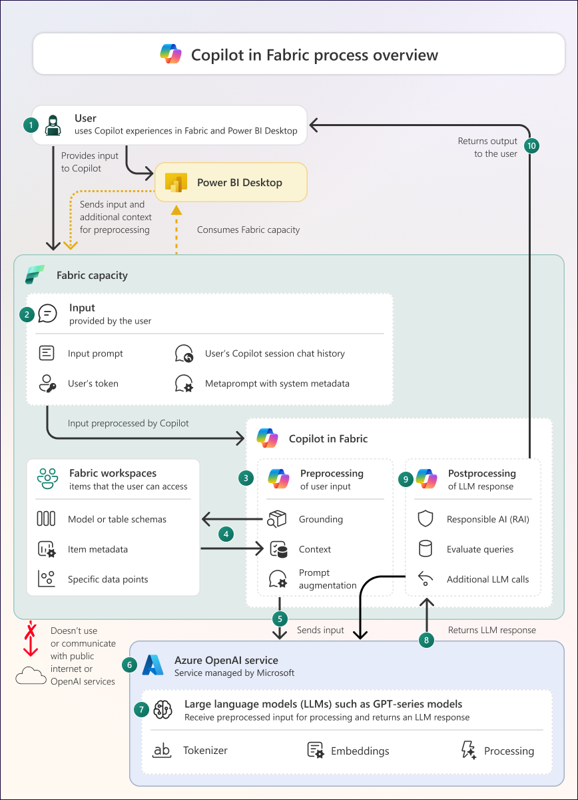

Microsoft Copilot in Fabric is a generative AI assistive technology designed to enhance the data analytics experience. Understanding how Copilot works is essential for administrators and users to effectively manage, govern, and utilize this powerful tool.

## The Copilot architecture overview

Copilot in Microsoft Fabric follows a structured five-step process to transform user inputs into meaningful outputs. This process ensures that responses are contextually relevant, secure, and appropriate for the specific Fabric workload being used.

> [!div class="mx-imgBorder"]
> 

The following steps describe how Copilot in Microsoft Fabric processes user inputs to generate responses:

1. The user initiates an interaction with Copilot in Fabric, Power BI Desktop, or the Power BI mobile app. This interaction can be a written prompt or another action that generates a prompt. All interactions are specific to the user.

2. The input sent to Copilot includes the user's prompt, authentication token, and contextual information such as the user's Copilot session chat history and system metadata about the user's activity within Fabric or Power BI Desktop.

3. Copilot manages both the preprocessing of user inputs and the postprocessing of responses from the large language model (LLM). The exact preprocessing and postprocessing steps vary depending on the Copilot experience. Copilot must be enabled by a Fabric administrator in the tenant settings.

4. During preprocessing, Copilot performs grounding to gather additional contextual information that enhances the relevance and specificity of the LLM response. Grounding data may include metadata (like schema details from a lakehouse or semantic model), data points from workspace items, or the current session's chat history. Copilot only accesses data the user is permitted to view.

5. The preprocessing phase produces the final prompt and grounding data to be sent to the LLM. The specific data included depends on the Copilot experience and the user's request.

6. Copilot sends the prepared input to the Azure OpenAI Service, which is managed by Microsoft and not configurable by users. Azure OpenAI doesn't train models with customer data. If Azure OpenAI is unavailable in the user's region and the relevant tenant setting is enabled, data may be processed outside the user's geographic area or compliance boundary.

7. Azure OpenAI hosts LLMs such as the GPT series. These models don't use public OpenAI services or APIs, and OpenAI doesn't have access to customer data. The LLM tokenizes the input and uses its training data embeddings to generate a response. The configuration of the LLM is managed by Microsoft and can't be changed by customers. Communication with Azure OpenAI occurs over Azure infrastructure, not the public internet.

8. The LLM response is returned from Azure OpenAI to Copilot in Fabric. This response may include natural language, code, or metadata, and can sometimes be inaccurate or of varying quality. Responses are nondeterministic, so repeated prompts may yield different outputs.

9. Copilot postprocesses the LLM response, which includes responsible AI filtering and further handling to produce the final output. The postprocessing steps depend on the specific Copilot experience.

10. The final output is returned to the user, who should review it before use, as Copilot outputs don't guarantee reliability, accuracy, or trustworthiness.

This architectural understanding enables organizations to effectively deploy, manage, and govern Copilot in Microsoft Fabric while maximizing its benefits and minimizing risks.