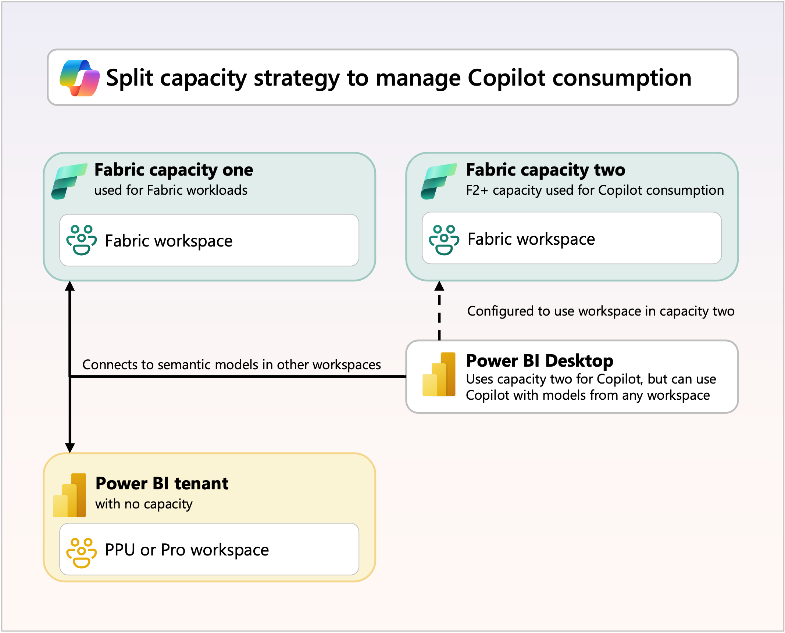

As organizations adopt Copilot in Microsoft Fabric, understanding how to scale its usage effectively becomes crucial for maintaining optimal performance and managing costs. 

## Scaling strategies for Copilot

Organizations can implement several strategies to scale Copilot usage effectively while maintaining performance and controlling costs.

### 1. Controlled rollout

To ensure a smooth and controlled adoption of Copilot, organizations could initially limit access to specific security groups. This allowlisting approach helps manage risk and provides granular control over who can use Copilot features. By creating separate security groups for different Fabric workloads, organizations can tailor access according to user roles and responsibilities. As users complete the necessary training, access can be gradually expanded to additional groups, ensuring that only prepared and knowledgeable users interact with Copilot.

### 2. Capacity scaling approaches

**Proactive scaling** involves planning and adjusting capacity ahead of time based on anticipated needs. Organizations should analyze usage trends to predict when additional capacity will be required. They can make seasonal adjustments for periods of expected high Copilot usage. Scaling capacity in advance also helps accommodate projected user base growth.

**Reactive scaling** addresses capacity needs as they arise. Organizations can temporarily increase capacity by scaling to higher SKUs during peak usage periods, providing short-term relief from throttling and performance issues. It's important to weigh the temporary increase in costs against potential productivity losses when making reactive scaling decisions.

### 3. Dedicated Copilot capacity

For large organizations with high Copilot usage, isolating Copilot consumption from other Fabric workloads can be beneficial. By allocating a separate F64 or higher SKU exclusively for Copilot experiences, organizations ensure that Copilot activity doesn't affect business-critical workloads on other capacities. This separation provides clearer cost attribution and improved governance over Copilot-related expenses, but it also requires purchasing and managing multiple capacity SKUs, which may increase overall costs.

> [!div class="mx-imgBorder"]
> 

## Best practices for sustainable scaling

1. **Start small and measure**: Begin with pilot groups to understand consumption patterns
2. **Invest in training**: Comprehensive user education reduces inefficient usage
3. **Monitor continuously**: Use capacity metrics to guide scaling decisions
4. **Plan for growth**: Anticipate scaling needs rather than reacting to capacity issues
5. **Optimize iteratively**: Continuously refine data models and usage patterns
6. **Consider split strategies**: For large deployments, evaluate capacity isolation benefits
7. **Balance cost and performance**: Make informed decisions about scaling investments

By applying these scaling strategies and monitoring practices, organizations can deploy Copilot in Microsoft Fabric while maintaining performance, managing costs, and supporting a consistent user experience across analytics workflows.