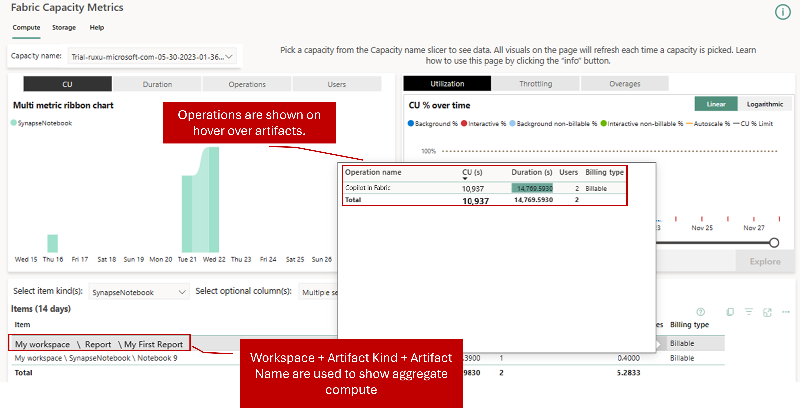

Unlike other Microsoft Copilots, Copilot in Fabric doesn't require additional per-user or per-capacity licenses. Rather, Copilot in Fabric consumes from your available Fabric capacity units (CUs). The consumption rate of Copilot is determined by the number of tokens in your inputs and outputs when you use it across the various experiences in Fabric.

You should manage its usage to avoid overconsumption that can lead to throttling and disruption of your other Fabric operations. Effective utilization of Copilot involves understanding its consumption model, which impacts usage, billing, and data processing considerations.

## Usage and billing

**Token-Based Measurement**: Fabric quantifies Copilot's usage by processing tokens, where approximately 1,000 tokens equate to 750 words. It consumes tokens at defined rates for both input prompts and output responses.

**Capacity Unit Consumption**: Requests to Copilot consume Fabric Capacity Units (CU). The consumption rates are as follows:

- **Input Prompt**: 100 CU seconds per 1,000 tokens
- **Output Completion**: 400 CU seconds per 1,000 tokens

For example, assume each Copilot request has 2,000 input tokens and 500 output tokens. The price for one Copilot request is calculated as follows: (2,000 × 100 + 500 × 400) / 1,000 = 400.00 CU seconds = 6.67 CU minutes.

Since Copilot is a background job, each Copilot request (~6.67 CU minute job) consumes only one CU minute of each hour of a capacity. For a customer on F64 who has 64 * 24 CU Hours (1,536) in a day, and each Copilot job consumes (6.67 CU mins / 60 mins) = 0.11 CU Hours, customers can run over 13,824 requests before they exhaust the capacity. However, once the capacity is exhausted, all operations will shut down.

Administrators can use the **Fabric Capacity Metrics app** to monitor Copilot usage, providing insights into capacity consumption and helping manage resources effectively.

> [!div class="mx-imgBorder"]
> 

## Data processing considerations

**Data Residency**: Data processed by Copilot in Fabric stays within your tenant's geographic region, unless you explicitly allow data to be processed outside your region.

To allow data to be processed outside your capacity's geographic region, turn on the related setting, "Data sent to Azure OpenAI can be processed outside your capacity's geographic region, compliance boundary, or national cloud instance."

> [!div class="mx-imgBorder"]
> 

**Security and Privacy**: Microsoft is committed to ensuring that AI systems adhere to responsible AI principles, focusing on data security and user privacy. Your data isn't used to train models and isn't available to other customers. Copilot doesn't store your data for abuse monitoring.

Copilot responses can include inaccurate or low-quality content, so make sure to review outputs to ensure accuracy and appropriateness before you use them in your work.