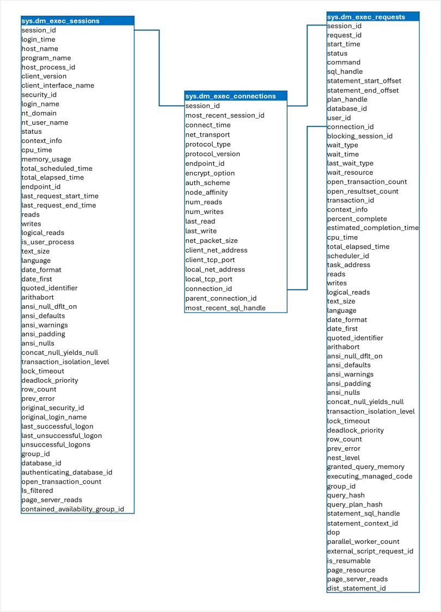

You can use dynamic management views (DMVs) to retrieve information about the current state of the data warehouse. Specifically, Microsoft Fabric data warehouses include the following DMVs:

- **sys.dm_exec_connections**: Returns information about data warehouse connections.
- **sys.dm_exec_sessions**: Returns information about authenticated sessions.
- **sys.dm_exec_requests**: Returns information about active requests.

The schema of these tables is shown here:



## Querying DMVs

You can retrieve detailed information about current activities in the data warehouse by querying the *dm_exec-\** DMVs. For example, consider the following query:

```sql
SELECT sessions.session_id, sessions.login_name,
    connections.client_net_address,
    requests.command, requests.start_time, requests.total_elapsed_time
FROM sys.dm_exec_connections AS connections
INNER JOIN sys.dm_exec_sessions AS sessions
    ON connections.session_id=sessions.session_id
INNER JOIN sys.dm_exec_requests AS requests
    ON requests.session_id = sessions.session_id
WHERE requests.status = 'running'
    AND requests.database_id = DB_ID()
ORDER BY requests.total_elapsed_time DESC
```

This query returns details about the active requests in the current database, ordered by the duration for which they have been executing; which may be useful to identify long-running queries that could benefit from optimization. An example result set from the query is shown here:

|session_id|login_name|client_net_address|command|start_time|total_elapsed_time|
|--|--|--|--|--|--|
|60|fred@contoso.com|10.23.139.162|SELECT|2023-12-07T14:56:41.3530000|57266|
|126|nandita@contoso.com|10.23.137.98|SELECT|2023-12-07T14:57:22.7800000|15840|
|137|zoe@contoso.com|10.23.119.171|SELECT|2023-12-07T14:57:38.6070000|4|

> [!TIP]
> For more information about using DMVs, refer to **[Monitor connections, sessions, and requests using DMVs](/fabric/data-warehouse/monitor-using-dmv)** in the Microsoft Fabric documentation.
