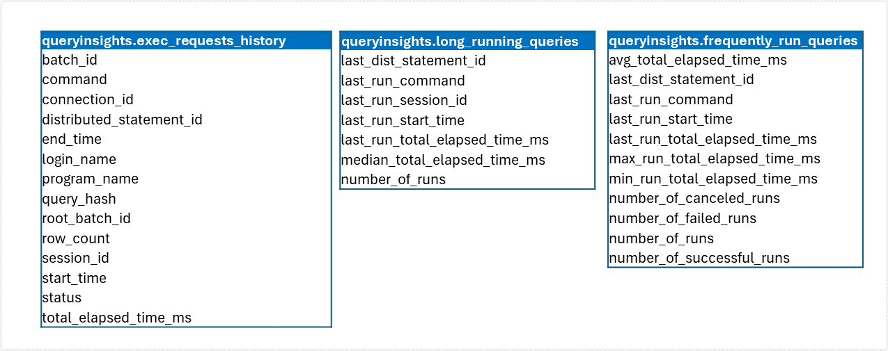

Microsoft Fabric data warehouses include *query insights* feature that provides historical, aggregated information about the queries that have been run; enabling you to identify frequently used or long-running queries, and helping you analyze and tune query performance.

Query insights are provided through the following views:

- **queryinsights.exec_requests_history**: Details of each completed SQL query.
- **queryinsights.long_running_queries**: Details of query execution time.
- **queryinsights.frequently_run_queries**: Details of frequently run queries.

The schema for these tables is shown here:



## Retrieving query insights

The query insights views are a useful source of information about the queries that are being run in your data warehouse.

For example, consider the following query:

```sql
SELECT start_time, login_name, command
FROM queryinsights.exec_requests_history 
WHERE start_time >= DATEADD(MINUTE, -60, GETUTCDATE())
```

This query uses the **queryinsights.exec_requests_history** view to identify queries that were run in the previous hour.

> [!NOTE]
> Depending on the concurrent workloads, queries may take up to 15 minutes to be reflected in the query insights views.

You can get details of long-running queries from the **queryinsights.long_running_queries** view like this:

```sql
SELECT last_run_command, number_of_runs, median_total_elapsed_time_ms, last_run_start_time
FROM queryinsights.long_running_queries
WHERE number_of_runs > 1
ORDER BY median_total_elapsed_time_ms DESC;
```

This query identifies long-running SQL commands that have been used more than once and returns them in descending order of their median time to complete.

> [!NOTE]
> To enable the views to provide aggregated metrics, queries with predicates are parameterized and considered the same query if the parameterized statements are an exact match. For example, the following queries would be considered to be the same command:
>
> `SELECT * FROM sales WHERE orderdate > '01/01/2023'`
>
> `SELECT * FROM sales WHERE orderdate > '12/31/2021'`

To find commonly used queries, you can use the **queryinsights.frequently_run_queries** view, like this:

```sql
SELECT last_run_command, number_of_runs, number_of_successful_runs, number_of_failed_runs
FROM queryinsights.frequently_run_queries
ORDER BY number_of_runs DESC;
```

This query returns details of successful and failed runs for frequently run commands.

> [!TIP]
> For more information about using query insights refer to **[Query insights in Fabric data warehousing](/fabric/data-warehouse/query-insights)** in the Microsoft Fabric documentation.
