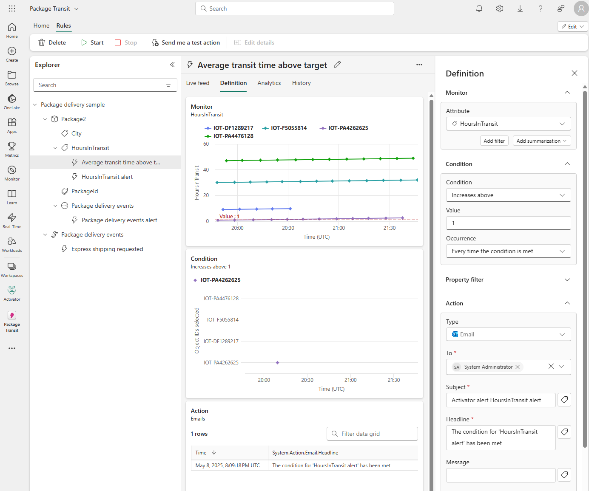

When monitoring surfaces changing data, anomalies, or critical events, alerts are generated or actions are triggered. Real-time data analytics is commonly based on the ingestion and processing of a data stream that consists of a perpetual series of data, typically related to specific point-in-time events. For example, a stream of data from an environmental IoT weather sensor. Real-Time Intelligence in Fabric contains a tool called Activator that can be used to trigger actions on streaming data. For example, a stream of data from an environmental IoT weather sensor might be used to trigger emails to sailors when wind thresholds are met. When certain conditions or logic is met, an action is taken, like alerting users, executing Fabric job items like a pipeline, or kicking off Power Automate workflows. The logic can be either a defined threshold, a pattern like events happening repeatedly over a time period, or the results of logic defined by a Kusto Query Language (KQL) query.  

## What is Activator
Activator is a technology in Microsoft Fabric that enables automated processing of events that trigger actions. For example, you can use Activator to notify you by email when a value in an eventstream deviates from a specific range or to run a notebook to perform some Spark-based data processing logic when a real-time dashboard is updated.

## Understand Activator key concepts

Activator operates based on four core concepts: *Events*, *Objects, *Properties*, and *Rules*.

- **Events** - Each record in a stream of data represents an *event* that has occurred at a specific point in time.
- **Objects** - The data in an event record can be used to represent an *object*, such as a sales order, a sensor, or some other business entity.
- **Properties** - The fields in the event data can be mapped to *properties* of the business object, representing some aspect of its state. For example, a *total_amount* field might represent a sales order total, or a *temperature* field might represent the temperature measured by an environmental sensor.
- **Rules** - The key to using Activator to automate actions based on events is to define *rules* that set conditions under which an action is triggered based on the property values of objects referenced in events. For example, you might define a rule that sends an email to a maintenance manager if the temperature measured by a sensor exceeds a specific threshold.

## Use cases for Activator

Activator can help you in various scenarios, such as dynamic inventory management, real-time customer engagement, and effective resource allocation in cloud environments. It's a potent tool for any circumstance that requires real-time data analysis and actions.

Use Activator to:

- Initiate marketing actions when product sales drop.
- Send notifications when temperature changes could affect perishable goods.
- Flag real-time issues affecting the user experience on apps and websites.
- Trigger alerts when a shipment hasn't been updated within an expected time frame.
- Send alerts when a customer's account balance crosses a certain threshold.
- Respond to anomalies or failures in data processing workflows immediately.
- Run ads when same-store sales decline.
- Alert store managers to move food from failing grocery store freezers before it spoils.

> [!TIP]
> For more information about working with Activator, see **[Tutorial: Create and activate an Activator rule](/fabric/real-time-intelligence/data-activator/activator-tutorial)**.