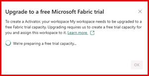

Alerts and actions are a major feature of Microsoft Fabric. Fabric supports alerts in Real-Time hubs, changes to KQL Query sets, Blob Storage events, and more. One of the more business oriented elements of alerts within Fabric is its ability to send a Teams message, an Email, or even run a Fabric item, such as triggering a notebook or a Data Factory pipeline activity.

## Introduction to Fabric Data Activator

Fabric Data Activator is a powerful tool that allows businesses to use their data effectively. It enables users to collect, analyze, and act on data in real time, providing valuable insights that can drive decision-making.

> [!NOTE]
> You may have to upgrade to a ***free Microsoft Fabric trial*** if you're not on already on a Fabric capacity instance.
> select the **Account Manager** icon (the user image at the top right) and in the menu, select **Free trial** to start a Microsoft Fabric trial. Select **Activate**.
> You will receive a message that your trial workspace is being prepared, which can take several minutes.
> 

By applying these features, you can maintain the reliability and accuracy of your semantic models, ensuring that your data-driven insights are always based on the latest information.

**Key Features of Fabric Data Activator

| Feature | Description |
|---------|-------------|
| Real-time Data Collection | Collects data from various sources in real time. |
| Data Analysis | Analyzes the collected data to provide actionable insights. |
| Event Stream Processing | Processes and analyzes real-time data from event streams. |
| Detection Conditions | Allows users to set specific conditions for data analysis. When these conditions are met, certain actions can be triggered. |

## Learning Fabric Data Activator

Let's start by understanding what Data Activator is and how it can benefit your business. Learn about its key features and how they work.

Fabric Data Activator is a tool designed to help businesses apply their data more effectively. It's part of the Microsoft Fabric suite, which provides various tools for data analysis and visualization. The Data Activator allows users to collect, analyze, and **act** on data in real time. This can provide valuable insights that can drive decision-making and business strategy. It's useful for businesses that need to process large amounts of data quickly and efficiently. Key features of the Data Activator include real-time data collection, data analysis, event stream processing, and detection conditions. These features allow businesses to monitor their data, set specific conditions for data analysis, and trigger certain actions when these conditions are met.

### Setting Up Data Activator

Data activator can be set up in several places, but event streams are a good place to start as it goes through its transformation and integration process, where we may want to send data back to an upstream or downstream resource to notify them there's an anomaly in the data collected.

1. **Create an event stream**:
   - In the Microsoft Fabric portal, navigate to the Event Streams section and create a new stream.
   - Configure the stream to ingest data from your desired source, such as an IoT hub or Kafka article.

2. **Add a destination**:
   - Once the stream is set up, add a destination of type Reflex.
   - This action allows you to connect the stream to Data Activator.

3. **Configure data activator**:
   - Open Data Activator and select the event stream item you created.
   - Assign the data to relevant objects and set up conditions for triggering actions.

4. **Monitor and respond**:
   - With the setup complete, you can now monitor the data in real-time and respond to events as they occur.
   - For example, you can trigger an alert if a sensor detects a temperature anomaly.

### Working with event streams and Fabric data activator

In the realm of real-time data processing, Microsoft Fabric offers powerful tools to handle streaming data efficiently. Two key components in this ecosystem are Event Streams and Fabric Data Activator. This module guides you through the functionalities and use cases of these components, enabling you to harness their full potential for real-time intelligence.

#### Event Streams

**Event Streams** in Microsoft Fabric are designed to ingest data from multiple streaming sources, providing a no-code experience for event processing and routing data to other Fabric entities. This component is crucial for scenarios where data needs to be processed and analyzed in real-time, such as monitoring IoT devices, financial transactions, or social media feeds.

**Key Features:**

- **Ingestion from Multiple Sources**: Event Streams can ingest data from various sources like Kafka, Event Hubs, and IoT devices.
- **No-Code Experience**: It offers a user-friendly interface for setting up and managing data streams without the need for extensive coding.
- **Routing and Processing**: Data can be routed to different destinations within the Fabric ecosystem, such as Data Activator, KQL databases, or data warehouses.

**Use Case:**
Imagine a scenario where a retail company wants to monitor customer interactions in real-time to provide personalized offers. Event Streams can ingest data from in-store sensors, online transactions, and social media mentions, process this data, and route it to a KQL database for real-time analytics.

#### Fabric Data Activator

**Fabric Data Activator** is a tool that enables automated actions based on patterns or conditions detected in streaming data. It's designed to trigger responses to specific events, making it ideal for scenarios that require immediate action based on real-time data insights.

**Key Features:**

- **Automated Actions**: Data Activator can trigger actions such as sending notifications, updating dashboards, or executing workflows based on predefined conditions.
- **Integration with Event Streams**: It seamlessly integrates with Event Streams, allowing you to set up complex event-driven architectures.
- **Real-Time Monitoring**: Provides real-time monitoring and alerting capabilities to ensure timely responses to critical events.

**Use Case:**
Consider a logistics company that needs to monitor the temperature of perishable goods during transit. By integrating Event Streams with Data Activator, the company can set up alerts to notify drivers and logistics managers if the temperature exceeds safe limits, ensuring the quality of the goods.

#### Practical Example

Let's walk through a practical example of setting up an Event Stream and connecting it to Data Activator:

1. **Create an Event Stream**: In the Microsoft Fabric portal, navigate to the Event Streams section and create a new stream. Configure the stream to ingest data from your desired source, such as an IoT hub or Kafka article.
2. **Add a Destination**: Once the stream is set up, add a destination of type Reflex. This setup allows you to connect the stream to Data Activator.
3. **Configure Data Activator**: Open Data Activator and select the event stream item you created. Assign the data to relevant objects and set up conditions for triggering actions.
4. **Monitor and Respond**: With the setup complete, you can now monitor the data in real-time and respond to events as they occur. For example, you can trigger an alert if a sensor detects a temperature anomaly.

#### Conclusion

By applying Event Streams and Fabric Data Activator, you can build robust real-time data processing solutions that drive immediate insights and actions. These tools empower you to create responsive, event-driven architectures that enhance operational efficiency and decision-making.

